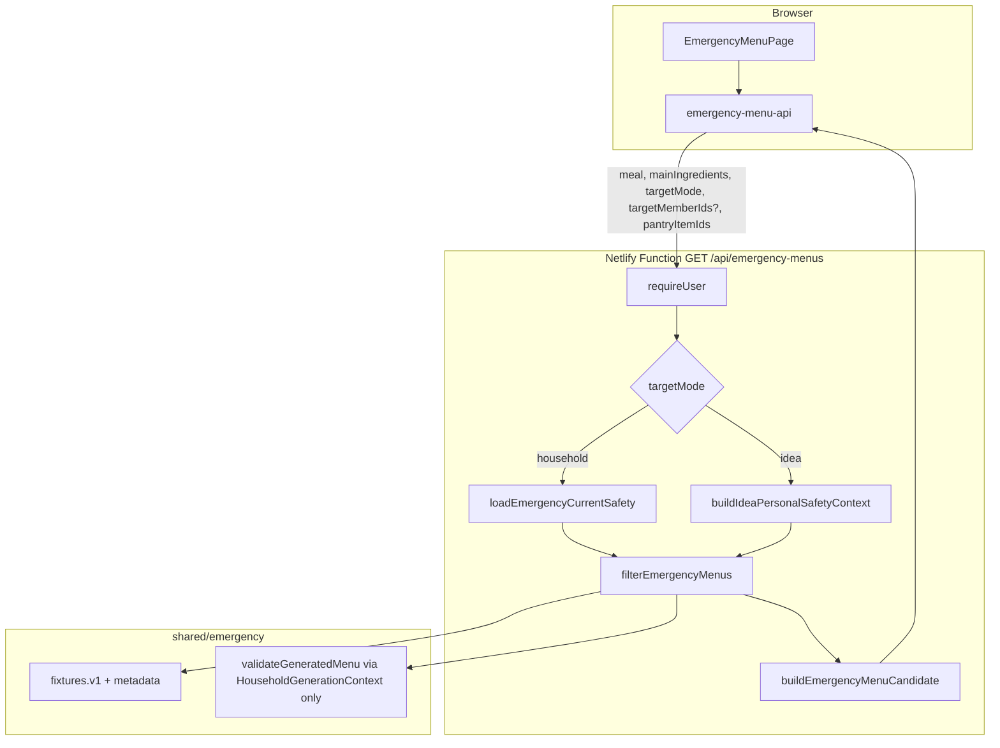
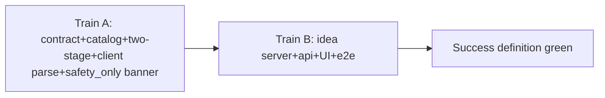

# 緊急献立の対応力改善設計（catalog + matching + empty UX + idea mode）

| 項目 | 値 |
|------|-----|
| 文書 | `docs/archive/superpowers/specs/2026-07-28-emergency-menu-capability-design.md` |
| 作者 | （実装担当） |
| 日付 | 2026-07-28 |
| 状態 | Approved（敵対的レビュー open 0 + 人間サインオフ済み） |
| 人間サインオフ | **2026-07-28** — Spec amendments（Plan 7 §4.2 / §209 supersede）および idea API の draft 非束縛方針を承認。実装開始可 |
| 関連 | MVP §9.3 / §676、Plan 7（本設計が §4.2 / §209 の一部を supersede）、`shared/emergency/*` |

---

## Spec amendments / supersedes（必読）

本設計は、既存仕様の **到達性・empty 契約** を意図的に改訂する。ロック表（人間合意）だけを根拠にせず、以下を正式な supersession とする。

### Plan 7 `2026-07-22-guided-planner-optional-household-design.md`

| 箇所 | 原文の趣旨 | 本設計での扱い |
|------|------------|----------------|
| **§4.2 非ゴール**「家族情報を使わない緊急献立の新しい商品仕様」 | Plan 7 時点では idea 用の緊急候補表示を **含めない** | **本設計が supersede する**。idea 個人固定候補（アレルギー/年齢未適用 + 必須開示）を商品仕様として追加する |
| **§209** `/emergency-menus` は idea 下書きでも到達可能だが、**家族不在を説明する empty に安全終端**し、家族安全 query を開始しない | 候補表示はしない | **改訂後**: idea 下書き → **idea 個人候補 + 必須開示**。`get_current_safety_snapshot` / React Query の `household_members`（settings 以外）/ 買い物・再検証・生成 API は **引き続き開始しない**。`GET /api/emergency-menus?targetMode=idea` は **許可**（後述 e2e 契約の書き換え） |

### MVP `2026-07-11-kondate-mvp-design.md` §9.3

| 箇所 | 扱い |
|------|------|
| 表示前に **現在の対象メンバー** と同じ決定論的安全ルールで絞り込む | **`path=household` では絶対維持**。未確認 / 未マップ / unsupported diet / アレルゲン∩metadata / 年齢帯 / `validateGeneratedMenu` 失敗は表示しない |
| 条件を満たす候補がない場合は無理に表示しない | household / idea とも **緩和して埋めない**。idea は対象メンバーが居ないため合成 adult コンテキストで fixture 検証する（家族アレルギー適用ではない） |
| AI 非消費・人手レビュー固定・安全保証表現禁止 | **変更なし** |

**製品例外の一文**: idea 個人パスは「対象メンバーの current safety で絞る」MVP 規則の **明示的例外** であり、wire の `path: "idea"` と UI の idea 専用 chrome（家族絞り込み intro の非表示）で世帯パスと混同させない。

---

## Overview

AI が使えない・上限に達したとき、利用者は **固定の15分緊急献立** に頼る。現状の catalog は朝・昼・夕各1件（計3 fixture）で、昼食・夕食は鶏肉中心、メイン食材は **安全通過後の AND ハードフィルタ** のため一致0で候補全滅、idea 下書きでは API すら呼ばずブロック、空状態の理由も粗い。

本設計は、人手レビュー済み fixture の拡大（9〜12件）、**二段階マッチ（メイン食材 → 安全のみ fallback）**、idea 向けの **個人固定候補パス**、正直な empty / disclosure UX を一体で届け、**主要蛋白アレルゲン集合に対して朝昼夕ほぼ常に ≥1 候補** を目指す。AI 生成・テンプレート合成・安全条件の黙った緩和は行わない（Approach A）。

**成功定義の完了ゲート**: PR2（catalog）単独では「完了」としない。受け入れ表全体が green になるのは **PR train 最終（UI/e2e まで）マージ後** のみ。

---

## Background & Motivation

### 現状（worktree で確認した事実）

| 領域 | 実装 | 問題 |
|------|------|------|
| Catalog | `shared/emergency/fixtures.v1.ts` — breakfast 鮭 / lunch 鶏そぼろ / dinner 鶏肉塩蒸し、`fixtureVersion = "2026-07-11.v1"` | 蛋白軸が薄く、鶏アレルギーだけでも昼・夕が同時に空になりやすい |
| Matching | `filterEmergencyMenus`（`shared/emergency/filter-emergency-menus.ts`） | 安全通過後に料理名・材料名への **AND 部分一致**。0件なら `emptyReason: "main_ingredient_no_match"` で全滅 |
| API | `GET /api/emergency-menus` | `targetMemberIds` 必須。wire に `emptyReason`・`matchMode`・`path` なし |
| UI | `emergency-menu-page.tsx` | idea は API 非呼び出し + ブロック文言。intro は常に「家族・アレルギー・年齢…で絞り込み」 |
| Validation | `validateGeneratedMenu` は `targetMode === "idea"` のとき `validateIdeaMenu` へ分岐し **adaptations / labelConfirmations を拒否** | idea 用 GenerationContext を誤配線すると fixture が全落ちする |
| E2E | `generation-recovery-results.spec.ts` | `/api/emergency-menus` 自体を family-safety 禁止リストに含め、idea では API 0件を期待 |

### 痛み

1. **catalog 不足**（鶏・卵・さけの組み合わせで mealType 全滅）。
2. **メイン食材の全滅**（安全候補まで消える）。
3. **idea 遮断**（Plan 7 は到達と正直 empty のみ。候補は非ゴールだった）。
4. **空 UX / 開示不足**（理由が wire に載らない。idea 時も世帯向け intro が残り得る）。

### 人間と合意済みのロック（再導出禁止）

1. catalog / matching / empty UX を **一体** で改善する。
2. 成功定義: 主要蛋白アレルゲンについて一般家庭が **ほぼ常に ≥1 候補**（後述の行列が正本）。
3. メイン食材: AND → 0 なら **安全のみ fallback**。安全は黙って落とさない。UI 開示必須。
4. idea: 家族アレルギー/年齢 **未適用** の個人固定候補 + 開示。**Plan 7 §4.2 を本設計が supersede**（上記）。
5. catalog: 朝昼夕 × 3〜4 = **9〜12 件**。既存3維持。
6. Approach A のみ。

---

## Goals & Non-Goals

### Goals

- AI 不可時でも、**coverage 行列が定義する主要蛋白アレルゲン集合**に対し朝昼夕で調理可能な15分固定候補を ≥1 件。
- catalog 拡大、二段階マッチ、idea 個人パス、正直 empty / path 条件付き chrome。
- 全候補は人手レビュー済み完全献立。`consumesAiQuota: false`。

### Non-Goals

- AI 生成緊急献立 / テンプレ合成 / タグ採点エンジン（初期）。
- 嗜好（嫌い・分量・辛さ）のハードフィルタ。
- 買い物・履歴・お気に入りの新規連携。
- 未確認 / 未マップ / unsupported diet の黙った緩和。
- 15分超。
- **soy / wheat / milk / shrimp 等の「一般家庭ほぼ常に」保証**（残余リスクとして文書化。行列の必須セルではない）。
- サーバが planner draft を読んで `targetMode` を強制すること（API は明示 query。UI が draft と一致させる）。

### 成功受け入れ表

| シナリオ | 期待 |
|----------|------|
| household・アレルギーなし・メインなし | 朝/昼/夕 ≥1 |
| 鶏アレルギーのみ | 朝/昼/夕 ≥1 |
| メイン食材不一致（例: 豚肉） | 安全通過候補 ≥1 + `matchMode: "safety_only"` 開示 |
| idea mode | 家族 RPC なしで ≥1 + idea chrome / アレルギー未適用開示 |
| 未確認 / 未マップ | 0 + `current_safety_unavailable`（緩和なし） |
| AI quota | 常に `consumesAiQuota: false` |
| catalog 主要蛋白をすべてブロック | 0 + `no_matching_fixture` |
| **完了判定** | 上表 + e2e 改訂 + UI chrome が **PR train 最終まで** green |

---

## Proposed Design

### 全体アーキテクチャ



### 1. 二段階マッチ（`matchMode`）

#### アルゴリズム

```
入力: mealType, mainIngredients[], pantryNames[], context, memberLabels

1. Stage S 前ゲート（context.members に対する共通ロジック。idea 合成は常に通過）
   - members.length === 0
     OR いずれかが unconfirmed / hasUnmappedCustomAllergy / unsupportedDietStatus !== "none"
   → menus=[], emptyReason="current_safety_unavailable", matchMode=null

2. Stage S: mealType 一致 fixture
   - eligibleAgeBands / standardAllergenIds 交差
   - remapFixtureForMembers（idea は1人で実質 no-op）
   - validateGeneratedMenu(menu, emergencyGenerationContext(...))
     ※ emergencyGenerationContext は常に targetMode: "household"（下記ロック）
   → safetyCompatibleMenus
   ※ validation 失敗の fixture は落とす。サーバは menuId 単位で非PII カウントをログ可

3. Stage M:
   - mainIngredients が空
     → selected = safetyCompatibleMenus, matchMode="none"
   - 非空:
     a. mainMatched = AND forward 部分一致（dish.name / ingredient.name、NFKC+trim）
        candidateName.includes(mainIngredient) のみ（逆方向禁止）
     b. mainMatched.length > 0
        → selected = mainMatched, matchMode="main_ingredient"
     c. mainMatched.length === 0 かつ safetyCompatibleMenus.length > 0
        → selected = safetyCompatibleMenus, matchMode="safety_only"
     d. 両方 0 → selected = [], emptyReason="no_matching_fixture", matchMode=null
     （selected は各分岐でのみ代入。fall-through で未定義にしない）

4. pantry sort（既存）
5. return { menus, emptyReason, matchMode }
```

#### `matchMode` 三値

```typescript
export type EmergencyMatchMode = "none" | "main_ingredient" | "safety_only";
// none: メイン食材制約なしで Stage S 通過集合を返した
// main_ingredient: ユーザー指定メインが AND 一致
// safety_only: メイン不一致のため Stage S 集合へ fallback
// null: candidates 空
```

#### UI ロック（誤推論禁止）

- **`matchMode === "safety_only"` のときだけ** メイン不一致バナーを出す（候補非空でも必須）。トリガは `matchMode` のみ。**`message` パース禁止**。
- バナー **文言は `path` 条件付き**（§5 正本）。household のみ「安全条件に合う」を使い、idea では使わない（アレルギー未適用の開示と矛盾させない）。
- `matchMode === "main_ingredient"` や `"none"` から「メインが使えた」以上の意味を UI が推測しない。
- テスト: household 文言 exact / idea 文言 exact / idea 表示中に household バナー文言が不在（§5 のテスト名）。
- **Ship ロック**: household 文言バナーは **Train A4**（A3 と同一 main マージ）。idea 文言バナーは **Train B2**。

#### 既存との差分

| 項目 | 現状 | 変更後 |
|------|------|--------|
| メイン不一致 | empty `main_ingredient_no_match` | 非空 + `safety_only` |
| `main_ingredient_no_match` | emptyReason | **削除**。repo 全体 grep-kill（Train A3） |
| 旧 handler 文言「選択したメイン食材に合う固定候補がありません」 | 空時専用 | **削除**。非空 safety_only では新文言。Stage S=0 で main 指定時も `no_matching_fixture` 汎用 empty |
| 部分一致 | forward | **維持**。短トークン「肉」が「鶏肉」に当たるのは **現行どおり受理**（後述 nit） |
| GenerationContext | household 形 | idea パスでも **常に household 形**（Issue 5） |

#### `EmergencyFilterResult`

```typescript
export type EmergencyEmptyReason =
  | "current_safety_unavailable"
  | "no_matching_fixture";

export type EmergencyFilterResult = {
  menus: readonly ValidatedMenu[];
  emptyReason: EmergencyEmptyReason | null;
  matchMode: EmergencyMatchMode | null;
};
```

**禁止**: Stage M 失敗を理由に Stage S を緩めない。fallback は Stage S 通過集合への戻りのみ。

### 2. Catalog 拡大

#### バージョン（混同禁止）

| 識別子 | 値 | 備考 |
|--------|-----|------|
| **menu `schemaVersion`** | **`"2026-07-11.v1"` のまま** | `validatedMenuSchema` / `z.literal` 固定。**絶対に 2026-07-28 へ上げない** |
| **`emergencyFixtureVersion`** | **`"2026-07-28.v1"`** | wire / カタログ版のみ |

#### 既存3件

既存 `menuId` / 内部 UUID **不変**。内容原則不変。metadata の `reviewedAt` は既存のまま可。

#### 強制カバレッジ（authoritative — 「推奨」ではない）

**行列（adult・メイン食材なし・`filterEmergencyMenus` Stage S をテスト強制）**:

| Blocking allergens | breakfast | lunch | dinner |
|--------------------|-----------|-------|--------|
| none | ≥1 | ≥1 | ≥1 |
| chicken only | ≥1 | ≥1 | ≥1 |
| salmon only | ≥1 | ≥1 | ≥1 |
| egg only | ≥1 | ≥1 | ≥1 |
| chicken + salmon | ≥1 | ≥1 | ≥1 |
| chicken + egg | ≥1 | ≥1 | ≥1 |
| 当該 version の全 `standardAllergenIds` 和集合 | 0 + `no_matching_fixture` | 0 | 0 |

**導出プロパティ（各 mealType 必須）**:

- 少なくとも1 fixture が `standardAllergenIds` と `{chicken}` が交差し**ない**。
- 少なくとも1 fixture が `{egg}` と交差し**ない**。
- 少なくとも1 fixture が `{chicken, egg}` の両方と交差し**ない**（chicken+egg 行の逃げ）。典型: **卵を含まない魚**、**卵を含まない豆腐/野菜**、または **pork**。
- lunch / dinner で「非鶏スロットが卵のみ」かつ pork 省略は **禁止**（chicken+egg が 0 になるため）。

#### 必須スロット表（合計 9〜12、既存3含む）

| # | mealType | 蛋白軸 | standardAllergenIds 制約 | 備考 |
|---|----------|--------|---------------------------|------|
| 1 | breakfast | fish/salmon | 既存 `salmon` | **既存** |
| 2 | breakfast | egg | 含 `egg`、非 chicken | 必須 |
| 3 | breakfast | tofu-veg **非卵** | `chicken`/`egg`/`salmon` を載せない（soy は材料にあれば必須申告） | chicken+egg+salmon 逃げにも寄与 |
| 4 | lunch | chicken | 既存 | **既存** |
| 5 | lunch | fish **非卵** | 非 chicken・非 egg | 必須（chicken+egg 逃げ） |
| 6 | lunch | egg **または** tofu-veg 非卵 | どちらか一方でよいが、#5 と合わせて chicken+egg を満たすこと | 必須 |
| 7 | lunch | pork 等 | 任意。#5+#6 で行列が足りなければ **必須化** | 4本目 |
| 8 | dinner | chicken | 既存 | **既存** |
| 9 | dinner | fish **非卵** | 非 chicken・非 egg | 必須 |
| 10 | dinner | egg **または** tofu-veg 非卵 | #9 と合わせて chicken+egg | 必須 |
| 11 | dinner | pork 等 | 任意 / 行列不足時必須 | 4本目 |
| 12 | breakfast 第4 | 任意 | 上限12 | 行列が既に満たせば不要 |

「egg-or-tofu」の曖昧さ解消: **tofu を選ぶ場合は卵を材料に含めず `egg` を metadata に載せない**。卵料理なら必ず `egg`。

#### soy / wheat 等の残余リスク

- 成功定義の「ほぼ常に」は **行列の主要蛋白（chicken / salmon / egg および fixture が宣言する蛋白 ID）** に限定する。
- tofu 拡張で soy アレルギー家庭が 0 になり得ることは **Accepted residual risk**。stretch として soy-only / wheat-only 行をテストに足してもよいが、0 を許容し必須ゲートにしない。
- 醤油・小麦粉を使う fixture は `wheat` / `soy` を **過少申告しない**（材料に含まれるなら metadata と labelConfirmation 方針に従う）。

#### `standardAllergenIds` 過少申告ガード

1. **人手レビュー**（必須）: 材料一覧 vs metadata。
2. **best-effort ユニットテスト**: 各 fixture の各 `ingredient.name` を `normalizeFoodText` し、allergen catalog の `displayName` または alias と **完全一致**したら、その allergen id が `metadata.standardAllergenIds` に含まれること。NLP はしない。加工名・複合語は人手。
3. catalog に存在しない ID を metadata に書けないことの静的/実行時チェック。

#### fixture オーサリング必須条件

1. `totalElapsedMinutes ≤ 15`、完全献立。
2. dinner: main+side+soup 推奨。breakfast/lunch: main|staple + side。
3. `eligibleAgeBands`: 原則 `allReviewedAgeBands`。
4. `standardAllergenIds` 過少申告禁止 + 上記 automatic alias hit。
5. safetyActions ingredient-bound。`cut_small` は料理単位。
6. `validateGeneratedMenu` + **HouseholdGenerationContext** で `post_weaning_to_2` / `adult` / `senior` ok。
7. idea も同一 set（unsafe catalog 禁止）。
8. `reviewedAt: "2026-07-28"`（新規）。
9. **UUID**: 下記 reserved bands。全 fixture 横断で id 一意性テスト。

#### Reserved UUID bands

| 用途 | 帯（例） | 備考 |
|------|----------|------|
| 既存 menu / dish / … | `82…` 系（現行） | **不変** |
| 新規 menuId | `82000000-0000-4000-8000-000000000010` 以降の未使用、または `84…` プレフィックス | 実装で空きを選び一意テスト |
| dish / ingredient / step / timeline / adaptation | menu ごとに一意。末尾12hex は remap 対象 | `remapUuidForMember` は末尾12桁に `memberIndex * 0x100000000` を加算。複数 member でも衝突しないよう base を十分離す |
| idea 合成 member | **`83000000-0000-4000-8000-000000000001` のみ** | fixture のどの id とも **重複禁止**。DB に存在しない |

### 3. Idea 個人パス

#### 製品意味

- 家族アレルギー・年齢・requiredSafetyConstraints **未適用**。
- 同一 reviewed fixture。mealType + 二段階メイン。
- UI は idea 専用 chrome（世帯 intro 禁止）+ 開示。
- **React Query の `household_members` と current-safety RPC を idea では開始しない**。
- **Realtime**（`household_members` / `member_allergies`）と 60s safety revision poll も **idea 下書きでは購読しない**（`draft.targetMode === "idea"` または draft 読込前は household 用 effect を enabled にしない）。owner filter でも Plan 7 の family-safety activity 精神に合わせる。

#### API は draft 非束縛（製品決定 — 受理）

- サーバは **query の `targetMode` のみ**で分岐する。planner draft を読まない。
- 認証済み利用者は `targetMode=idea` で **世帯アレルギーを迂回した個人固定候補**を取得できる。これは意図した **personal API** であり、IDOR ではなく「自分の session で個人パスを選ぶ」モデル。
- 緩和策:
  1. 応答 `path: "idea"` + 固定開示 message。
  2. **UI ロック**: `draft.targetMode === "household"` のとき request は必ず `targetMode: "household"`。eligible 0 で idea へ **自動フォールバックしない**（現行の正直 empty を維持）。
  3. コンポーネントテスト: `does not request idea path when draft is household` / `does not fallback to idea when eligible members empty`。
  4. 監査ログ（非PII）: `path`, `matchMode`, `emptyReason`, `candidateCount`。
- draft 束縛（サーバが DB draft を読む）は非採用 — 緊急 GET のレイテンシと draft 不在時の複雑さのため。

#### リクエスト / ハンドラ query Zod（正本）

```typescript
// netlify/functions/emergency-menus.ts（意図する形）
const mealSchema = z.enum(mealTypes);
const targetModeSchema = z.enum(["household", "idea"]);

// 未知キーは拒否しない（現行 handler の z.object 非 strict に合わせる。.strict() にしない）
const rawQuerySchema = z.object({
  meal: mealSchema,
  // searchParams.getAll — 空配列可
  mainIngredients: emergencyMainIngredientsSchema,
  targetMode: targetModeSchema.optional(),
  // 欠落は undefined。空文字 CSV は invalid
  targetMemberIds: z.string().optional(),
  pantryItemIds: z.string().optional(),
});

// 正規化後（handler 内 superRefine / 手動）:
// 1. targetMode 欠落:
//    - targetMemberIds が valid 非空 CSV → household
//    - それ以外 → 400 invalid_request
// 2. targetMode=idea:
//    - targetMemberIds が undefined または未送出のみ許可
//    - 空文字 "" や "," や UUID リスト → 400
// 3. targetMode=household:
//    - targetMemberIds は uuidListSchema(20) 必須（1..20 unique）
// 4. pantryItemIds: 既存 optional uuidListSchema(50)
// 5. 未知 targetMode 文字列 → Zod enum で 400
// fieldErrors キー: meal, mainIngredients, targetMode, targetMemberIds, pantryItemIds
// error.code: "invalid_request"（既存）
```

テスト名（handler）:

- `rejects idea with targetMemberIds`
- `rejects idea with empty-string targetMemberIds`
- `treats omitted targetMode + members as household`
- `rejects omitted targetMode without members`
- `rejects unknown targetMode`
- `idea path does not call loadContext`
- `idea path loads pantry names without loadContext`
- `household path calls loadContext once`

#### ハンドラ分岐

```typescript
// pantry は path 共通: 所有者 pantry のみ（家族表を読まない）。既存 loadPantryNames をそのまま使う。
const pantryNames = await deps.loadPantryNames(userId, resolved.pantryItemIds);

if (resolved.targetMode === "idea") {
  // loadEmergencyCurrentSafety 禁止（家族 current safety のみ禁止）
  const idea = buildIdeaPersonalSafetyContext(); // shared/emergency/idea-context.ts
  const filtered = filterEmergencyMenus({
    mealType: resolved.meal,
    mainIngredients: resolved.mainIngredients,
    pantryNames, // Stage M の pantry sort 用。idea でも空配列固定にしない
    context: idea.context,
    memberLabels: idea.memberLabels,
  });
  // path: "idea"
} else {
  const loaded = await loadEmergencyCurrentSafety(...);
  const filtered = filterEmergencyMenus({
    mealType: resolved.meal,
    mainIngredients: resolved.mainIngredients,
    pantryNames,
    context: loaded.context,
    memberLabels: loaded.memberLabels,
  });
  // path: "household"
}
```

idea で filter が理論上 `current_safety_unavailable` を返したら **バグ**。handler は 200 でその emptyReason を出さず **500 handleError**（fail closed / 運用検知）。wire superRefine も idea+unavailable を拒否。

#### 合成コンテキスト + validation ロック（Issue 5）

```typescript
// shared/emergency/idea-context.ts — contracts から re-export 禁止
// filter / handler / tests のみ import
function buildIdeaPersonalSafetyContext(): {
  context: CurrentSafetyContext;
  memberLabels: Readonly<Record<string, string>>;
} {
  const syntheticMemberId = "83000000-0000-4000-8000-000000000001";
  return {
    memberLabels: { member_1: "あなた" },
    context: {
      dictionaryVersion: /* current catalog version */,
      foodRuleVersion: /* current rules version */,
      requestText: "",
      members: [{
        householdMemberId: syntheticMemberId,
        anonymousRef: "member_1",
        ageBand: "adult",
        allergyStatus: "none",
        allergenIds: [],
        hasUnmappedCustomAllergy: false,
        requiredSafetyConstraints: [],
        unsupportedDietStatus: "none",
        unsupportedDietKinds: [],
      }],
      allergenDictionary: /* static current */,
      foodSafetyRules: /* static current */,
    },
  };
}
```

**ハードロック**:

- `emergencyGenerationContext`（および idea 経路の validate 呼び出し）は **常に `targetMode: "household"` の `HouseholdGenerationContext`** を渡す。
- **`IdeaGenerationContext` / `validateIdeaMenu` を緊急 fixture に使わない**。`validateIdeaMenu` は adaptations を拒否し、全 reviewed fixture が Stage S で 0 になる。
- これは「家族アレルギーを適用した」意味では **ない**。wire `path: "idea"` と UI が製品上の真実。コメント必須。
- 単体テスト: `idea personal filter returns ≥1 per mealType` かつ validation に渡した context の `targetMode === "household"`（スパイまたは export した builder の契約テスト）。

### 4. API 応答契約

#### After

```typescript
{
  fixtureVersion: string; // "2026-07-28.v1"
  candidates: EmergencyMenuCandidate[];
  message: string;
  consumesAiQuota: false;
  path: "household" | "idea";
  matchMode: "none" | "main_ingredient" | "safety_only" | null;
  emptyReason: "current_safety_unavailable" | "no_matching_fixture" | null;
}
```

不変条件: 非空 ⇔ `emptyReason === null` かつ `matchMode !== null`。空 ⇔ 逆。idea ⇔ emptyReason は `no_matching_fixture` のみ可。

#### message 指針

| 条件 | message |
|------|---------|
| household・非空・`none` または `main_ingredient` | `AIを使わない15分緊急献立です` |
| household・非空・`safety_only` | `メイン食材は一致しませんでした。安全条件に合う固定候補を表示しています` |
| idea・非空・`none` または `main_ingredient` | `AIを使わない15分緊急献立です。アレルギー条件は適用していません` |
| idea・非空・`safety_only` | `メイン食材は一致しませんでした。アレルギー条件は適用していません`（「安全条件に合う」を含めない。UI バナーも同趣旨・§5） |
| empty（両 emptyReason） | `条件に合う緊急献立がありません` |

旧文言「選択したメイン食材に合う固定候補がありません」は **廃止**（grep-kill）。

### 5. Empty UX / 開示 UX / ページ enablement

#### クライアント enablement（正本 pseudocode）

実装可能なデータフロー順。`loading` / `error` は **candidateQueryEnabled の後** に定義する（先に参照して TDZ や「候補ロード中なのに pre-API empty」を起こさない）。

```typescript
// 1) draft
const draft = draftQuery.data; // null | PlannerDraft | undefined while pending
const draftReady =
  draftQuery.isSuccess && draft !== null && draft !== undefined && !draftQuery.isFetching;
const isIdea = draft?.targetMode === "idea";
const isHouseholdPath =
  draft !== null && draft !== undefined && draft.targetMode !== "idea"; // household または targetMode null

// 2) household query（idea では起動しない — Plan 7 + 本設計）
const householdQueryEnabled =
  userId !== undefined && draftQuery.isSuccess && !draftQuery.isFetching && isHouseholdPath;
const safetyRealtimeEnabled = householdQueryEnabled; // Realtime / 60s poll も同条件

// 3) target members（household のみ意味を持つ）
const eligibleMemberIds = /* complete + allergy confirmed + no unsupported diet */;
const targetMemberIds = isIdea
  ? []
  : shouldResolveUnselectedTargets
    ? eligibleMemberIds.slice(0, 20)
    : draft?.targetMode === "household"
      ? draft.targetMemberIds.filter((id) => eligibleMemberIds.includes(id)).slice(0, 20)
      : [];
const hasEligibleHouseholdMembers = targetMemberIds.length > 0;

// 4) candidate query enablement（loading より先）
const candidateQueryEnabled =
  userId !== undefined &&
  draftReady &&
  (isIdea ||
    (householdQueryEnabled && householdQuery.isSuccess && hasEligibleHouseholdMembers));

// 5) loading / error（candidateQueryEnabled に依存）
const loading =
  (userId !== undefined && (draftQuery.isPending || draftQuery.isFetching)) ||
  (householdQueryEnabled && (householdQuery.isPending || householdQuery.isFetching)) ||
  (candidateQueryEnabled && (query.isPending || query.isFetching));
const error =
  draftQuery.isError || (householdQueryEnabled && householdQuery.isError) || query.isError
    ? "緊急献立を読み込めませんでした"
    : null;

// 6) pre-API empty: candidate query が disabled のときだけ。idea は落とさない。
//    draft/household ロード中は出さない（loading 中に empty フラッシュしない）。
const showPreApiEmpty =
  draftReady &&
  !isIdea &&
  !loading &&
  error === null &&
  !candidateQueryEnabled &&
  !hasEligibleHouseholdMembers;

// 7) request（Train A では household のみ実送。idea アームは Train B1 の api client）
const request = isIdea
  ? { mealType, mainIngredients, targetMode: "idea" as const, targetMemberIds: [], pantryItemIds }
  : {
      mealType,
      mainIngredients,
      targetMode: "household" as const,
      targetMemberIds,
      pantryItemIds,
    };
```

#### クライアント request Zod（discriminated union）

```typescript
const emergencyMenuRequestSchema = z.discriminatedUnion("targetMode", [
  z
    .object({
      targetMode: z.literal("household"),
      mealType: z.enum(mealTypes),
      mainIngredients: emergencyMainIngredientsSchema,
      targetMemberIds: z.array(z.uuid()).min(1).max(20).refine(/* unique */),
      pantryItemIds: z.array(z.uuid()).max(50).refine(/* unique */),
    })
    .strict(),
  z
    .object({
      targetMode: z.literal("idea"),
      mealType: z.enum(mealTypes),
      mainIngredients: emergencyMainIngredientsSchema,
      targetMemberIds: z.tuple([]), // または .length(0)
      pantryItemIds: z.array(z.uuid()).max(50).refine(/* unique */),
    })
    .strict(),
]);
// getEmergencyMenus: idea では targetMemberIds を query に載せない。targetMode は常に載せる。
// emergencyMenuKeys.candidates に targetMode を含める。
```

#### 先行 empty（API 前）— non-idea のみ

| 条件 | 文言案 | 導線 |
|------|--------|------|
| draft なし | 献立条件の下書きがありません… | `/planner` |
| 登録家族0 | 対象の家族が登録されていない… | `/onboarding` |
| eligible 0 | 表示できる対象の家族がいません… | `/onboarding` |
| 選択が非eligible | 選んだ家族が対象にできない… | `/planner` |

idea ブロック文言「アイデアモードでは緊急献立を表示できません…」は **削除**。

#### path 条件付き chrome（Issue 2 — 必須）

`EmergencyMenuContent` は `path`（または loading 中は draft から推定した expectedPath）を受け取り、**単一の家族 blurb を共有しない**。

| path | intro（必須置換・**プレーン日本語のみ。markdown `**` 等を UI 文字列に含めない**） |
|------|-------------------|
| `household` | `現在の家族・アレルギー・年齢・必須条件で固定候補を絞り込みます。AI利用回数は消費しません。` |
| `idea` | `個人向けの固定候補です。家族のアレルギー・年齢条件は適用していません。AI利用回数は消費しません。調理前に原材料表示と家庭内の混入を確認してください。` |

**非空時の `safety_only` バナー（path 条件付き・プレーン文字列）**:

- 表示条件: `response.matchMode === "safety_only"` のときだけ（候補が1件以上でも必ず表示）。トリガは `matchMode` のみ。**`message` をパースして文言を選ばない**。
- 文言は `response.path` で分岐する（server message 指針と整合。idea に「安全条件に合う」を使わない）:

| path | 許可コピー（exact plain JP・唯一） |
|------|-------------------------------------|
| `household` | `メイン食材は一致しませんでした。安全条件に合う候補を表示しています。` |
| `idea` | `メイン食材は一致しませんでした。アレルギー条件は適用していません。` |

- 現行 page は非空時に `message` を出さない（`candidates.length === 0` のみ）。バナーが非空時開示の正本。
- **Train A4**: household 経路で上表 household 文言を実装 + テスト。
- **Train B2**: idea 経路で上表 idea 文言を実装。household 文言が idea 表示中に **DOM 不在**であることを断言。
- テスト名:
  - `shows household safety_only banner only when matchMode is safety_only`（household 文言 exact）
  - `shows idea safety_only banner without family-safety wording`（idea 文言 exact）
  - `does not show household safety_only banner text on idea path`

その他:

- idea 表示中に世帯 intro 文字列が DOM に存在しないことを component テストで断言（exact plain string）。
- idea intro と `safety_only` バナーは `role="status"` / `role="note"`。
- 常時（候補カード内）: 固定データ・安全保証ではない・ラベル確認（既存）。

#### API 後 empty

| emptyReason | path | UI |
|-------------|------|-----|
| `current_safety_unavailable` | household | アレルギー確認未了または対応できない食事条件… |
| `no_matching_fixture` | household | いまのアレルギー・年齢に合う15分固定候補がありません。条件は緩めていません |
| `no_matching_fixture` | idea | 固定候補を表示できませんでした |

#### キャッシュ / モード切替（fail closed）

- query key に `targetMode` 必須。
- idea → household（または逆）で key が変わる。**旧 path の candidates を新 path chrome と混在表示しない**。
- テスト: `clears idea candidates and chrome when draft switches to household before refetch completes`（loading 中は candidates 非表示、世帯 intro も idea 開示も出し分けを fail closed）。

### 6. 変更してはならないもの

| 項目 | 理由 |
|------|------|
| household の未確認 / 未マップ / unsupported / アレルゲン / 年齢 fail-closed | MVP §9.3 |
| AI 生成・quota 消費 | 緊急の定義 |
| preference ハードフィルタ / ease 写像 | 既存方針 |
| unsafe 別 catalog | レビュー契約 |
| contracts への filter / idea-context import | browser 境界 |
| 「安全確認済み」表現 | MVP |
| household eligible 0 の idea 自動フォールバック | 正直 empty |

### 7. シーケンス

（household safety_only / idea 個人は前版どおり。idea では Realtime も起動しない旨を Note に含む。）

---

## Locked interfaces / API contracts

### Wire 成功応答 Zod

```typescript
export const emergencyMenusDataSchema = z
  .object({
    fixtureVersion: z.string().trim().min(1),
    candidates: z.array(emergencyMenuCandidateSchema),
    message: z.string().trim().min(1),
    consumesAiQuota: z.literal(false),
    path: z.enum(["household", "idea"]),
    matchMode: z.enum(["none", "main_ingredient", "safety_only"]).nullable(),
    emptyReason: z
      .enum(["current_safety_unavailable", "no_matching_fixture"])
      .nullable(),
  })
  .strict()
  .superRefine((value, ctx) => {
    const empty = value.candidates.length === 0;
    if (empty && (value.emptyReason === null || value.matchMode !== null)) {
      ctx.addIssue({ code: "custom", message: "empty invariants" });
    }
    if (!empty && (value.emptyReason !== null || value.matchMode === null)) {
      ctx.addIssue({ code: "custom", message: "non-empty invariants" });
    }
    if (value.path === "idea" && value.emptyReason === "current_safety_unavailable") {
      ctx.addIssue({ code: "custom", message: "idea must not use current_safety_unavailable" });
    }
  });
```

### 内部モジュール

| モジュール | 配置 |
|------------|------|
| `buildIdeaPersonalSafetyContext` | **`shared/emergency/idea-context.ts` を推奨**（filter 肥大化回避）。filter と handler と tests のみ import |
| `filter-emergency-menus.ts` | Stage S/M、常に HouseholdGenerationContext |
| `contracts.ts` | browser-safe。idea-context / filter を import しない。forbidden import テストを idea-context にも拡張可 |

### 所有境界

| モジュール | 利用側 |
|------------|--------|
| `contracts.ts` | browser + Functions |
| `fixtures.v1.ts` / `idea-context.ts` / `filter-emergency-menus.ts` | Functions + unit tests |
| `src/features/emergency/*` | browser only |
| `emergency-menus.ts` | server only |

---

## Data Model Changes

DB マイグレーションなし。idea は current safety RPC 非呼び出し。

---

## Failure modes and emptyReason matrix

| # | 状況 | path | 結果 |
|---|------|------|------|
| 1 | 通常・メインなし | household | ≥1, matchMode=`none` |
| 2 | メイン一致 | household | ≥1, `main_ingredient` |
| 3 | メイン不一致 | household | ≥1 fallback, `safety_only` |
| 4 | アレルゲン全滅 | household | 0, `no_matching_fixture` |
| 5–7 | unconfirmed / unmapped / unsupported | household | 0, `current_safety_unavailable` |
| 8 | idea 通常 | idea | ≥1, `none` |
| 9 | idea メイン不一致 | idea | ≥1, `safety_only` |
| 10 | invalid query | — | 400 `invalid_request` + fieldErrors |
| 11 | auth 失敗 | — | 既存 |
| 12 | safety snapshot 障害 | household | handleError（偽の空成功にしない） |
| 13 | idea で全 fixture validation 失敗（版バグ） | idea | 0, `no_matching_fixture`（通常 CI で防止） |
| 14 | idea + 非空 targetMemberIds | — | 400 |
| 15 | idea + `targetMemberIds=` 空文字 | — | 400 |
| 16 | idea + targetMemberIds 省略 | idea | 200 正常 |
| 17 | household + IDs 欠落 | — | 400 |
| 18 | 未知 `targetMode` | — | 400 |
| 19 | idea 合成が unavailable を返した | idea | **500**（到達しない想定） |

**優先順位**: gate unavailable > no_matching_fixture > メイン不一致は empty にしない。

---

## Alternatives Considered

（タグ採点 / テンプレ合成 / catalog のみ / idea に家族アレルギー適用 — 前版どおり却下。）

追加:

- **Server draft 束縛 idea**: 却下。レイテンシと draft 不在。UI ロック + 開示で受理。
- **matchMode 二値のまま**: 却下。空 main を `main_ingredient` と呼ぶと誤読。`none` を採用。

---

## Security & Privacy Considerations

| 脅威 | 深刻度 | 緩和 |
|------|--------|------|
| idea で他人 safety を読む | High | loadEmergencyCurrentSafety 非呼び出し |
| idea + member IDs | Medium | 400 |
| **意図的 allergy-skip（自分の idea API）** | Medium（製品受理） | 開示 + UI が household draft で idea を送らない + 監査 path。draft サーバ束縛はしない |
| 未確認の黙った表示 | Critical | household gate |
| 過少申告 | Critical | 人手 + alias exact-match テスト |
| idea UI 過信 | High | **intro 置換** + disclosure + 世帯文不在テスト |
| ログ PII | High | 禁止。validation 失敗は menuId のみ |

---

## Observability

- 許可: `fixtureVersion`, `path`, `matchMode`, `emptyReason`, `candidateCount`, `mealType`, `mainIngredientCount`。
- Stage S で `validateGeneratedMenu` が失敗した **menuId カウント**（非PII）。dev/CI では adult-none で unexpected 失敗 0 を assert 可能。
- 禁止: member 名、アレルギー内容、main 生文字、献立全文。

---

## Compatibility with existing tests and e2e

### 単体・ハンドラ

| テスト | 変更 |
|--------|------|
| filter / contracts / handler / api / page / cache | 新 wire・`none`/`safety_only`・idea enablement・coverage matrix・alias テスト・UUID 一意 |
| **grep-kill** | `main_ingredient_no_match` と旧メイン空メッセージを repo 全体から除去（PR 契約同期コミット） |
| 全 `EmergencyMenusData` 組み立て箇所 | 新必須フィールド。省略は typecheck/test 失敗 |

### E2E 契約の書き換え（Issue 4 — 正本）

現行 `generation-recovery-results.spec.ts` は `url.pathname === "/api/emergency-menus"` を family-safety 配列に積み **0件期待**している。idea 候補表示とは両立しない。

**分割後**:

| クラス | idea 下書き / skipped で |
|--------|---------------------------|
| **許可** | `GET /api/emergency-menus`（query に `targetMode=idea`）。候補または idea disclosure 表示 |
| **禁止（0件）** | `get_current_safety_snapshot` RPC、PostgREST `household_members`（settings 画面を除く）、`member_allergies` を安全目的で読むもの、`/api/shopping-lists/*`、`/api/generations/*`、`/api/menus/*/revalidate` |
| **Realtime** | idea では page が channel を張らない（実装ロック）。e2e で Realtime フレームまで見る必要はないが、REST 禁止リストは上表 |

listener から **emergency-menus を family-safety 禁止シグナルとして扱わない**。別名 `disallowedSafetySideEffectRequests` にリネーム推奨。

draft なし訪問: 従来どおり empty（API 呼ばない）でよい。

### RED→GREEN

- 豚肉: empty → `safety_only` 非空。
- idea ブロック文言 → 候補/開示。

---

## Testing strategy

### Unit

1. fixture 完全性・件数 9–12・UUID 一意・schemaVersion 固定。
2. **authoritative coverage matrix** + chicken+egg 導出プロパティ。
3. alias exact-match → standardAllergenIds。
4. 二段階 / gate / `none` / `safety_only`。
5. idea ≥1 mealType と **validation context targetMode === "household"**。
6. forward 部分一致・NFKC（既存）。短トークン「肉」は現行受容（文書化）。

### Handler

idea/household 400 表、loadContext 非呼び出し、message grep、500 on idea unavailable。

### Component

1. **Train A4**: household で `matchMode=safety_only` → **household 文言**バナー。`shows household safety_only banner only when matchMode is safety_only`。
2. **Train B2**: idea enablement、**世帯 intro 不在 / idea intro 存在**、idea `safety_only` → **idea 文言**バナー（「安全条件に合う」不在）。
3. household draft が idea を送らない。
4. eligible 0 で idea に落とさない。
5. idea で household バナー文言が DOM に出ないこと。
6. **mode switch cache fail-closed**。
7. Realtime effect が idea で subscribe しない（mock channel 0）。

### E2E

上表の許可/禁止 URL。idea で見出し + 開示または候補。

### 手動

材料 vs metadata、15分、開示誤解。

---

## Rollout Plan / PR train（Issue 7）

### 原則

- feature flag なし。
- **`emergencyMenusDataSchema` は `.strict()` かつ browser parse 必須** → 新必須フィールドは **server が emit するコミットと client parse が同一 main マージ列車**でないと壊れる。
- **PR1「schema のみ」を main に単独マージしない**。
- optional フィールド段階は **採用しない**（設計が required を選んだため）。

### 改訂 PR 分割（開発ブランチ上のコミット単位。main への merge gate は Train A/B）

#### Train A（main マージ 1）— 契約 + 二段階 + household wire + **household `safety_only` 開示 UI**

**単一 merge gate**。分割コミットは可だが **まとめて main**。

| コミット | 内容 | ファイル（列挙は最小限でなく「全構築箇所」） |
|----------|------|-----------------------------------------------|
| A1 | schema + types（`matchMode` に `none`） | `shared/emergency/contracts.ts`, `contracts.test.ts` |
| A2 | catalog + coverage | `fixtures.v1.ts`, filter tests（Stage S matrix は旧 match でも可） |
| A3 | two-stage filter + handler household 新 wire | `filter-emergency-menus.ts`, `emergency-menus.ts`, handler tests |
| A4 | client parse + 全応答リテラル + **household 経路の `safety_only` バナー** | 下記 |

**A4 必須スコープ（開示ロック — Train A 単体で main/prod に載せても silent fallback にしない）**:

1. `emergency-menu-api.ts` / `.test.ts`: 新 wire parse。household リクエストは **`targetMode: "household"` を常送**（Open Q2）。idea アームの discriminated union 完成は B1 でもよいが、Train A 時点で household 形に `targetMode` を載せる。
2. **全** `EmergencyMenusData` 組み立て箇所を新フィールド付きに更新。
3. **`emergency-menu-page.tsx` / `EmergencyMenuContent`**: 非空 + `matchMode === "safety_only"` + `path === "household"` なら **household 文言**バナー（§5）。`message` パース禁止。
4. テスト: `shows household safety_only banner only when matchMode is safety_only`（household fixture）。
5. idea 下書きは **まだ旧ブロック empty のままでよい**（B2 で解除）。ただし新 wire を parse する経路が household で壊れないこと。

**A の受け入れ**:

- household 二段階 + wire が動作。
- **メイン不一致で candidates ≥1 のとき household 文言の `safety_only` バナーが出る**（本番に Train A だけ載っても household 開示ロックを満たす）。
- idea はまだ旧ブロックでもよい。grep: `main_ingredient_no_match` ゼロ。
- **成功定義全体（idea 含む）はまだ green でない**。

**禁止**: Stage M fallback を A3 で ship して **household** バナーを B に残したまま main/prod に載せる中間状態。

#### Train B（main マージ 2）— idea path + idea chrome + e2e

| コミット | 内容 |
|----------|------|
| B1 | idea server + **client idea request アーム** |
| B2 | page idea enablement / idea intro / **idea 文言 `safety_only` バナー** / cache mode switch / Realtime gate |
| B3 | e2e 許可リスト改訂 |

**B1 必須ファイル**:

- `shared/emergency/idea-context.ts`
- `filter-emergency-menus` / handler idea 分岐 + pantry load + tests
- **`src/features/emergency/emergency-menu-api.ts` / `.test.ts`**: discriminated union の **idea アーム**、idea 時 `targetMemberIds` を query に載せない、`emergencyMenuKeys.candidates` に `targetMode`、`targetMode=idea` 常送

**B の受け入れ = 成功定義 green**（idea 候補 + 開示 + e2e）。

#### PR2 catalog 単独の位置づけ

- 開発上 A2 として先に積んでよい。
- **ステークホルダ向け「完了」は Train B 後のみ**。
- A2 のみの受け入れ = Stage S coverage matrix のみ（idea/main fallback は未）。



Rollback: fixtures + filter + contracts を前 version に戻す（DB なし）。

---

## Risks and mitigations

| リスク | 深刻度 | 緩和 |
|--------|--------|------|
| validateIdeaMenu 誤配線 | Critical | 常時 HouseholdGenerationContext + テスト |
| idea 過信 | High | intro 置換 + 不在断言 |
| Zod 中間破壊 | High | Train A 一括 merge |
| **Train A で fallback のみ ship しバナー欠落** | High | **A4 に household `safety_only` バナーを含める**（Issue 1）。バナーなしの A3-only 本番禁止 |
| e2e が API を禁止のまま | High | 許可リスト分割 |
| chicken+egg 行列破綻 | High | 非鶏非卵スロット必須 |
| soy 残余 | Accepted | 成功定義を蛋白行列に限定 |
| 短トークン「肉」 | Low | 現行受容。将来 min grapheme≥2 を follow-up |
| 意図的 idea allergy-skip | Medium | 製品受理 + UI ロック |

---

## Open Questions

1. ~~matchMode 空 main~~ → **`none` 採用でクローズ**。
2. `targetMode` 省略互換を何リリース残すか → 推奨: Train A でサーバ互換維持。**クライアント household は A4 で `targetMode` 常送**（`emergency-menu-api`）。idea 常送は B1。サーバ必須化は follow-up。
3. idea member 表示「あなた」→ 初期固定。
4. soy-only stretch 行を CI に入れるか → 任意。必須ゲートにしない。

人間サインオフが必要なのは **Spec amendments（Plan 7 supersede）** と **idea API draft 非束縛の受理** のみ。

---

## Key Decisions

| # | 決定 | 根拠 |
|---|------|------|
| K1 | Approach A | 人間合意・§676 |
| K2 | fallback → `safety_only` | ≥1 と安全非緩和 |
| K3 | emptyReason から `main_ingredient_no_match` 削除 + grep-kill | fallback 後は空でない |
| K4 | idea 同一 fixture・合成 adult・家族 RPC/Realtime なし | 本設計が Plan 7 §4.2 を supersede |
| K5 | wire `path` / `matchMode` / `emptyReason` | UI 非パース |
| K6 | **Train A/B merge gate**（schema 単独 main 禁止） | strict Zod |
| K7 | fixtureVersion のみ 2026-07-28、**schemaVersion は 2026-07-11.v1 固定** | generation 契約 |
| K8 | coverage 行列 authoritative + 非鶏非卵必須 | chicken+egg |
| K9 | 緊急 validate は常に HouseholdGenerationContext | validateIdeaMenu 全落ち防止 |
| K10 | idea API は draft 非束縛 + UI ロック | 個人 API として受理 |
| K11 | matchMode に `none` | 空 main の誤読防止 |
| K12 | idea chrome で世帯 intro 禁止 | under-disclosure 防止 |
| K13 | e2e は emergency API 許可・safety side-effect 禁止 | 現行テスト修正 |
| K14 | **household `safety_only` バナーは Train A4**；idea 文言バナーは B2（path 条件付き） | 中間 prod で silent household fallback 禁止。idea に「安全条件に合う」を出さない |
| K15 | idea でも `loadPantryNames` する | Stage M sort 契約。禁止は safety のみ |
| K16 | handler query は **non-strict** `z.object` | 現行 handler と一致 |

---

## PR Plan（詳細ファイル）

### Train A（main 1 merge）

**A1 contracts**  
`shared/emergency/contracts.ts`, `contracts.test.ts`

**A2 catalog**  
`shared/emergency/fixtures.v1.ts`, coverage / alias / UUID tests in `filter-emergency-menus.test.ts`  
受け入れ: Stage S matrix のみ。**製品成功定義は未完了と明記**。

**A3 two-stage + handler household**  
`filter-emergency-menus.ts`, `netlify/functions/emergency-menus.ts`, `_tests/emergency-menus.test.ts`  
チェックリスト: `rg main_ingredient_no_match` → 0。旧メイン空 message 0。Stage S=0+main 指定 → `no_matching_fixture`。

**A4 client parse + 全リテラル + household `safety_only` バナー（開示ロック）**  
- `src/features/emergency/emergency-menu-api.ts` (+test): 新 wire parse、household で `targetMode` 常送  
- `src/features/emergency/emergency-menu-page.tsx` (+tests / cache tests):  
  - 非空 + `matchMode === "safety_only"` + household path → §5 **household 文言**バナー  
  - テスト `shows household safety_only banner only when matchMode is safety_only`  
- その他 `EmergencyMenusData` 組み立てすべて  
**A1–A4 を分けて main に出さない。A3 だけ本番に載せない。**

### Train B（main 2 merge）

**B1 idea server + client idea request アーム**  
- `shared/emergency/idea-context.ts`  
- filter / `netlify/functions/emergency-menus.ts` idea 分岐（**loadPantryNames あり**、loadContext なし）+ tests（`idea path loads pantry names without loadContext`）  
- **`src/features/emergency/emergency-menu-api.ts` / `.test.ts`**: discriminated union の idea アーム、idea で IDs 非送出、keys に `targetMode`、`targetMode=idea` 常送  

**B2 idea UI chrome + idea `safety_only` 文言**  
`emergency-menu-page.tsx` (+tests): idea enablement、idea intro（世帯 intro 不在）、**idea 文言 `safety_only` バナー**（「安全条件に合う」不在 / household 文言不在）、Realtime gate、cache mode switch。

**B3 e2e**  
`generation-recovery-results.spec.ts`（許可リスト）、必要なら `menu-domain-pantry.spec.ts`

### コミットメッセージ例

- `feat: 緊急献立APIにpathとmatchModeを追加`
- `feat: 緊急献立fixtureを2026-07-28.v1へ拡充`
- `feat: 緊急献立のメイン食材フォールバックを追加`
- `feat: アイデアモードの緊急献立個人パスを追加`
- `feat: 緊急献立の空状態と開示UXを更新`

---

## References

- `docs/archive/superpowers/specs/2026-07-11-kondate-mvp-design.md` §9.3 / §676（household 規則は維持、idea は本設計の例外）
- `docs/archive/superpowers/specs/2026-07-22-guided-planner-optional-household-design.md` §4.2 / §209（**本設計が supersede**）
- `docs/archive/superpowers/specs/2026-07-16-plan2-readiness-remediation-design.md`
- 実装: `shared/emergency/*`, `shared/safety/validate-generated-menu.ts`（`validateIdeaMenu`）, `shared/contracts/generation.ts`（schemaVersion literal）, `netlify/functions/emergency-menus.ts`, `src/features/emergency/*`, `e2e/specs/generation-recovery-results.spec.ts`
