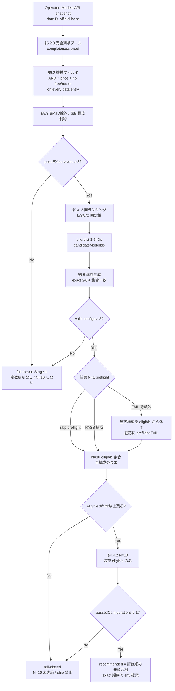
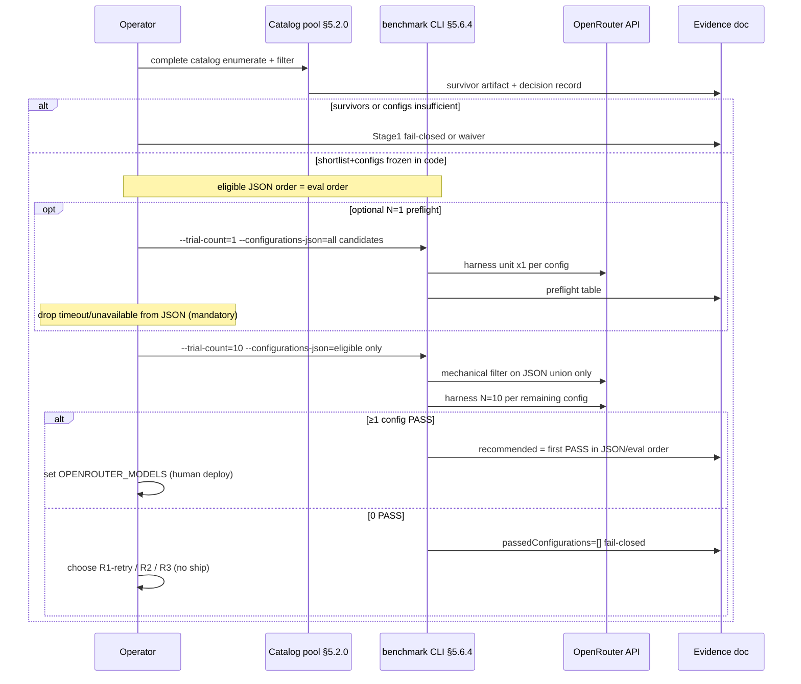

# 改訂案 R1: OpenRouter 候補モデル / exact 構成の差し替え

- 日付: 2026-07-27
- 状態: **Approved**（2026-07-27 人間承認。敵対レビュー REVISE 吸収 + 再レビュー nits N-M1〜4 反映済み・未実装）
- 著者: 設計作業 + 敵対レビュー反映（承認: セッション指示「N-M1〜4 も直してから承認」）
- 敵対レビュー:
  - 一次/二次: `docs/reviews/2026-07-27-r1-candidate-reslist-adversarial-primary.md` /
    `docs/reviews/2026-07-27-r1-candidate-reslist-adversarial-secondary.md`（REVISE）
  - 再レビュー一次/二次: `docs/reviews/2026-07-27-r1-candidate-reslist-adversarial-rereview-primary.md` /
    `docs/reviews/2026-07-27-r1-candidate-reslist-adversarial-rereview-secondary.md`（APPROVE_WITH_NITS → nits 本節で閉鎖）
- 対象設計書: `docs/superpowers/specs/2026-07-26-paid-openrouter-models-design.md`
  （§4.4 shortlist / §4.4.1 / §4.4.2 / §12 Key Decision 5）
- 実装完了ゲート証跡: `docs/bugfix/2026-07-27-plan8-production-gate-evidence.md`（**第4ラウンド**が現行正本）
- 直前 Plan クローズ: `docs/bugfix/2026-07-27-plan8-response-format-revision-closeout.md`
- 直前改訂（実装済み）: `docs/superpowers/specs/2026-07-27-paid-openrouter-response-format-revision-proposal.md`
- テーマ ID: **R1**（closeout §4 P1）。R2（prompt/materialize）、R3（単価上限）とは独立

---

## 1. Overview

Plan 8 の response-format 改訂（root object wire / production-service harness / exact 順序付き構成単位）は **実装完了し main にマージ済み**である。にもかかわらず、承認済み exact 3 構成の live N=10 は **合格 0 / 3** のままである（HEAD `c5d4478`、exit 1）。wire/schema 経路（旧 root `oneOf` による HTTP 400）は既に塞がれており、第4ラウンドの失敗はすべて **production harness 上の品質失敗または repair 時間超過**である。

本改訂案 R1 は、**候補ショートリストと exact 順序付き構成だけ**を差し替え、同じ §4.4.2 ゲート（N=10・20s/送信・50s/単位・repair 最大 1・fresh ledger）で再評価できるようにする。prompt 改訂（R2）や単価上限見直し（R3）は **非目標**。新しい構成が 1 本でも N=10 を通れば、その exact 順序だけを本番 `OPENROUTER_MODELS` に提案する。0 本なら従来どおり ship しない。

選定は **機械的ゲート（カタログ全件フィルタ + EX-*）を決定論的に適用**し、その後 **固定 4 軸での人間ランキング**と **機械検査可能な構成制約**で shortlist / configs を確定する（§3.1 Goal 1）。

---

## 2. Background & Motivation

### 2.1 現状（ロック済み shortlist）

設計 §4.4 とコードが同一の固定値を持つ:

```js
// scripts/benchmark-paid-openrouter-models.mjs
candidateModelIds = [
  "openai/gpt-4.1-nano",
  "meta-llama/llama-3.1-8b-instruct",
  "openai/gpt-oss-120b",
]
paidOpenRouterModelConfigurations = [
  ["openai/gpt-4.1-nano"],
  ["openai/gpt-4.1-nano", "meta-llama/llama-3.1-8b-instruct"],
  ["openai/gpt-4.1-nano", "openai/gpt-oss-120b"],
]
```

同一値は `docs/runbooks/openrouter.md`、設計 §4.4 / §12-5、`scripts/benchmark-paid-openrouter-models.test.mjs` の freeze テストにも複製されている。

### 2.2 第4ラウンド結果（2026-07-27, HEAD `c5d4478`）

| Exact configuration | 失敗 | 観察 |
|---|---|---|
| `["openai/gpt-4.1-nano"]` | unit1 `invalid_ai_response`（~2.9s） | primary 単独。HTTP/wire は通るが app 受理に至らない |
| `["openai/gpt-4.1-nano", "meta-llama/llama-3.1-8b-instruct"]` | unit1 `invalid_ai_response`（primary+repair） | repair まで到達（~13s）しても単位成功にならない |
| `["openai/gpt-4.1-nano", "openai/gpt-oss-120b"]` | unit1 `generation_timeout`（repair ~20s） | primary は速いが repair の oss-120b が 20s 境界で落ちる |

- `passedConfigurations`: なし / `recommendedConfiguration`: null
- 個別 ID 結果の再結合による推奨合成: **禁止・未実施**（正しい no-pass 扱い）
- 本番 `OPENROUTER_MODELS` 確定・デプロイ: **不可**

### 2.3 過去ラウンドからの教訓（R1 選定に使う）

| クラス | 意味 | R1 での扱い |
|--------|------|-------------|
| **A**（旧） | root `oneOf` で OpenAI/Gemini が HTTP 400 | **解消済み**（wire root object）。第4ラウンドは HTTP 200 経路 |
| **B** | 20s 内に envelope 完了しない | **再採用に強い反証**。同一 ID を shortlist に戻すには **新しい** 20s 内完了の closed-code 証跡が必要 |
| **C** | 20s 内だが materialize/validate 失敗 | 単体 ID の初回一発は厳しいが、**2-ID repair 構成**で救済し得る（§4.4.2 の意図）。ただし第4ラウンドの nano+llama は救済できなかった |
| **D**（第4） | primary は速いが repair 相手が 20s を食う | 2-ID 構成の **repair 側にも 20s ヘッドルーム**が必須。`gpt-oss-120b` を repair にする構成は反証済み |

追加の固定事実:

- 第3ラウンド probe: wire + 本番 prompt で `openai/gpt-4.1-nano` は **2.2–2.5s**・schema 適合だが `pantry_name_mismatch` 等で materialize 落ち（品質問題）。
- `openai/gpt-5-nano` は `provider.require_parameters: true` 下で chat **404** → 候補外（ロック維持）。
- Gemini 系は schema 複雑度で 400 のまま → **既定で候補外**（例外再入は **本設計 §16**）。
- 第1ラウンドの `mistralai/mistral-small-3.2-24b-instruct` / `qwen/qwen3-30b-a3b-instruct-2507` 等は 20s abort（クラス B）。
- 第2ラウンドは Models API で AND + ≤$0.50 を満たす **全 40 本**を列挙してから上位を評価した。R1 も同型の **全カタログ機械通過集合**から選ぶ（§5.2.0）。

### 2.4 なぜ R1 が先か

closeout は「同じ 3 構成を根拠なく繰り返して課金する」ことを非推奨としている。wire 経路は直ったのに **モデル/構成が N=10 を満たさない**のが現在の P0 ブロックである。prompt 大改訂（R2）や価格キャップ変更（R3）より、**候補差し替えの方が影響範囲が小さく、既存ゲート実装をそのまま再利用できる**。

---

## 3. Goals & Non-Goals

### 3.1 Goals

1. **選定手続きを固定**する: (a) カタログ全件の **決定論的**機械フィルタ、(b) 決定論的 EX-* 除外、(c) **固定 4 軸での人間ランキング**（同点時の単価タイブレークのみ機械的）、(d) **機械検査可能な**構成制約（長さ・集合一致・件数）。「全ステップが純アルゴリズム」であることは主張しない。
2. shortlist から **exact 順序付き構成（3–6 本）** を生成する **規則**を固定すること（個別 ID 結果の再結合禁止を維持）。
3. コード・設計・runbook・freeze テストの **触る場所リスト**を確定すること。
4. 再ゲートで **0 構成合格**のとき、および **shortlist / 構成を充足できない**ときの fail-closed と次テーマ遷移を明文化すること。
5. 課金抑制のための **任意 N=1 preflight** を定義しつつ、合格基準は **常に N=10** のままにすること。

### 3.2 Non-Goals（本改訂ではやらない）

| ID | 内容 | 理由 |
|----|------|------|
| R2 | 本番 prompt / materialize 整合の大改訂 | 別設計。locked contracts / 利用者向け文言に波及し得る |
| R3 | 単価上限 $0.50/1M の引き上げ | §4.1.7 ロック変更。候補が枯渇した場合の **後続**テーマ |
| — | 20s / 50s / 22s pre-send / repair max 1 の緩和 | 時間ロック。ゲートを通すための緩和は禁止 |
| — | クォータ 3 / 6 / 20 の変更 | 露出抑制ロック |
| — | structured_outputs **OR** response_format への緩和 | AND ロック |
| — | `:free` / router（`openrouter/auto` 等）の再導入 | 有料 allowlist 方針 |
| — | 公式 base 以外での live ゲート | exact `https://openrouter.ai/api/v1` のみ |
| — | 個別 ID 合格結果の再結合で `OPENROUTER_MODELS` を合成 | §4.4.2 明示禁止 |
| — | N=1 preflight 合格だけで ship | N=10 が唯一の合格基準 |
| — | Gemini 系の schema 縮小対応 | 既定スコープ外（**本設計 §16**） |
| — | 有料ベンチの本設計セッション内実行 | 人間承認後・operator 実行 |
| — | `runPaidBenchmark` の推奨構成選定ロジック変更 | 現行コードは評価順の先頭合格を採用。R1 は定数順で好みを表現する（§5.7） |

### 3.3 変更しないロック（Must LOCK）

本改訂の実装・再ゲート中に次を **一切変更しない**:

- クォータ: 成功 3 / attempt 6 / global 20（JST 日）および短期 4/600s
- 時間: per-send 20s、送信前残 22s、単位 50s、repair 最大 1、stale 180s
- 単価: prompt+completion ≤ **$1.00 / 1M**（境界 inclusive、R3 改訂。request/cache 非加算）
- 構造化: `structured_outputs` **AND** `response_format`
- base URL: 公式 exact `https://openrouter.ai/api/v1`
- 禁止: `:free`（実 API）、router ID
- 合格単位: production service harness + fresh ledger + exact 順序付き構成（再結合禁止）
- 構成長: 最大 2 model ID、順序固定
- 証跡: 許可フィールドのみ（API キー・prompt 本文・raw model output 禁止）
- Gemini: 既定候補外

---

## 4. Key Decisions

| # | 決定 | 根拠 |
|---|------|------|
| KD-R1-1 | **R1 の本質は shortlist + exact 構成定数の差し替え**であり、harness / wire / quota / 時間境界の再設計ではない | 第4ラウンド失敗は品質/timeout。実装経路は既に本番相当 |
| KD-R1-2 | **最終 model ID は本 Draft では埋めない**。operator が **新しい Models API スナップショット**を取った日付を証跡に残し、§5 の手続きで shortlist を埋める | 未検証の pricing / `supported_parameters` を発明しない制約。カタログは日次で変わり得る |
| KD-R1-3 | shortlist サイズ **3–5 ID**、exact 構成 **3–6 本**。充足できない場合は **Stage 1 で停止**（§5.8.1） | 課金上限とレビュー可能性。1–2 本のまま N=10 に進まない |
| KD-R1-4 | 2-ID 構成は **primary-first**（速い・安い・ヘッドルーム大を primary） | 初回成功率を上げ attempt 消費を抑える。親設計 §5.2 の「毎回 repair だと attempt 6 ちょうど」を緩和 |
| KD-R1-5 | **第4ラウンドと同一の exact 3 構成は、R1 再ゲートの必須セットに含めない**（任意の対照再測は禁止しないが、推奨しない） | closeout「同じ 3 構成を根拠なく繰り返さない」。学習済み失敗に課金しない |
| KD-R1-6 | クラス B の **closed 既知集合**（§5.3.0）に属する ID は shortlist 不採用。再入は **n≥3**・全サンプルおよび p95 が **elapsedMs &lt; 12_000**・production harness + 公式 base + 現行 `menuResponseFormat` の closed-code 証跡が揃った場合のみ | 20s いっぱいの 1 回成功では再採用しない（A-I1）。本番 timeout ロックを事実上緩めない |
| KD-R1-7 | repair スロット再入（および 2-ID の `configuration[1]` 配置）は、同上の **n≥3 / 全・p95 &lt; 12_000** を満たす ID に限る。満たさない ID は **shortlist に載せてもよいが repair スロット禁止**（§5.3.2） | 第4 oss-120b repair 20005ms。n≥1 は再入閾値として不十分（I-4） |
| KD-R1-8 | N=1 preflight は **任意（推奨）**。preflight で除外した構成は N=10 に入れない。preflight PASS だけでは ship 不可。**eligible 集合と trialCount は R1 必須 CLI/runbook 経路で指定**し、一時的なソース編集は禁止（§5.6.4 / KD-R1-18） | コスト制御と合格基準の分離。I-3 対策 |
| KD-R1-9 | 再ゲートで合格 0 なら **本番 env を更新せず**、R2 / R3 / 別 shortlist ラウンドへ人間判断で遷移する。自動フォールバックなし | 設計全体の fail-closed |
| KD-R1-10 | 証跡フィールドは現行 §4.4.2 / runbook と同一集合に限定する | privacy と secret 非記録 |
| KD-R1-11 | **集合不変条件**: `set(candidateModelIds) === union(paidOpenRouterModelConfigurations の全 member)`。どちらか一方だけの ID は禁止 | ゲートは config union のみを再フィルタする。文書 shortlist と実行対象の乖離を防ぐ |
| KD-R1-12 | **推奨構成 = 評価順で最初に N=10 合格した exact 構成**（現行 `passedConfigurations[0]`）。複数合格時の別タイブレークは R1 で実装しない。好みは **定数配列の順序**で表現する | コード・freeze テストと設計を一致させる |
| KD-R1-13 | **有料 chat 開始前**（preflight 含む）の `hard_limit_covers_est=yes` は **`hard_limit_usd ≥ est_pass_all_usd` のみ**。`est_fail_unit1` は予報用で開始ゲートに使わない。`est_pass_all` は preflight send 上限を含む | $1 vs C=6 full-pass。preflight 課金をゲート外にしない（M-6） |
| KD-R1-14 | Stage 1 カタログ列挙は **本番 chat の 1 MiB / 5s と同一である必要はない**。完全性証明付きの Stage-1 専用予算（ページネーションまたは明示的高 cap）を使い、不完全プールでのランキングを禁止する | I-1。chat body-cap と catalog 列挙のカテゴリ誤りを正す |
| KD-R1-15 | EX を **(A) ID 除外** と **(B) 構成制約** に分離する。repair-slow ID は shortlist 可、`configuration[1]` 配置は機械禁止 | I-2 |
| KD-R1-16 | Stage 1 freeze には **意思決定記録**（L/S/J/C 序数・却下ペア・承認者）を必須とする。ビット一致 shortlist は要求しないがレビュー可能な根拠は要求する | I-5 |
| KD-R1-17 | freeze テストは `set(ids)===union(configs)` に加え、**frozen IDs ⊆ コミット済み survivor 表**を assert する | I-6 |
| KD-R1-18 | R1 live 実行は **eligible 構成集合と trialCount を指定できる必須経路**（CLI フラグまたは env + runbook の one-liner）を PR-R1-2 と同時に用意する。preflight-only も同経路。**一時ソース編集禁止** | I-3 |

---

## 5. Proposed Design

### 5.1 全体フロー



> 注: preflight FAIL で除外した構成は **N=10 に入らない**。`H` から `I2` への直接エッジは無い。N=10 は常に残存 eligible 集合だけを評価する。

### 5.2.0 候補プール構築（snapshot 必須・Stage 1 の入口）

shortlist は **既知 ID の再列挙から始めない**。第2ラウンドと同様、Models API カタログから機械通過集合を作る。

#### 5.2.0.1 完全列挙契約（KD-R1-14・I-1 対策）

**禁止:** 本番 chat / live ベンチの **1 MiB body cap + 5s Models timeout** を「全カタログ取得に足りる」とみなすこと。  
`runPaidBenchmark` が Models API に使う cap は **config union 再フィルタ用**であり、Stage 1 の完全列挙とは役割が違う。

**必須のいずれか（実装・runbook で 1 つを選んで固定）:**

| 方式 | 要件 |
|------|------|
| **A. ページネーション** | Models API のページを `limit`/`offset` または `links.next` 相当で回し、各ページ body ≤ Stage-1 ページ cap（既定 1 MiB 可）。**全ページ取得完了**までループ。終了条件を証跡に書く（例: 空 `data` / next なし / `total_count` 一致） |
| **B. Stage-1 専用高予算 1 発取得** | offline ツールのみ **time budget ≥ 60s** かつ **byte cap ≥ 8 MiB**（数値は runbook に固定。本番 `OPENROUTER_MAX_BODY_BYTES` は変更しない）。応答が cap 超過または timeout なら **fail-closed**（部分 JSON で進めない） |

**完全性証明（いずれか 1 つ以上を証跡に残す）:**

- API が `total_count` / 同等を返す場合: `len(all_entries) === total_count`
- ページネーション: 最終ページが空 or next なし、かつ前ページが non-empty の連鎖が記録されている
- 方式 B: 単一応答が cap 内で完了し、parse 後 `data` が配列であること + `entry_count` を記録

**fail-closed（不完全プール）:** 完全性を証明できない、HTTP 非 OK、JSON 不正、timeout、byte cap 超過 → **ランキングも N=10 も行わない**（§5.8.1）。別ツールの「だいたい全件」で補完して「§5.2.0 準拠」と称してはならない。

#### 5.2.0.2 手順

1. スナップショット日 **D**（UTC）と列挙方式（A/B）を証跡に記録する。
2. 公式 base `https://openrouter.ai/api/v1` で text models を **完全列挙**する（§5.2.0.1）。  
   - Authorization: 有料キー（値は証跡に書かない）  
   - URL パスは少なくとも `models?output_modalities=text` を含む（ページネーション query は方式 A で追加可）
3. 結合後の **全 entry** の `id` について §5.2 の機械規則を適用する。  
   - 実装再利用: `evaluateMechanicalFilter` / `filterCandidatesMechanically`  
   - **live ゲート**は現状どおり **frozen configs の union だけ**を再フィルタする。
4. コミット可能な survivor 成果物を作る（KD-R1-17）:
   - パス例: `docs/bugfix/artifacts/r1-models-snapshot-D.json`（または同等の tracked 表）  
   - 必須フィールド: `snapshotDate`, `enumerationMethod`, `entryCount`, `completenessProof`, `survivors[]`（`id`, `promptPlusCompletionUsdPerMillion`）, `mechanicalExclusions[]`（`id`, `reason`）  
   - 任意: `models_response_sha256`（生 body はコミットしない。ハッシュのみ可）  
   - **生の models 全 body・キー・無制限 error text はコミットしない**
5. survivor 集合だけを §5.3 と §5.4 に渡す。**survivor に無い ID を shortlist に発明してはならない。**

Stage 1 用の小さな列挙スクリプトを `scripts/` に追加してよい（PR-R1-2 と同梱推奨）。手作業でも §5.2.0.1 の完全性証明を満たせばよい。

### 5.2 機械フィルタ（§4.4.1 と `evaluateMechanicalFilter` と同一）

§5.2.0 で得た各 ID について **即除外**:

1. 空 ID
2. `:free` 終端
3. router 集合（少なくとも `openrouter/auto` / `openrouter/free` / `openrouter/auto-beta`）
4. Models API に不在
5. `supported_parameters` に `structured_outputs` または `response_format` 欠落（**AND**）
6. `pricing.prompt` / `pricing.completion` 欠落・非数値・負、または和 > $1.00/1M（**ちょうど 1.00 は可**・R3）

除外理由は証跡に残す（ID + reason のみ。生 body 全体の無制限貼付はしない）。

**ゲート日の再検証:** 定数凍結後に `runPaidBenchmark` を走らせると、**config union のみ**が同じ機械規則で再フィルタされる（現行 L279–312）。member が 1 つでも落ちた構成は chat しない。選定時 survivor とゲート日カタログがずれて全滅した場合も ship しない。

### 5.3 事前除外（KD-R1-15）— ID 除外と構成制約を分離

機械フィルタ通過後に適用する。**pricing は捏造しない**。表の例示 ID は過去証跡の参照であり、再スナップショットで不在なら機械フィルタが最終決定する。

#### 5.3.0 closed「既知クラス B」集合（M-4 / A-I1）

次の **閉集合**を EX-B の対象とする（例示ではなく規範リスト。追加は証跡ラウンドで明示改訂）:

1. `deepseek/deepseek-v4-flash`
2. `qwen/qwen3.5-flash-02-23`
3. `z-ai/glm-4.7-flash`
4. `mistralai/mistral-small-3.2-24b-instruct`
5. `qwen/qwen3-30b-a3b-instruct-2507`

証跡に **20s abort / `invalid_json_envelope` 打ち切り**が記録された他 ID を追加するときは、本節のリスト改訂として設計 PR に含める。

#### 5.3.0b closed「EX-404」集合（N-M1 と対）

1. `openai/gpt-5-nano`

`require_parameters: true` 下 chat 404 が証跡に残った他 ID を追加するときは、本節のリスト改訂として設計 PR に含める。

#### 5.3.0c closed「CFG-REPAIR-SLOW」集合（N-M2）

2-ID の `configuration[1]` に置いてはならない ID の **閉集合**:

1. `openai/gpt-oss-120b`（第4ラウンド repair `generation_timeout` / elapsedMs 20005）

plan8 / R1 証跡で repair 送信が 20s 境界 fail した他 ID を追加するときは、本節のリスト改訂として設計 PR に含める。freeze テストは本集合を fixture として読む。

#### 5.3.1 表 A — ID 除外（shortlist に載せない）

| 規則 | 対象 | 再入条件（すべて必須） |
|------|------|------------------------|
| EX-B | §5.3.0 の closed 集合 | production harness + 公式 base + 現行 wire で closed-code 単体送信 **n≥3**。**全サンプルおよび p95** が `elapsedMs &lt; 12_000`。生出力は残さない |
| EX-404 | `require_parameters: true` 下 chat 404（§5.3.0b closed 集合） | 同条件で HTTP 200 の closed-code 証跡 **n≥3**（全試行 200。生 body は残さない）。EX-B とサンプル数を揃える（N-M1） |
| EX-GEM | `id` が `google/gemini` で始まる、または証跡上 Gemini 系として除外済みの ID | **本設計 §16** をすべて満たす別メモ承認 |

#### 5.3.2 表 B — 構成制約（shortlist 可・配置制限）

| 規則 | 意味 | 機械検査 |
|------|------|----------|
| CFG-REPAIR-SLOW | §5.3.0c の closed 集合に属する ID | **shortlist に載せてよい**。**どの 2-ID 構成でも `configuration[1]` にしてはならない**（freeze assert）。単独 primary `[id]` は可。再入して repair 可にするには KD-R1-7 と同じ n≥3 / 全・p95 &lt; 12_000 証跡のうえ **§5.3.0c から ID を外す設計 PR** |
| CFG-R4-EXACT | 第4ラウンドと **同一の exact 3 配列** | **必須セットに含めない**（任意対照は推奨しない）。freeze 時に必須配列として混入させない |

> 以前の「EX-R4-REPAIR-SLOW = shortlist に載せない」読解は **誤り**。表 A と表 B を混同しない（I-2）。

### 5.4 人間ランキング基準（post-EX survivors → shortlist 3–5）

**この段階は人間判断である。** 機械が保証するのは入力が post-EX survivor であること、出力件数が 3–5、同点時に単価和が安い方を上位にすること、および証跡フィールドが揃っていることだけである。

operator（または設計承認者）が次の **4 軸**で順位付けし、上位 3–5 を `candidateModelIds` とする。スコアは整数の簡易順位でよい（厳密な重み付けアルゴリズムは必須としない）。**同点時は単価和が安い方を上位**（このタイブレークのみ機械的）。

| 軸 | 望ましい方向 | 判定材料（許可される情報のみ） |
|----|--------------|--------------------------------|
| **L — Latency headroom** | 20s に対し余裕 | 過去 closed elapsed、provider 公開の典型レイテンシ（参考）、同一 family の過去失敗クラス。**未計測 ID は「未知」として中位**にし、N=1 preflight で落とす |
| **S — Structured-output reliability** | root object wire + `require_parameters` で 200 になりやすい | 過去 HTTP 200 証跡、OpenAI strict 互換の実績、第3ラウンド probe |
| **J — Japanese / menu-ish instruction following** | pantry 名単位・ref 整合に強い | 過去 materialize 失敗コードの傾向（`duplicate_ref` / `pantry_*` が頻出する ID は J を下げる）。raw output は読まない |
| **C — Cost within cap** | 単価和が安い | Models API の prompt+completion 和（スナップショット D の値のみ） |

**ランキング出力 = 意思決定記録（証跡必須・KD-R1-16 / I-5）:**

ビット一致 shortlist は要求しない。次の **レビュー可能な記録**は必須:

| フィールド | 内容 |
|------------|------|
| `snapshotDate` | UTC |
| `survivorArtifactPath` | §5.2.0.2 のコミット成果物パス |
| `mechanicalExclusions` | id + reason |
| `exIdRulesApplied` | 表 A で落とした id + 規則 ID |
| `exConfigRulesApplied` | 表 B 適用メモ（repair-slow 集合など） |
| `rankingTable` | 各 post-EX survivor について L/S/J/C を **1..n の序数**（同点は単価で機械解消後の最終順位） |
| `axisNotes` | 各軸 1 行（秘密なし・raw 出力なし） |
| `shortlistFinal` | 順序付き 3–5 ID |
| `rejectedFromShortlist` | 落とされた survivor と 1 行理由 |
| `pairCandidatesConsidered` | 検討した 2-ID と採用/却下コード（例: `adopt` / `reject_r4_identical` / `reject_repair_slow_slot` / `reject_j_low`） |
| `approver` | freeze を承認する人名またはロール |
| `disagreementNote` | 複数 operator が割れた場合の最終決定者（無ければ `none`） |

post-EX survivors が **3 未満**の場合は §5.8.1 で停止し、shortlist を無理に埋めない。

#### 5.4.1 暫定ヒント（確定 shortlist ではない）

過去証跡に **接地した観察**のみ。実装定数への転記は **禁止**（スナップショット後の手続き完了まで）:

| 観察 | 含意 |
|------|------|
| `openai/gpt-4.1-nano` は wire 後 ~2.5–3s と L 軸で優秀だが、第4 で単独/primary とも app 受理せず | **L/S は高いが J は低い**。primary 候補として残すなら **repair 相手の J が十分高い** 2-ID が前提。第4 の llama repair では不足だった |
| `meta-llama/llama-3.1-8b-instruct` は ~11s で L は可、J は `duplicate_ref` 履歴 | repair または単独の候補余地はあるが、**nano primary との組は第4 で失敗済み** → 同一 exact は再必須化しない |
| `openai/gpt-oss-120b` は repair スロットで 20s timeout | **repair 不適**（CFG-REPAIR-SLOW）。shortlist 単独 primary は可だが L 軸は厳しい |
| 第2 の flash 帯（deepseek / qwen3.5 / glm）はクラス B | 新証跡なしでは不採用 |

**新しい**機械通過 ID（過去ラウンド未評価）を shortlist に入れることを **積極的に許容する**。それが R1 の主戦場である。未評価 ID は L/J が「未知」のため、§5.6 の N=1 preflight を **強く推奨**する（必須化は Open Q #2。I-7 は Minor として任意維持）。

### 5.5 exact 構成の生成規則

shortlist を順位付き配列 `S[1..k]`（k∈[3,5]）とする。`S[1]` が総合最優先。  
**評価順の先にある構成ほど、複数合格時に `recommendedConfiguration` になりやすい**（§5.7）。operator は好みの構成を配列前方に置く。

#### 5.5.1 不変条件（規範・定数 PR で必須）

各構成:

- 長さ 1 または 2
- 要素はすべて shortlist（`candidateModelIds`）に含まれる
- 要素に重複なし
- 順序は **評価対象そのもの**（並べ替えは別構成）
- **CFG-REPAIR-SLOW:** 長さ 2 のとき `configuration[1]` は repair-slow 集合に属してはならない（§5.3.2）。freeze テストで assert

構成集合全体:

- 件数 **3–6 本**
- 第4ラウンドと同一の exact 配列は **必須セットに含めない**
- **集合一致（KD-R1-11）:**
  - `set(candidateModelIds) === union(全 configuration の members)`
  - shortlist の各 ID は **少なくとも 1 構成**に現れ、構成の各 member は shortlist に含まれる
- **survivors 包含（KD-R1-17）:**
  - `set(candidateModelIds) ⊆ set(survivorArtifact.survivors[].id)`
  - freeze テストはコミット済み survivor 成果物（またはそこから生成した frozen fixture）を読み、包含を assert する

#### 5.5.2 生成手順（人間が表を埋め、制約は機械検査）

ステップ (1)(2) は **人間が表を完成**させる作業である。ステップ (3) 以降と §5.5.1 は機械検査可能。

```
configs = []

// (1) 人間: 単独 primary 候補
//     L 軸が「高」の ID について最大 2 本まで single-ID を入れる。
//     すべての ID を単独必須にはしない。
for id in human_pick_singles(S, limit=2):
  configs.append([id])

// (2) 人間: 2-ID repair 対
//     primary = L が高く C が良い ID
//     repair  = J が期待できる別 ID かつ CFG-REPAIR-SLOW 非該当（configuration[1] 禁止集合）
//     順序は常に [primary, repair]
//     最大 4 本。配列全体として一意。
for p in human_pick_pairs(S):
  configs.append([p.primary, p.repair])

// (3) 機械検査: 件数 3..6。超過なら順位の低いものから落とす（落とす対象は人間が指定）。
// (4) 機械検査: 第4 identical 配列が混入していたら除去。
// (5) 機械検査: set(S) === union(configs)。不一致なら Stage 1 fail-closed（短list から未使用 ID を削るか、構成を足す）。
```

**明示:**

- すべての shortlist ID を primary にする必要はない。
- **未使用 shortlist ID は残さない**（KD-R1-11）。以前の「望ましい」から **規範**に格上げ。
- 単独構成と 2-ID 構成の **両方を検討する**（どちらか一方のみは、根拠を証跡に残した場合のみ可。ただし件数 ≥3 と集合一致は維持）。

#### 5.5.3 プレースホルダ（スナップショット後に埋める表）

実装 PR に入る直前の設計改訂 PR で、次の表を **具体 ID で埋める**:

| # | `candidateModelIds`（順序） | 単価和 (snapshot D) | L/S/J/C 要約 |
|---|----------------------------|---------------------|--------------|
| 1 | _TBD after snapshot D_ | _TBD_ | _TBD_ |
| … | | | |

| # | Exact configuration | 種別 | 選定理由（1 行） |
|---|---------------------|------|------------------|
| 1 | `["…"]` | single / pair | _TBD_ |
| … | | | |

この表が空のまま、または §5.5.1 不変条件を満たさないままコード定数を更新する PR は **レビュー reject** とする。

### 5.6 任意の安価 preflight（N=1）と eligible 実行経路（KD-R1-18 / I-3）

#### 5.6.1 目的

N=10 フルランの前に、明らかに無理な構成（即 timeout / HTTP 非 200 / 即 invalid）を **1 単位**で落とし、クレジットを節約する。

#### 5.6.2 方法

- 既存 production harness の **1 単位**（`trialCount=1`）を **eligible 予定の exact 構成ごと**に実行。
- 記録してよいのは現行証跡と同じ closed フィールドのみ。
- **合格判定に使わない**。preflight PASS ≠ ship。

#### 5.6.3 運用規則

| preflight 結果 | N=10 への扱い（**preflight を実施した場合の規範**・N-M3） |
|----------------|---------------|
| `generation_timeout` / `model_unavailable`（接続・404 系） | 当該構成を N=10 **対象外にすることが必須**。eligible JSON から外し、N=10 ループに入れない |
| `invalid_ai_response` / materialize 系 closed code | **対象外にしてもよいが必須ではない**。J 軸未知の新規 ID では 1 回の失敗で捨てすぎるリスクがあるため、operator 判断で N=10 に進めてよい（判断を意思決定記録に 1 行残す） |
| PASS | **必ず N=10 を実行**して初めて合格判定 |

- preflight 自体をスキップして直接 N=10 に入ることは **許容**（Open Q #2 / I-7）。スキップ時は上表の「必須除外」は適用されない。
- **preflight を 1 構成でも走らせたラウンド**では、timeout / unavailable の除外を怠って N=10 に入れることは **手続き違反**（結果を ship 判断に使わない）。
- preflight で全構成を対象外にした場合、N=10 は実行せず §5.8 fail-closed（合格 0 相当）。
- **禁止:** preflight 結果を無視して「いつもの」`main` 全構成 N=10 を流し、設計上の eligible 集合と食い違うこと。

#### 5.6.4 必須の operator 実行経路（R1 必須・一時ソース編集禁止）

現状の `main()` は常に `paidOpenRouterModelConfigurations` と `trialCount=10` を使う。R1 では次を **PR-R1-2 と同時**に用意する（「任意 polish」ではない）:

**CLI（推奨・規範的インターフェース）:**

```bash
# preflight（trialCount=1）。eligible は JSON 配列の配列。
docker compose run --rm --no-deps app node scripts/benchmark-paid-openrouter-models.mjs   --trial-count=1   --configurations-json='[["model-a"],["model-a","model-b"]]'

# N=10。preflight 除外後の eligible のみを渡す（空なら実行しない）。
docker compose run --rm --no-deps app node scripts/benchmark-paid-openrouter-models.mjs   --trial-count=10   --configurations-json='[["model-a","model-b"]]'
```

代替: 同一意味の env（例: `PAID_BENCH_TRIAL_COUNT` / `PAID_BENCH_CONFIGURATIONS_JSON`）でもよいが、**runbook に one-liner を 1 本**固定する。

**意味論:**

- フラグ未指定時の既定は現行どおり **frozen 全構成・trialCount=10**（後方互換）。
- フラグ指定時は `runPaidBenchmark({ configurations, trialCount })` に渡す。機械フィルタは渡した union のみ。
- **C 削減**（§8.1）も同じ `--configurations-json` で表現する。定数ファイルを一時編集して減らすことは **禁止**。
- preflight / N=10 いずれの有料実行前にも §8.1 の hard-limit ゲートを通す（preflight のみでも `est_pass_all` に preflight send を含めた式で yes が必要。N=10 前に再計算）。

preflight 結果は証跡の「R1 ラウンド」節に表で残す。

### 5.7 本ゲート（N=10）

§4.4.2 の合格条件（harness・時間境界・10/10・再結合禁止）を **緩めない**。

**推奨構成の選定（現行コードと一致・R1 で変更しない）:**

- `runPaidBenchmark` は合格した構成を評価順に `passedConfigurations` へ積み、
  `recommendedConfiguration = passedConfigurations[0] ?? null` とする
  （`scripts/benchmark-paid-openrouter-models.mjs`）。
- すなわち **`runPaidBenchmark` に渡した `configurations` 配列の順序**で最初に N=10 合格した exact 構成が推奨になる（`passedConfigurations[0]`）。
- フラグ未指定時はその配列 = frozen `paidOpenRouterModelConfigurations`。CLI 使用時は **`--configurations-json` の配列順 = 評価順 = 推奨タイブレーク**（runbook に明記。N-M4）。
- `firstAttemptSuccesses` は証跡・選定材料として記録するが、**推奨選定アルゴリズムには使わない**（現行どおり）。
- 複数構成を通したい / 特定構成を推奨したい場合は、**JSON / 定数配列の前方にその構成を置く**（operator の Stage 1 責任）。N=10 実行後に人手で並べ替えて推奨を合成してはならない。

**その他（変更なし）:**

- production service harness / fresh ledger / primary+repair
- 20s / 22s / 50s / repair max 1
- 10/10 単位成功のみ合格
- 失敗単位で打ち切り（現行 `runConfigurationGate`）
- 合格 exact 構成だけを順序不変で `OPENROUTER_MODELS` 提案

### 5.8 Fail-closed

#### 5.8.1 Stage 1（選定）で停止する場合 — 有料 N 実行前

次のいずれかなら **定数更新 PR を出さない・preflight/N=10 を走らせない**:

| 条件 | 記録すること | 次の人間判断 |
|------|--------------|--------------|
| カタログ列挙失敗（非 OK / timeout / byte cap / JSON 不正 / 完全性証明不可） | 方式 A/B、エラー種別（秘密なし） | 方式変更・再 snapshot。部分プールで強行しない |
| post-EX survivors &lt; 3 | survivor 成果物、表 A 除外 | R1-retry、**R3**、または明示 waiver |
| 意思決定記録（§5.4）欠落 | — | 記録完成まで停止 |
| 人間ランキング後に 3–5 の shortlist を正当化できない | 記録 + 拒否理由 | 同上 |
| 生成後の valid exact configs &lt; 3、集合一致不可、repair-slow を `configuration[1]` に配置、survivors 包含違反 | 試みた構成表 | shortlist 見直し、R3、waiver |
| `hard_limit_covers_est=no`（§8.1） | コスト行 | limit 引上げまたは C 削減（CLI で eligible を狭める） |

**明示 waiver（例外）:** survivors または configs が 3 未満のまま進めたい場合は、証跡に `cardinality_waiver: true` と理由・承認者を書き、**そのラウンド限定**で 1–2 構成の N=10 を許す。waiver なしの黙認は禁止。waiver しても N=10 不合格なら ship しない（通常の §5.8.2）。

#### 5.8.2 N=10 後も 0 合格

1. スクリプト exit non-zero（現行維持）。
2. `recommendedConfiguration = null`。README / runbook の本番例を **合格構成で更新しない**（不合格 ID を例示のまま残す場合は「未検証・使用禁止」注記を維持）。
3. 本番 Netlify env を変更しない。デプロイしない。
4. **同じ shortlist を根拠なく再実行しない**（クレジット保護）。再実行は (a) Models API カタログ変化、(b) harness バグ修正、(c) R2/R3 完了、のいずれかが証跡で示せるときに限る。
5. 人間が次を選ぶ:
   - **R1 再ラウンド**: 別 shortlist（§5 手続きを最初から）
   - **R2**: prompt / materialize 整合
   - **R3**: 単価上限見直しで候補帯拡大
   - **R4**: closed 診断粒度の追加（合否に使わない）
6. 自動で free や router にフォールバックしない。



---

## 6. API / Interface Changes

**ランタイム API・Zod 契約・OpenRouter リクエスト形・推奨選定ロジックは変更しない**（KD-R1-12）。

変更するのは **評価対象定数・Stage 1 成果物・operator CLI・freeze テスト / 文書**。

| シンボル / 面 | ファイル | 変更 |
|---------------|----------|------|
| `candidateModelIds` | `scripts/benchmark-paid-openrouter-models.mjs` | 新 shortlist 3–5 |
| `paidOpenRouterModelConfigurations` | 同上 | 新 exact 3–6 構成 |
| CLI | 同上 `main` | **必須:** `--trial-count` / `--configurations-json`（または同等 env）。未指定時は現行既定 |
| freeze テスト | `scripts/benchmark-paid-openrouter-models.test.mjs` | 配列 deepEqual + set 相等 + **survivors 包含** + repair-slow が `configuration[1]` にいないこと |
| survivor 成果物 | `docs/bugfix/artifacts/`（例） | snapshot D の closed survivor 表 |
| 設計本文 | 親設計 §4.4 / §4.4.2 / §12-5 | 具体 shortlist 反映時 |
| ランブック | `docs/runbooks/openrouter.md` | 候補・構成・**CLI one-liner**・列挙方式。推奨 env は N=10 合格後のみ |
| harness テスト fixture ID | harness tests | 「本番推奨」意味がなければ必須変更ではない |

**変更しない:**

- `parseOpenRouterModels` / `verify-openrouter-models.mjs` の規則
- `openrouter.ts` の 20s 単調時計・wire adapter
- `paid-openrouter-benchmark-harness.ts` の単位意味論
- `recommendedConfiguration = passedConfigurations[0]` の意味論
- クォータ SQL / preflight exact 3/6/20
- `menuResponseFormat` / prompt 本文

**live ゲートと shortlist の関係（文書化）:**

- ゲート実行時の機械フィルタ対象 = `union(paidOpenRouterModelConfigurations)` のみ
- `candidateModelIds` は設計・runbook・freeze 用の正本 shortlist であり、集合相等不変条件により config union と一致する

---

## 7. Data Model Changes

なし。DB マイグレーション、RLS、privacy version、quota テーブルは対象外。

---

## 8. Security & Privacy Considerations

| 項目 | 扱い |
|------|------|
| API キー | 証跡・コミット・ログに出さない（現行） |
| prompt / raw model output | 証跡禁止（現行） |
| closed failure codes | 既存列挙のみ |
| hard limit | operator がキー total credit hard limit を設定（過去ゲート例: **$1**）。R1 再実行前に再確認 |
| 課金 | 下記 §8.1 チェックリストで **full-pass 上限**を見積り、**hard limit ≥ est_pass_all_usd** を証跡で yes にしてから N=10 を開始する（fail-closed） |
| PII | ベンチ固定 context は非 PII（現行 harness）。変更しない |

### 8.1 実行前コストチェックリスト（必須・fail-closed）

親設計 §6.3 の概算帯（おおよそ **$0.001–0.01 / 生成単位**）を使う。厳密な token 課金計算はアプリ責務外。  
**有料 chat（preflight および N=10）開始の可否は optimistic 見積ではなく、full-pass 上限見積で判定する。**  
preflight だけ先に走らせて hard-limit ゲートを後回しにしない（M-6）。

| 記号 | 定義 |
|------|------|
| `C` | N=10 対象の exact 構成数（preflight 除外後、1–6） |
| `P` | preflight を実施する構成数（0–C₀、C₀ は preflight 前の構成数） |
| `S_fail_unit1` | 全構成が unit1 で落ちる場合の最大 send 数。2-ID は primary+repair で構成あたり最大 2、single-ID は 1 → 合計は構成ごとに足す |
| `S_pass_all` | 全構成が 10/10 かつ **毎回 repair** の最悪 send 数。2-ID は `C × 10 × 2`、single-ID のみなら `C × 10 × 1`（混在時は構成ごとに計算して和） |
| `S_preflight` | preflight の最大 send 数。各構成 1 単位・repair あり得るなら構成あたり最大 2 → 保守的に `P × 2` |
| `U_hi` | 単価上限バンド **$0.01 / send**（親 §6.3 の高側を send 近似に流用。より保守的にするなら operator が上げてよい） |

**二系統の見積（両方を証跡に記録する）:**

| 名前 | 式 | 用途 |
|------|-----|------|
| `est_fail_unit1_usd` | `(S_preflight + S_fail_unit1) × U_hi` | **運用予報のみ**（多くは unit1 打ち切り）。N=10 開始ゲートには使わない |
| `est_pass_all_usd` | `(S_preflight + S_pass_all) × U_hi` | **hard limit 比較用の上限**。部分成功や全通でもキーを使い切らないことの必要条件 |

**有料実行開始ゲート（fail-closed・規範）:**

1. 予定する `C`（N=10 対象）と `P`（preflight 対象）を決め、上表で両見積を計算する。  
   - preflight のみ先行する場合: 当面の `est_pass_all` は少なくとも `S_preflight` 分を含み、**その実行前**に yes が必要。続けて N=10 するなら N=10 前に **再計算**する。
2. キーの `hard_limit_usd` を operator が確認する（キー秘密は書かず金額のみ可。過去例 $1）。
3. **`hard_limit_covers_est = yes` の定義は唯一:**  
   `hard_limit_usd ≥ est_pass_all_usd`  
   - `est_fail_unit1_usd` だけを見て yes にしてはならない。  
   - 中間見積でゲートを緩めることも禁止。
4. `hard_limit_covers_est = no` のまま **preflight も N=10 も開始しない**。次のいずれかで yes になるまで止める:
   - **hard limit を上げる**（例: $1 → $2）、または
   - **`C`/`P` を減らす**（`--configurations-json` で後方構成を外す。残す集合は KD-R1-11 を再確認。ソース一時編集禁止）、または
   - preflight 後に eligible が減り再計算で yes になる（その preflight 自体が step 1–3 を満たしていること）。
5. 証跡必須行（各有料実行バッチ開始前）:

```
hard_limit_usd=<n>; C=<n>; P=<n>; U_hi=0.01;
est_fail_unit1_usd=<x>; est_pass_all_usd=<y>;
hard_limit_covers_est=yes|no
```

`hard_limit_covers_est=no` の証跡のまま preflight / N=10 を走らせた場合、その実行は **手続き違反**（結果の合否に関わらず ship 判断材料にしない。必要なら hard limit 確保後に再実行）。

**数値例（参考・非規範、すべて 2-ID・preflight なし・U_hi=$0.01）:**

| C | S_fail_unit1 | S_pass_all | est_fail_unit1 | est_pass_all | hard limit $1 で covers? |
|---|-------------:|-----------:|---------------:|-------------:|--------------------------|
| 3 | 6 | 60 | $0.06 | **$0.60** | **yes** |
| 5 | 10 | 100 | $0.10 | **$1.00** | **yes**（境界） |
| 6 | 12 | 120 | $0.12 | **$1.20** | **no** → C≤5 に減らすか limit ≥ $1.20 へ |

過去ゲートの hard limit **$1** のまま C=6 全 2-ID を走らせることは、上表どおり **開始不可**。C=6 を維持するなら limit を上げる。

---

## 9. Observability

- ベンチ stdout の JSON 行（構成・unit・outcome・failureCodes・sends・elapsed）を現行どおり利用。
- 証跡ドキュメント更新パス:
  - 追記先: `docs/bugfix/2026-07-27-plan8-production-gate-evidence.md` に **「R1 ラウンド」** 節を追加（第4 を上書きしない）。
  - 必須: snapshotDate、列挙方式と完全性証明、survivor 成果物パス、表 A/B 適用、§5.4 意思決定記録、exact 構成表、集合一致・survivors 包含・repair-slot 禁止の確認、cardinality_waiver（ある場合）、§8.1 コスト行（両見積 + pass_all 基準の covers）、preflight 表（実施時）と **実際に渡した `--configurations-json`**、N=10 結果、exit code、`passedConfigurations` / `recommendedConfiguration`、hard limit 金額（キー値なし）。
- アプリ本番メトリクス変更はなし。

---

## 10. Code / Doc Touch List（実装チェックリスト）

承認後の実装で触る／更新する場所:

1. **定数 + CLI（PR-R1-2 必須）**
   - [ ] `scripts/benchmark-paid-openrouter-models.mjs` — `candidateModelIds`, `paidOpenRouterModelConfigurations`
   - [ ] 同 — `--trial-count` / `--configurations-json`（または同等 env）を `main` に配線
2. **freeze / 契約テスト**
   - [ ] `scripts/benchmark-paid-openrouter-models.test.mjs` — 配列 deepEqual + set 相等 + survivors 包含 + repair-slow 非 `configuration[1]` + CLI 引数の単位テスト
3. **Stage 1 成果物**
   - [ ] survivor artifact パスと freeze の読取契約
   - [ ] （推奨）catalog 完全列挙ヘルパ script
4. **設計**
   - [ ] 親設計 §4.4 / §4.4.2 / §12-5 / 改訂履歴
5. **ランブック**
   - [ ] 候補・構成リスト、列挙方式、**CLI one-liner**、hard-limit チェック。推奨 env は合格後のみ
6. **証跡**
   - [ ] production-gate-evidence に R1 ラウンド + 意思決定記録
7. **README**
   - [ ] N=10 合格後のみ exact 置換
8. **実装 Plan**
   - [ ] SuperPowers plan（§13）

### 10.1 検証コマンド（定数 PR 後・Docker・1 コマンドずつ）

```bash
docker compose run --rm --no-deps app node --test scripts/benchmark-paid-openrouter-models.test.mjs
docker compose run --rm --no-deps app npm run typecheck
docker compose run --rm --no-deps app npm run lint
docker compose run --rm --no-deps app npm run format:check
```

有料ゲートは runbook の one-liner（§5.6.4）のみ。キーをログに出さない。

**意図的に触らない:**

- `shared/contracts/**`（R2 でない限り）
- `generation-prompt.ts` / materializer（R2）
- `maxPromptPlusCompletionUsdPerMillion`（R3）
- 本番 chat の `OPENROUTER_MAX_BODY_BYTES` / `modelsApiTimeoutMs` を Stage 1 のために緩めること（Stage 1 は別予算）
- SQL quota / privacy version
- `recommendedConfiguration` 選定コード（KD-R1-12）

---

## 11. Alternatives Considered

### 代替 A — 現行 3 構成をそのまま再 N=10

- 利点: 差分ゼロ
- 欠点: 第4 で 0/3。closeout が明示的に非推奨。**採用しない**

### 代替 B — 個別 ID を N=10 し、合格 ID を後から 2 本に組み合わせる

- 利点: 組み合わせ探索が広い
- 欠点: §4.4.2 が禁止。repair 除外規則付きの exact 順序挙動を証明できない。**採用しない**

### 代替 C — 時間 20s/50s を緩めて現行モデルを通す

- 利点: 一時的にゲート通過しやすく見える
- 欠点: 本番 `OPENROUTER_TIMEOUT_MS` と乖離し、実ユーザーも timeout。ロック違反。**採用しない**

### 代替 D — 先に R2（prompt）だけやる

- 利点: 品質失敗の根に近い可能性
- 欠点: locked 文言・materialize 契約に波及しレビューが重い。現行 shortlist の L 軸問題（oss-120b repair timeout）は prompt では直らない。**R1 と独立。本設計の主経路にはしない**（0 合格後の候補）

### 代替 E — 先に R3（単価キャップ引き上げ）

- 利点: 上位モデル帯へアクセス
- 欠点: コスト方針の再決定が必要。キャップ内未評価 ID がまだ残る可能性。**枯渇時の後続**（§5.8.1 で survivors &lt;3 のとき有力）

### 代替 F — 本設計（プール構築 + 手続き + 新 shortlist + exact 構成）← **採用**

- 利点: ロックを維持したまま探索空間を更新。既存ベンチ資産を再利用。課金は preflight で抑制可能
- 欠点: 新 ID でも J 軸不足なら再び 0 合格 → R2/R3 へ。保証はない（§15）

### 代替 G — 複数合格時に primary_success で推奨を並べ替え（コード変更）

- 利点: 初回成功率の高い構成を自動推奨
- 欠点: ベンチ/テスト/設計の変更範囲が広がる。R1 の本質（定数差し替え）から外れる。**採用しない**。好みは評価順で表現（KD-R1-12）

---

## 12. Rollout Plan

| 段階 | 内容 | 完了条件 |
|------|------|----------|
| 0 | 本改訂稿の人間承認 | 承認コメント（敵対指摘吸収を確認） |
| 1 | Operator: 完全列挙 snapshot D + 意思決定記録 + 構成表 | survivor 成果物、記録、shortlist 3–5、構成 3–6、集合一致・repair-slot・survivors 包含、§8.1 yes または §5.8.1 停止/waiver |
| 2 | **PR-R1-1+2**（設計反映 + 定数 + freeze + **CLI** + runbook one-liner） | レビュー + §10.1 テスト緑。CLI 無しは reject |
| 3 | （任意）N=1 preflight — **eligible CLI のみ** | 表と実際の JSON を証跡へ |
| 4 | N=10 live — **eligible CLI のみ** | exit 0 かつ ≥1 PASS、または exit 1 で fail-closed 証跡 |
| 5 | PASS 時のみ: README / runbook 推奨 env を exact 置換 + 人間承認デプロイ | ship。FAIL 時は段階 5 に進まない |

**ロールバック:** env を触っていなければロールバック不要。誤って未合格構成を env に載せた場合は直前の mock または前回合格構成へ戻し再デプロイ。

**フィーチャーフラグ:** なし。ゲート不合格なら有料本番を有効化しないだけ。

---

## 13. PR Plan（順序付き・独立レビュー可能）

| PR | 内容 | レビュー観点 | 依存 |
|----|------|--------------|------|
| **PR-R1-0**（文書） | 本改訂案 + 敵対レビュー記録を docs に配置し closeout からリンク | スコープが R1、ロック未緩和、敵対指摘の吸収 | 人間承認 |
| **PR-R1-1+2**（統合推奨） | snapshot D の shortlist/構成を親設計・runbook に反映 + コード定数 + freeze（set 相等・survivors 包含・repair-slot）+ **CLI `--trial-count` / `--configurations-json`** + runbook one-liner。**推奨 env の合格置換は含めない** | 手続き遵守、意思決定記録、3–5/3–6、再結合なし、CLI 必須 | snapshot + 意思決定記録 |
| **PR-R1-3** | （任意）catalog 列挙ヘルパの独立 polish | 本番 chat cap を緩めていないこと | PR-R1-1+2 |
| **PR-R1-4** | live 証跡（秘密なし）+ PASS 時のみ README/runbook 推奨 env | 証跡フィールド、eligible JSON 記録、fail-closed、recommended=先頭合格 | PR-R1-1+2 + operator |

**マージ方針:**

- 親設計の具体 ID 表だけを main に置き、freeze を赤のままにしない → **PR-R1-1 と PR-R1-2 は統合または連続 merge**。
- CLI 無しの定数 PR は **reject**（I-3）。
- PR-R1-0 は定数を変えないため単独 merge 可。

各 PR は Conventional Commits 日本語。時間/quota/AND/price / 推奨ロジック変更は reject。

---

## 14. Risks

| リスク | 深刻度 | 緩和 |
|--------|--------|------|
| 新 shortlist でも J 軸不足で再び 0/N | **高** | fail-closed。次は R2。preflight で無駄打ち削減 |
| カタログ変動で snapshot 翌日に ID 消失・値上げ | 中 | デプロイ時 `verify:openrouter:models --remote` fail-closed。ゲート直近で snapshot |
| post-EX survivors &lt;3 で Stage 1 停止 | 中 | 証跡化のうえ R3 または再 snapshot。黙って 1–2 で N=10 しない |
| preflight 1 回の false negative で有望構成を捨てる | 中 | invalid 系は N=10 続行を許可（§5.6.3） |
| 構成数×N=10 で hard limit 超過 | 中 | §8.1: `hard_limit_covers_est` は **est_pass_all のみ**で yes。不足なら C 削減 or limit 引き上げ。optimistic 見積での開始禁止 |
| 未検証 pricing を設計に書いてしまう | 高（プロセス） | KD-R1-2。本 Draft は TBD |
| Gemini 例外再入のスコープ膨張 | 中 | **本設計 §16** の高バー |
| shortlist と config の drift | 中 | KD-R1-11 + freeze set 相等 |
| 不完全カタログでの選定 | 高 | KD-R1-14 + §5.8.1 列挙 fail-closed |
| eligible CLI 不在で全構成再課金 | 高 | KD-R1-18 + PR-R1-1+2 必須 CLI |
| 弱い再入で class B / repair-slow 復活 | 高 | KD-R1-6/7 n≥3・12s、表 A/B 分離 |
| 意思決定記録なしの freeze | 中 | KD-R1-16 |
| survivors と frozen の乖離 | 中 | KD-R1-17 |

---

## 15. Open Questions

1. **snapshot 実行日 D と担当 operator** — 承認後に決める。
2. **N=1 preflight を必須にするか任意のままか** — 本設計は **任意（推奨）** のまま（敵対 I-7 は Minor）。L/J 未知が多いラウンドでは必須化を運用で選んでよい。
3. **複数構成 PASS 時の推奨** — **解決済み（KD-R1-12）**: 評価順の先頭合格。別タイブレークが欲しければ **将来の別設計**でコード変更する。本 R1 の承認事項ではない。
4. **`openai/gpt-4.1-nano` を新 shortlist に残すか** — 手続き上は L/S で残し得るが、第4 で J 不足。snapshot 後の人間ランキングに委ねる（本 Draft は強制しない）。
5. **R1 で 0 合格が続いた場合、R2 と R3 のどちらを先にするか** — 製品判断。技術的には、survivors 枯渇やクラス B ばかりなら R3、クラス C/D（品質）ばかりなら R2 が自然。
6. **cardinality_waiver を誰が承認するか** — 既定は設計承認者と同じ人間。運用でロールを分けるなら承認時に指定。

---

## 16. Gemini 例外再入（既定: 行わない）

既定は **候補外維持**。例外再入は次を **すべて**満たす新規証跡がある場合のみ、別の短い設計メモで承認する:

1. 現行本番 wire `menuResponseFormat`（root object 後）で HTTP 200
2. `require_parameters: true` 維持
3. 機械フィルタ（AND + ≤$0.50）通過
4. production harness で 20s 内 envelope 完了の closed 実測
5. schema 縮小や contracts 変更が不要であること（必要なら R2 相当の別設計）

第3ラウンド時点の `google/gemini-2.5-flash-lite` は (1) を満たさない。  
親設計の §7.2（privacy 再同意）とは **無関係**。Gemini 再入の参照先は **常に本節 §16**。

---

## 17. What Not To Do（再掲・運用チェック）

- 第4 と同一 exact 3 構成を「もう一度だけ」で必須再実行する
- 個別 ID 結果を並べ替えて未評価の `OPENROUTER_MODELS` を作る
- 20s/50s/22s や repair 回数を緩める
- 単価キャップや AND を黙って緩める
- N=1 や probe 5 回を N=10 合格とみなす
- 合格 0 のまま README 推奨を新 ID に差し替える
- API キー・prompt・raw output を証跡に書く
- 本セッション（設計 Draft 作成）で有料ベンチを実行する
- survivor &lt;3 を黙って短 shortlist のまま N=10 する
- `candidateModelIds` に無い ID を config に入れる、または config に出てこない ID を shortlist に残す
- N=10 後に `primary_success` で推奨を手作業再ランクして ship する（評価順で表現する）
- `est_fail_unit1` だけ見て `hard_limit_covers_est=yes` とし、full-pass 上限が hard limit を超えたまま N=10 を開始する
- 本番 chat の 1 MiB/5s で「全カタログ取得できた」とみなし、完全性証明なしで shortlist を決める
- 一時的にソースの定数を書き換えて C 削減や preflight する（CLI/env を使う）
- repair-slow ID を `configuration[1]` に置く
- n=1 の 19.x s 成功だけで EX-B / repair-slow 再入する
- survivor 成果物に無い ID を freeze する
- 意思決定記録なしで shortlist PR を出す

---

## 18. References

- 親設計: `docs/superpowers/specs/2026-07-26-paid-openrouter-models-design.md` §4.4 / §4.4.1 / §4.4.2 / §12
- response-format 改訂案: `docs/superpowers/specs/2026-07-27-paid-openrouter-response-format-revision-proposal.md`
- Live 証跡: `docs/bugfix/2026-07-27-plan8-production-gate-evidence.md`（第1–4 ラウンド）
- Closeout: `docs/bugfix/2026-07-27-plan8-response-format-revision-closeout.md`（R1 定義）
- ベンチ実装: `scripts/benchmark-paid-openrouter-models.mjs`（`evaluateMechanicalFilter`, `runPaidBenchmark`, `recommendedConfiguration = passedConfigurations[0]`）
- Harness: `netlify/functions/_shared/paid-openrouter-benchmark-harness.ts`
- Runbook: `docs/runbooks/openrouter.md`
- 機械検証: `scripts/verify-openrouter-models.mjs` / `scripts/openrouter-models-contract.mjs`
- 敵対レビュー一次: `docs/reviews/2026-07-27-r1-candidate-reslist-adversarial-primary.md`
- 敵対レビュー二次: `docs/reviews/2026-07-27-r1-candidate-reslist-adversarial-secondary.md`
- 敵対再レビュー一次: `docs/reviews/2026-07-27-r1-candidate-reslist-adversarial-rereview-primary.md`
- 敵対再レビュー二次: `docs/reviews/2026-07-27-r1-candidate-reslist-adversarial-rereview-secondary.md`

---

## 19. 改訂履歴

| 日付 | 内容 |
|------|------|
| 2026-07-27 | 初稿（設計ループ writer/reviewer） |
| 2026-07-27 | 敵対レビュー（一次+二次）REVISE 指摘を反映: カタログ完全列挙、EX 表 A/B 分離、再入 n≥3/12s、意思決定記録、survivors 包含 freeze、eligible CLI 必須、hard-limit を preflight 含む有料実行に適用、検証コマンド明記 |
| 2026-07-27 | 再敵対レビュー nits 閉鎖 + **Approved**: N-M1 EX-404 再入 n≥3 と closed 集合、N-M2 CFG-REPAIR-SLOW closed 集合、N-M3 preflight 実施時 timeout/unavailable 除外を必須、N-M4 sequence/CLI 評価順の明記 |

---

## 20. 承認記録

| 項目 | 内容 |
|------|------|
| 承認日 | 2026-07-27 |
| 承認範囲 | 本設計 R1（候補 shortlist / exact 構成差し替え手続き）。具体 model ID の freeze は snapshot D 後の PR-R1-1+2 |
| 前提 | 敵対一次+二次 REVISE を設計に吸収済み。再レビュー APPROVE_WITH_NITS の N-M1〜4 を本改訂で閉鎖 |
| 承認者指示 | 「N-M1〜4 も直してから承認」 |
| 次アクション | PR-R1-0（本設計 + レビュー docs のコミット）、続けて snapshot D → PR-R1-1+2（定数+CLI） |
| 未実装の明示 | コードの eligible CLI・新 shortlist 定数は **未着手**。本承認は設計のみ |
