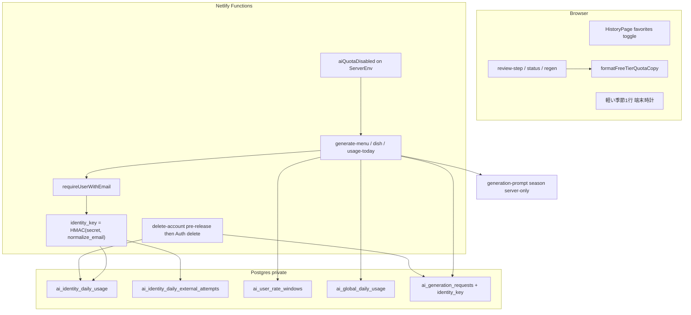

# 季節反映・お気に入りフィルタ・無料版文言・quota 強化 設計

| 項目 | 値 |
|------|-----|
| 文書 | `docs/superpowers/specs/2026-07-28-season-freemium-quota-design.md` |
| 日付 | 2026-07-28 |
| 状態 | **Approved**（二次レビュー r3: APPROVE open 0 / 敵対的 r3: ACCEPT_WITH_RESIDUAL_RISK・C/I open 0） |
| ブランチ / worktree | `feat/season-freemium-quota` / `.worktrees/feat-season-freemium-quota` |
| 関連 | MVP `2026-07-11-kondate-mvp-design.md` クォータ / プライバシー、Plan 8 の 3/6/20 枠、`private.ai_*`、`generation-prompt.ts`、履歴一覧 |
| レビュー記録 | `.superpowers/sdd/design-season-secondary-review.md`, `design-season-adversarial-review.md` |

---

## Overview

本番デプロイ前の MVP に対し、次の5点を **1 本の設計・実装列車** で入れる。後方互換は不要。

1. **季節**: JST の月・季節を AI 生成プロンプトへ注入し、旬を優先（制約・安全より下位）。UI は軽い説明1行のみ。
2. **お気に入りだけ表示**: 履歴一覧にセッション内トグル。
3. **無料版文言**: 残り回数・上限説明の文頭に「無料版は」を通す（有料課金 UI は作らない）。
4. **削除→再作成での日次枠回避を封じる**: 正規化メールの HMAC を identity とし、日次成功・日次 attempt を user CASCADE の外に保持。
5. **ローカル開発で AI 個人枠を無効化**: `AI_QUOTA_DISABLED=true` かつ isLocal のときのみ。

---

## Background & Motivation

| 領域 | 現状 | 痛み |
|------|------|------|
| 季節 | 生成プロンプトに月・季節なし | 夏に鍋など季節感のない献立が出やすい |
| お気に入り | `menus.is_favorite` と付け外し UI はある。一覧フィルタなし | 「お気に入りだけ見たい」が満たせない |
| 文言 | 「本日あと N 回」「成功回数：本日あと…」等 | フリーミアム前提の「無料版」が伝わらない |
| 削除再作成 | `private.ai_user_daily_*` が `auth.users` CASCADE | 削除→同一メール再登録で日次枠がリセットされる |
| ローカル | 常に 3/6/4 枠 | 開発・手動検証が枠に阻まれる |

### 人間と合意済みのロック（再導出禁止）

| # | 決定 |
|---|------|
| L1 | 季節は **AI 生成の中身中心**（軽い UI 表示可） |
| L2 | 削除回避は **正規化メールの HMAC identity** |
| L3 | ローカル無効化は **`AI_QUOTA_DISABLED` + isLocal 同時成立** |
| L4 | お気に入りは **トグル + セッション内 UI 状態** |
| L5 | 無料版文言は **制限説明の文頭に「無料版は」**（状態説明文は付けない） |
| L6 | 後方互換不要 |
| L7 | 有料課金 UI・provider `sub` identity・季節全面 UI テーマは非スコープ |

---

## Goals & Non-Goals

### Goals

- 履歴一覧でお気に入りのみを切替表示できる（44×44、日本語 UI）。
- 回数・上限のユーザー向け説明に一貫して「無料版は」が付く。
- 同一正規化メールでアカウント削除→再作成しても、**JST 日次の成功枠・attempt 枠**がリセットされない。
- ローカル origin かつ明示フラグでのみ個人 AI 枠を無効化でき、本番ではフラグ true で **起動失敗**する。
- 生成・再生成プロンプトに JST 季節コンテキストが入り、安全・must_use・品数制約より優先されない。
- 削除中の `processing` 予約が identity / global の `reserved_count` を永久に食い潰さない。

### Non-Goals

- Stripe 等の課金・プラン切替・「アップグレード」導線。
- OAuth provider `sub` や端末 fingerprint による identity。
- メールの高度正規化（`+tag` 除去、Gmail ドット除去等）。MVP は NFKC + trim + lower のみ。
- 短時間レート枠（10 分 4 回）の identity 化（user 単位のまま。再作成で短時間枠だけはリセットされてよい）。
- アプリ全体 global 日次枠（20）の identity 化およびローカル無効化（**global は常に有効**）。
- 季節カタログ DB、旬食材マスタ、季節テーマの色・イラスト全面差し替え。
- お気に入りフィルタの URL 永続化・サーバー側 page フィルタ API。
- メール変更 UI の実装、または Auth の email change を完全に塞ぐ運用変更（**残差リスクとして §3.6 に記載**。MVP に change-email 画面はない）。
- プライバシーポリシーの法務レビュー完了（文面追記と `privacyNoticeVersion` 更新は含む）。

### 成功受け入れ表

| シナリオ | 期待 |
|----------|------|
| 履歴に fav あり/なし混在、トグル ON | fav のみ。空なら専用 empty |
| トグル OFF / リロード | 全件。リロード後トグルは OFF |
| プランナー・生成中・再生成の制限説明 | allowlist 全文が「無料版は」で始まる |
| 成功 3/3 後にアカウント削除→同一メール再登録→生成 | 成功枠尽き（`user_daily_limit` 系） |
| `processing` + reserved 中にアカウント削除→同一メール再登録 | identity の **reserved は解放済み**。success_count のみ保持。枠が予約だけで永久に詰まらない |
| 別メールの新規ユーザー | 独立した日次枠 |
| 本番相当（!isLocal）で `AI_QUOTA_DISABLED=true` | **`parseServerEnv` が throw**（起動しない） |
| ローカル + フラグ true | 個人成功/attempt/短時間を消費せず finalize success 可能。global は従来どおり。usage-today は個人枠フル残 |
| プロンプト unit（固定時計 7 月） | `season=summer`, `month=7` が Function 組み立て messages に含まれる |
| クライアントが season を送っても | Function は無視しサーバー時計のみ |
| アレルギー must_use と季節が競合 | validate が安全・must_use を強制（季節は soft） |

---

## Proposed Design

### 全体アーキテクチャ



---

### Feature 1 — お気に入りだけを表示

**対象**

- `src/features/history/pages/history-page.tsx`（および `.test.tsx`）
- カードは既存 `HistoryGroup.representative.isFavorite`（`group-history.ts`）

**挙動**

1. `HistoryPageContent` が `useState(false)` の `favoritesOnly` を持つ。
2. `groups.length > 0` のとき、見出し直下に switch:
   - ラベル: `お気に入りだけを表示`
   - `role="switch"`, `aria-checked`, `min-h-11`
3. 表示: OFF=全件 / ON=`groups.filter((g) => g.representative.isFavorite)`  
   **バージョン横断 OR はしない**（代表のみ）。
4. Empty:
   - 取得 0: 既存「まだ献立がありません」
   - 取得 >0 かつフィルタ 0: 「お気に入りがありません」+ 「すべての献立を表示」でトグル OFF
5. URL・localStorage 不使用。リロードで OFF。件数表示は不要。

---

### Feature 2 — 「無料版は」文言

**ヘルパ**

- `shared/copy/free-tier.ts`（ブラウザ + テスト。Node crypto なし）

```ts
export function formatFreeTierQuotaCopy(body: string): string {
  const trimmed = body.trim();
  if (trimmed.length === 0) return trimmed;
  if (trimmed.startsWith("無料版は")) return trimmed;
  return `無料版は${trimmed}`;
}
```

- **葉の表示箇所だけ**で呼ぶ（親と子の二重ラップ禁止）。
- 「無料版は」は将来の有料枠を見据えた表示であり、課金 UI は出さない（L7）。

#### 2.1 Allowlist（必ずラップ）

> **Superseded (表示 allowlist 本文):** 利用者向け残数・上限・失敗コピーの allowlist / 削除対象は
> `docs/superpowers/specs/2026-07-29-quota-copy-simplification-design.md` が正。
> 本節の旧表は歴史的記録。新規実装は 2026-07-29 設計に従う。

| 箇所 | body（現状文面を維持） |
|------|------------------------|
| `review-step.tsx` | `本日あと{n}回作成できます` |
| 同上 | `AIへの問い合わせは本日あと{n}回まで受け付けます` |
| 同上 | `本日の作成回数の上限に達しています。明日0時（日本時間）以降にお試しください。` |
| 同上 | `AIへの問い合わせ回数が上限です。明日0時（日本時間）以降にお試しください。` |
| `generation-status-panel.tsx` | `成功回数：本日あと{n}回` |
| 同上 | `AI通信試行：本日あと{n}回` |
| 同上 `TerminalGenerationUsage` | `10分間の通信試行：あと{n}回`（個人短時間枠。identity 化はしないが **文言は無料版**） |
| 同上 生成中/失敗パネルの success 残数行 | `成功回数：本日あと{n}回` |
| `regeneration-sheet.tsx` | `別の献立が完成した場合に1回使用・現在残り{n}回` |
| 同上（残 0 相当の固定文） | `別の献立が完成した場合に1回使用します` |
| 同上 | `AIへの問い合わせは本日あと{n}回まで受け付けます` |
| `review-step.tsx` short-window ブロックバナー | `短い時間に何度も作成を試したため、少し待つ必要があります。{JST datetime}以降に再試行してください。`（日時部分は動的。文全体をラップ） |
| `regeneration-sheet.tsx` short-window ブロック | `しばらく続けて作成を試したため、{JST datetime}以降に再試行してください`（同上） |
| 失敗 UI が `error.message` を出すとき | 下記 failure_code のとき **のみ** ラップ |

**failure_code → ラップ対象**（`issueMessages` 等）:

- `user_daily_limit`
- `user_attempt_limit`
- `user_short_window_limit`

それ以外の `error.message` は **ラップしない**（blanket wrap 禁止）。

#### 2.2 Denylist（ラップしない）

- `本日の作成回数を確認しています…`
- `本日の作成回数を確認できませんでした…`
- `最新のAI通信試行残数を確認できません…`
- `成功回数には含まれません`
- `アプリ全体：作成できます` / `今日はここまで`（global）
- `ただいま混雑しています。しばらくしてからお試しください。`（global 混雑）
- `10分枠の再開：…` / `現在の受付再開：…`（時刻のみの情報行。制限説明本体ではない）
- feedback 送信上限
- 読み込み中・通信エラー一般
- 家族条件再確認待ちなど **quota 以外** の待機文

API の raw `message` 文字列契約は変更しない。表示時のみラップ。E2E は可視テキストを見る。

---

### Feature 3 — identity 日次枠（削除再作成耐性）

#### 3.1 識別子

```
normalize_email(email) := lower(trim(NFKC(email)))
identity_key := hex_lower(HMAC-SHA256(QUOTA_IDENTITY_HMAC_KEY, utf8(normalize_email)))
  // ちょうど 64 文字 [a-f0-9]（大文字 hex は拒否）
```

- 生メール・normalize 後メールは **DB 非保存・ログ禁止**。
- `QUOTA_IDENTITY_HMAC_KEY`: `generationRequestHmacKeySchema` と同型（canonical base64 of exactly 32 bytes）。
- **`GENERATION_REQUEST_HMAC_KEY` と共用しない**。
- `VITE_QUOTA_IDENTITY_HMAC_KEY` が source にあれば **`parseServerEnv` throw**（既存 VITE_ 秘密拒否と同型）。
- ローカル secrets / `.env.example` / Compose / e2e function env / preflight に必須。欠落は bootstrap 失敗。

#### 3.2 メール解決

- `requireUser` は **再定義しない**（Task 7 ロック）。拡張は:
  - `requireUserWithEmail(request): Promise<{ userId, accessToken, email }>`  
    内部で既存 `requireUser` 相当の JWT 検証後、同じ `getUser` 結果の **`user.email` のみ**を正とする（`identities[].identity_data.email` は使わない）。
- 受理: NFKC→trim 後 non-empty かつ `z.email()` 成功。
- 失敗（null / 空 / 空白のみ / invalid）:
  - HTTP **503**
  - body は他の設定・内部失敗と **同一の閉じた JSON**（既存 internal error 形状に合わせる）
  - code も `email_missing` 等の **識別可能な専用コードを付けない**
  - メッセージに `email` / `メール` を含めない
  - ログに email を出さない
- 適用: `generate-menu` / `generate-dish` / `usage-today`（identity を読むすべて）。
- 本アプリのログインは magic link + Google（email 付き前提）。欠落は例外経路。

#### 3.3 スキーマ（後方互換なし）

```sql
create table private.ai_identity_daily_usage (
  identity_key text not null check (identity_key ~ '^[a-f0-9]{64}$'),
  usage_day date not null,
  reserved_count integer not null default 0 check (reserved_count >= 0),
  success_count integer not null default 0 check (success_count >= 0),
  updated_at timestamptz not null default now(),
  primary key (identity_key, usage_day),
  check (reserved_count + success_count <= 3)  -- Plan 8 製品上限と同一（防御=製品）
);

create table private.ai_identity_daily_external_attempts (
  identity_key text not null check (identity_key ~ '^[a-f0-9]{64}$'),
  usage_day date not null,
  reserved_count integer not null default 0 check (reserved_count >= 0),
  sent_count integer not null default 0 check (sent_count >= 0),
  updated_at timestamptz not null default now(),
  primary key (identity_key, usage_day),
  check (reserved_count + sent_count <= 6)  -- Plan 8
);
```

- **FK to auth.users なし**（削除後も残す）。
- 既存 `private.ai_user_daily_usage` / `private.ai_user_daily_external_attempts` は migration で **drop**（二重書き禁止）。
- `private.ai_user_rate_windows`・`private.ai_global_daily_usage` は維持。
- `private.ai_generation_requests` に:
  - `identity_key text not null check (identity_key ~ '^[a-f0-9]{64}$')`
  - `personal_quota_disabled boolean not null default false`  
    （ローカル無効化時の finalize 分岐用。Feature 4）
- 本番前のため旧 request 行は migration で truncate または drop/recreate 可。

**保持期間**: identity 日次行は `usage_day < private.ai_jst_day(now()) - 40 days` を maintenance cleanup が削除する（今日・直近の削除再作成耐性は維持。30 日 generation ledger より少し長い 40 日）。pgTAP: 今日/昨日は消えず、41 日前は消える。

#### 3.4 RPC / 呼び出し一覧（網羅・部分移行禁止）

| RPC / 経路 | identity success | identity attempts | short (user) | global | 署名追加 |
|------------|------------------|-------------------|--------------|--------|----------|
| `reserve_ai_generation` | reserve check/inc | reserve check/inc | yes | yes | `p_identity_key`, `p_quota_disabled` |
| `reserve_ai_repair_call` | — | reserve via **request.identity_key** | yes | yes | `p_quota_disabled`（request から identity） |
| `finalize_ai_generation_success*` | success++ / reserved-- if not disabled | — | — | as today | request の identity_key / personal_quota_disabled |
| fail / conflict / mark sent 系 | release or convert | release/sent via identity_key | as today | as today | identity_key from request |
| `cleanup_stale_ai_generations_batch` | release identity reserved | release identity attempt reserved | — | release global | request.identity_key |
| `get_ai_usage_today` | read by p_identity_key | read | user | global | `p_identity_key`, 投影は既存 wire |
| `get_ai_generation_status` の残数投影 | 同上方針 | 同上 | | | identity 参照に更新 |
| `release_identity_and_global_for_user_processing`（**新規**） | release all processing for user | same | — | release | `p_user_id` only, service_role。**PostgREST 呼び出し用に `public` ラッパ（SECURITY DEFINER → private 本体）を置き、grant execute は service_role のみ**。既存 `reserve_ai_generation` と同じ public wrapper 慣習に合わせる |

- `p_identity_key` は Function 計算のみ。regex 不一致は `invalid_identity_key` 相当で台帳非接触。
- TS: `generation-repository.ts`, `usage-today.ts`, 関連 tests。migration 後 **`database.generated.ts` は typegen のみ**（手編集禁止）。
- `docs/testing/database-access-matrix.md` / RLS inventory から drop した user 日次表を消し identity 表を private/service のみと記載。

#### 3.5 アカウント削除（変更必須 — 予約解放）

**§3.5 ロック: delete は quota に対して no-op ではない。**

`delete-account` Function 順序（すべて成功してから Auth 削除）:

1. `authenticate`（既存）。
2. service_role で PostgREST `.rpc('release_identity_and_global_for_user_processing', { p_user_id })` を呼ぶ（**公開名は `public` ラッパ**。本体実装は `private` でもよい）:
   - 当該 user の `status = 'processing'` を `FOR UPDATE`。
   - 各行について: identity success/attempt の reserved を減算（request の flags と `identity_key` に従う）、global reserved を減算、request を terminal `failed`（または delete 前に failed 化）にし reserved フラグを下ろす。
   - **success_count / sent_count は減らさない**（消費済みは保持）。
3. 既存どおり `auth.admin.deleteUser`（CASCADE で user 所有行削除）。
4. identity 日次行は残る（success/sent と、解放後の reserved=適切な値）。

**本設計の正は delete-account の明示 RPC**（テストしやすい）。

**防御（必須の第2経路）**: `private.ai_generation_requests` の `BEFORE DELETE` トリガでも、`processing` かつ reserved フラグがある行について identity/global の reserved を解放する。これにより **SQL 直 delete / 運用ミス / Auth CASCADE のみ** の経路でも reserved 孤児を防ぐ。delete-account は RPC を先に呼び（二重解放は reserved フラグを下ろしたあとは no-op）、その後 Auth 削除する。

**脅威**: processing 中削除で reserved が永久残留 → 同一 identity のセルフ DoS。RPC + DELETE トリガで封じる。

**残差（許容）**: 解放後も in-flight OpenRouter 呼び出しの **プロバイダ課金**は止まり得ない（既存の processing 以外 status への finalize early-return と同じクラス）。個人枠・global reserved は fail-closed で戻る。

**ユーザー向け文言（必須・同時更新）**

| 面 | ロック文面（要旨。実装で一字句固定しテスト） |
|----|-----------------------------------------------|
| 削除確認ダイアログ | 家族・冷蔵庫・献立・買い物などは削除され元に戻せない。**不正利用防止のため、メールから作った復元できない識別子と日々の利用回数だけは残る**旨を必ず含める。「すべてのデータが削除」だけにしない |
| 設定説明 | 同上と矛盾しない |
| 削除後ログイン status | 削除完了 + 上記保持の短文 |
| プライバシー notice | 濫用防止の identity 日次回数を「アプリに保存する情報」に追加。生メールは保存しない |
| `privacyNoticeVersion` | `2026-07-28.v1` → **`2026-07-28.v1`**（再同意が必要） |
| `docs/runbooks/account-deletion.md` | identity 残存と pre-delete release を記載 |

E2E: 既存 `queryOwnedCounts` は `user_id` 列あり表のみなので identity は自動除外（ゼロ期待は維持）。**追加**: pgTAP または Function 統合で「delete → reserved 解放 → 同一 identity で success 枠継続」を必須自動検証。

#### 3.6 脅威と限界

| 攻撃 | 扱い |
|------|------|
| 同一メール削除再作成 | **封じる** |
| processing 中削除による reserved 孤児 | **封じる**（3.5 RPC + DELETE トリガ） |
| 運用の Auth 直削除（RPC スキップ） | DELETE トリガで reserved 解放。success 保持は identity 行のまま |
| `user+tag@` / Gmail ドット | 別 identity になり得る → Non-Goal |
| 完全に別メール | 別枠（想定内） |
| Auth のメール変更後の新 identity | **残差**: MVP に change-email UI なし。Supabase 設定で変更可能な場合は日次枠リセット経路。文書化し、将来 Auth で email change 無効化を検討 |
| クライアントが identity_key 指定 | **不可** |
| 鍵漏洩 | 推測メールとの突合リスク。ログ禁止。ローテで全 identity 実効リセット（`docs/deployment` に節） |
| `p_quota_disabled` の SQL 信頼 | service_role EXECUTE のみ。pgTAP で authenticated に EXECUTE が無いこと。VITE_ 拒否 |

---

### Feature 4 — ローカル AI 枠無効化

#### 4.1 Env と ServerEnv

- `AI_QUOTA_DISABLED`: 未設定 / `"false"` → false。`"true"` → true。**それ以外（`1`/`yes` 等）は throw**。
- isLocal の正: 既存どおり **`SERVER_SITE_ORIGIN === "http://127.0.0.1:5173"`**（`SITE_URL` という別名で書かない）。
- `parseServerEnv` が返す `ServerEnv` に **必ず**:
  - `isLocal: boolean`
  - `aiQuotaDisabled: boolean` … **`AI_QUOTA_DISABLED === true && isLocal` の積**だけを true にする（呼び出し側で再計算させない）
- **`!isLocal && AI_QUOTA_DISABLED === true` → throw**（本番持ち込み防止。黙殺しない）。
- `VITE_AI_QUOTA_DISABLED` 存在 → throw。
- 無効化対象: identity 日次成功・identity 日次 attempt・user 短時間枠。
- 無効化しない: global、同時 processing、HMAC/idempotency、OpenRouter 実呼び出し可否。
- 残差: ローカル + 実 OpenRouter + 本フラグで個人枠なし → コストは global 20 のみ。ドキュメントに明記。

#### 4.2 予約・finalize セマンティクス（S2 ロック）

**採用オプション (2)**: request に `personal_quota_disabled boolean` を永続化。

| 段階 | `aiQuotaDisabled === false` | `true` |
|------|-----------------------------|--------|
| reserve | 現行どおり identity/short を検査・予約。`user_quota_reserved` / attempt フラグ true | 個人 identity/short の **check も increment もしない**。`user_quota_reserved=false`, attempt reserved false。`personal_quota_disabled=true`。global と processing 一意は従来どおり |
| finalize success | identity success++ 等（フラグに応じ release） | **`user_reservation_missing` を出さない**。identity ledger を触らない。メニュー確定は成功 |
| fail / cleanup / release | フラグに応じ reserved 解放 | personal は no-op（最初から未予約） |
| repair reserve | 通常 | 個人 attempt 予約スキップ |

usage-today（disabled 時）: `success.consumed=0`, `remaining=limit`, attempts 同様, shortWindow 満タン, `retryAt=null`（個人要因）。`globalAvailable` は実 global。`usageTodayDataSchema` の balance 制約を満たす。

#### 4.3 テスト / E2E

- 単体: !isLocal + true → throw。invalid 値 throw。VITE_ 拒否。
- 単体/pgTAP: local disabled → reserve → finalize success → identity success/attempt 増えない。global は増える/制限される。
- pgTAP: authenticated が reserve EXECUTE 不可。
- E2E 既定: フラグ **off**。

---

### Feature 5 — 季節（プロンプト中心）

#### 5.1 定義

| season | 月（JST） | labelJa |
|--------|-----------|---------|
| spring | 3–5 | 春 |
| summer | 6–8 | 夏 |
| autumn | 9–11 | 秋 |
| winter | 12,1,2 | 冬 |

`shared/season/jst-season.ts`（純関数。ブラウザ表示 + テスト共用。**生成に使う now は Function のみ**）:

```ts
export type JstSeason = "spring" | "summer" | "autumn" | "winter";
export type SeasonContext = { month: number; season: JstSeason; labelJa: "春" | "夏" | "秋" | "冬" };
export function getJstSeasonContext(now: Date): SeasonContext;
```

#### 5.2 プロンプト（サーバー権威）

- `GenerationPromptDto` に `seasonContext: SeasonContext`。
- **組み立ては Function 内 `getJstSeasonContext(new Date())` のみ**。クライアント body / integrity HMAC ペイロードに season を **載せない・受け取らない**（未知フィールド strip）。
- system CORE 末尾固定:

  > 入力の seasonContext は日本の現在月・季節です。制約（アレルギー・安全・must_use・品数・時間）を満たす範囲で旬の食材や季節感を優先してください。季節のために制約を破らないでください。

- 配置は既存 CORE の制約文の **後**（優先順位を下げない）。
- whole / dish 再生成も Function 側で同一付与。
- テスト: 固定時計。prompt に season キー。クライアント注入が無視されること。must_use の hard gate は既存 validate（「季節が must_use を落とす」を AI モックで過大主張しない）。

#### 5.3 UI

- プランナー確認: `いまは{labelJa}（{month}月）の食材を優先して提案します`
- 端末時計の best-effort（JST 月境界でサーバーとズレ得る）。**生成の権威はサーバー**。
- 結果画面バッジは不要。menus に season 列は作らない。

---

## Key Decisions

| 決定 | 理由 |
|------|------|
| identity = メール HMAC、DB にメールなし | PII 最小化と削除耐性 |
| 日次 success/attempt のみ identity | 主目的。短時間は session 濫用用 |
| global 常時 | ローカル無効化と多アカウントのブレーキ |
| 本番 AI_QUOTA_DISABLED=true は throw | fail-fast |
| delete 前に processing 予約解放 | identity reserved 孤児 / セルフ DoS 防止 |
| personal_quota_disabled 列 + finalize 分岐 | 既存 `user_quota_reserved` 不変条件と両立 |
| Plan 8 の CHECK <=3 / <=6 | 防御=製品 |
| identity 40 日 retention | 無期限保存を避けつつ当日耐性 |
| お気に入りはクライアント・代表 isFavorite | MVP 十分 |
| 無料版は UI allowlist | API 契約維持・ムラ防止 |
| season はサーバーのみ | クライアント改ざん排除 |

---

## PR Plan

| PR | タイトル | 依存 | 内容 |
|----|----------|------|------|
| PR1 | shared free-tier + season util | なし | ヘルパと単体 |
| PR2 | 履歴お気に入りトグル | なし | history-page |
| PR3 | 季節プロンプト + 確認1行 | PR1 | prompt / regen / review-step。**generation-repository の引数は触らない** |
| PR4 | 無料版は allowlist 適用 | PR1 | UI + failure_code 選択ラップ + テスト |
| PR5 | identity 日次 + delete pre-release + personal_quota_disabled 列/finalize | なし（早め） | migration, RPC 全表, env HMAC key, requireUserWithEmail, usage-today, delete-account, privacy version, runbook, matrix, pgTAP。**ローカル無効化の SQL 分岐もここに含める** |
| PR6 | AI_QUOTA_DISABLED env ゲート + ServerEnv.aiQuotaDisabled + usage 投影 | PR5 | env parse, 配線, 単体。SQL 本体は PR5 済み |
| PR7 | E2E 更新と全体グリーン | PR2–PR6 | 文言・トグル・quota。identity 継続は pgTAP 必須 |

PR5 完了前に E2E を identity 前提にしない。database-access-matrix / generate-local-secrets / preflight は PR5–PR6。

---

## Testing Strategy（必須ケース）

| 層 | 必須 |
|----|------|
| Vitest free-tier | 二重付与なし、allowlist/denylist、failure_code のみラップ |
| Vitest season | 2/28 冬, 3/1 春, 6/1 夏, 12/1 冬。prompt 含有。クライアント season 無視 |
| Vitest history | トグル・フィルタ empty・代表 isFavorite |
| Vitest env | aiQuotaDisabled 積、本番 true throw、invalid、VITE_ 拒否、isLocal 露出 |
| Vitest auth email | null/empty/invalid → 閉じた 503、ログに email なし |
| pgTAP identity | Plan 8 CHECK 3/6。同一 key で success 3 block。別 key 独立。user 削除後 identity 残存。**reserve→delete user→reserved 解放**。40 日 cleanup。authenticated EXECUTE 否 |
| pgTAP disabled | personal_quota_disabled 行で finalize success、ledger 非消費、global は有効 |
| Function | repair が identity_key。usage-today balance。status 残数 |
| E2E | トグル、可視「無料版は」、削除確認に保持説明、privacy 再同意。フラグ off。重い delete→recreate は pgTAP で代替可だが **1 経路は自動** |

---

## Privacy & Ops

- 文言: Feature 3.5 表。
- `privacyNoticeVersion = 2026-07-28.v1`。
- ログ: email / identity_key / HMAC key を `SafeLogEvent` に載せない。
- 鍵ローテ: `docs/deployment` に「QUOTA_IDENTITY_HMAC_KEY ローテは identity 実効リセット」。旧行は unlinkable。
- secrets: 欠落で local/prod 起動失敗。

---

## Spec amendments / supersedes

| 文書 | 本設計 |
|------|--------|
| MVP 個人日次 user_id 台帳 | 日次 success/attempt の正は **identity_key**。短時間・global・request 所有者は user_id |
| MVP 削除で全消去 | **例外**: 濫用防止 identity 日次（生メールなし）。reserved は削除時解放 |
| Plan 6 アカウント削除 CASCADE 完了定義 | CASCADE 前に processing 予約解放 RPC。identity 表は user_id 無しで残る |
| finalize の user_quota_reserved 必須 | `personal_quota_disabled=true` のとき success を許可する分岐を正式追加 |
| privacyNoticeVersion | `2026-07-28.v1` に上げ、本文に identity 保持を記載 |

---

## Open Questions

なし（レビュー指摘は本書でロック済み）。

---

## Implementation Notes（固定値）

| 項目 | 値 |
|------|-----|
| 成功日次 | 3 |
| attempt 日次 | 6 |
| 短時間 | 4 / 600s（user） |
| global | 20（無効化対象外） |
| identity_key | `^[a-f0-9]{64}$` |
| メール正規化 | NFKC → trim → lower |
| isLocal | `SERVER_SITE_ORIGIN === http://127.0.0.1:5173` |
| identity retention | 40 JST days |
| privacyNoticeVersion | `2026-07-28.v1` |
| 季節 UI | `いまは{labelJa}（{month}月）の食材を優先して提案します` |
| トグル | `お気に入りだけを表示` |
| フィルタ empty | `お気に入りがありません` |
| email 欠落 HTTP | 503・閉じた body |
| 本番 AI_QUOTA_DISABLED=true | parse throw |
