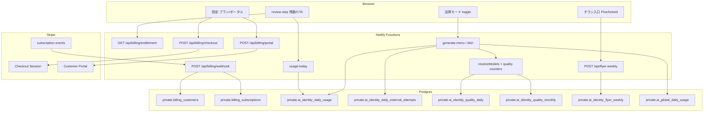
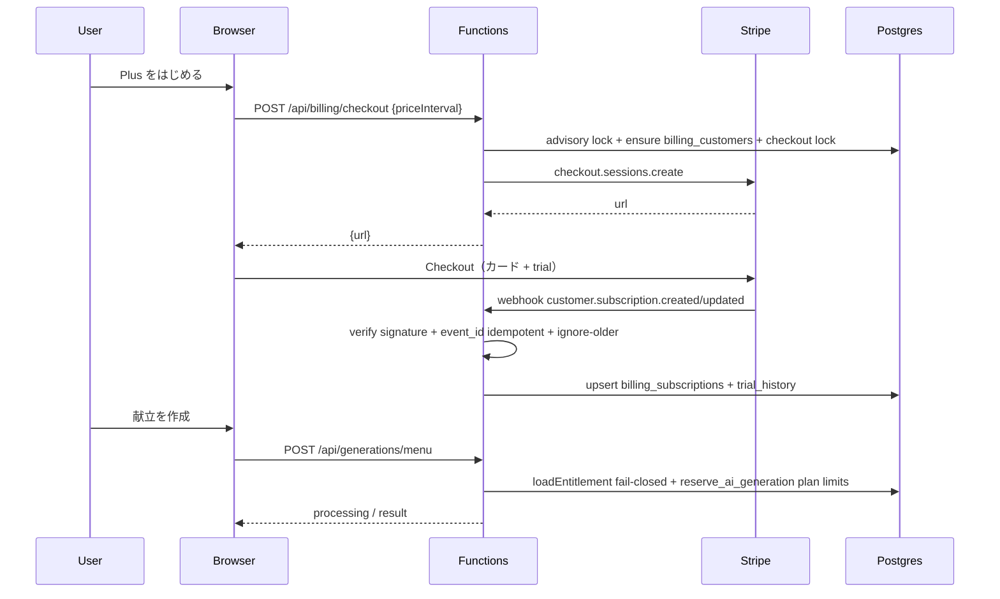
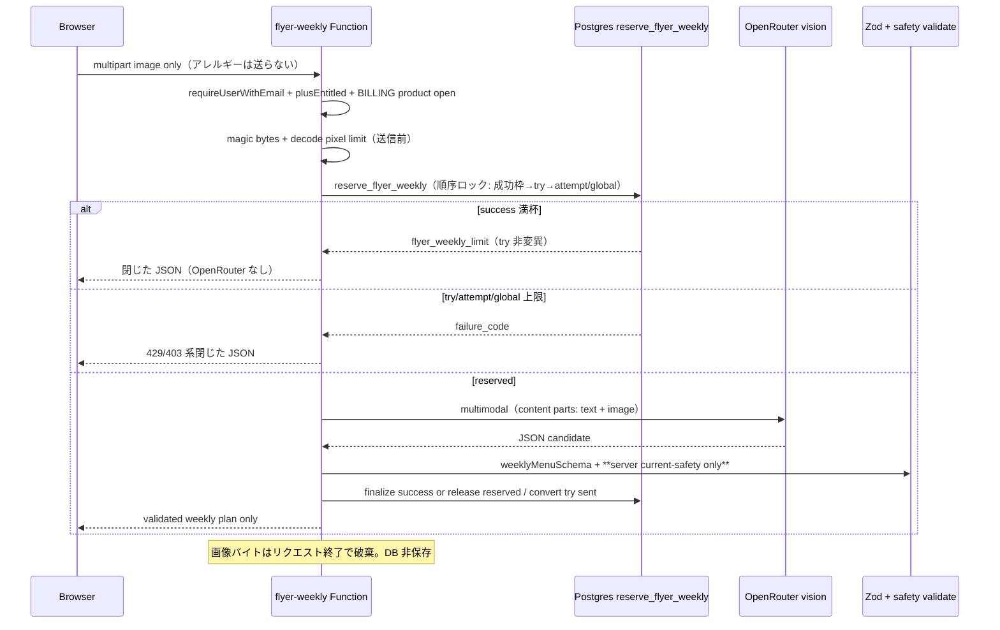
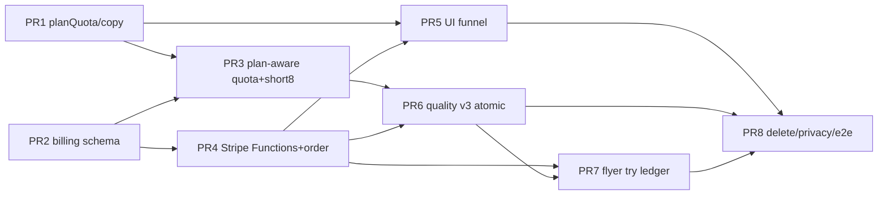

# こんだて日和 Plus（Stripe フリーミアム）設計

| 項目 | 値 |
|------|-----|
| 文書 | `docs/superpowers/specs/2026-07-29-paid-plan-stripe-design.md` |
| 日付 | 2026-07-29 |
| 状態 | **Review-ready**（r2 再レビュー指摘反映済み。実装計画着手可） |
| ブランチ / worktree | `feat-paid-plan-stripe` / `.worktrees/feat-paid-plan-stripe` |
| 関連 | MVP `2026-07-11-kondate-mvp-design.md` §11 クォータ / §18 非目標、Plan 8 `2026-07-26-paid-openrouter-models-design.md`、季節・identity 枠 `2026-07-28-season-freemium-quota-design.md`、利用回数コピー `2026-07-29-quota-copy-simplification-design.md`、`shared/copy/free-tier.ts`、`netlify/functions/generate-menu.ts`、`private.ai_identity_*` |
| レビュー | `docs/superpowers/specs/2026-07-29-paid-plan-stripe-primary-adversarial-review.md`、`docs/superpowers/specs/2026-07-29-paid-plan-stripe-secondary-verification.md` |
| 著者 | （プレースホルダ） |
| 改訂 | 2026-07-29 r1: 二次検証 must_fix。**r2**: flyer 成功枠尽時は try 非消費・OpenRouter 非送信; short は mark-time; webhook 同一秒 tie-break を非時系列 id 比較から改訂 |

---

## Overview

こんだて日和は現状、全ユーザー同一の日次成功 3 / 外部 attempt 6 / 短時間 4/600s / アプリ全体 global 20（JST）で AI 献立生成を提供する。OpenRouter は運営側有料モデルのみを使い、**エンドユーザー課金は MVP 非目標**だった。

本設計は、その非目標を **課金スコープに限り明示的に改訂**し、永久フリーミアム（Free は日常 1 食の献立づくりに十分）の上に、単一有料プラン **「こんだて日和 Plus」**（¥580/月・税込表示、年額 ¥5,800、7 日トライアル）を Stripe Checkout + Customer Portal で提供する。

P0 の価値は (1) **枠の余裕**、(2) **品質モード（上位モデルの小予算）**、(3) **チラシ画像→1 週間献立**の Plus 専用旗艦機能である。クライアントはプランを主張せず、Netlify Functions が entitlement を強制する。Webhook が entitlement の正本である。

---

## Background & Motivation

| 領域 | 現状 | 痛み |
|------|------|------|
| 課金 | MVP §18 で有料プラン・決済を非目標 | 運営の AI 原価を利用者に還元できず、枠を広げられない |
| 枠 | Free 固定 3/6/4/600（`releaseQuota`、RPC `p_user_limit <> 3`、CHECK ≤3/≤6） | Plus の 10/20 を載せられない。防御=製品が Free 上限と同一 |
| モデル | `OPENROUTER_MODELS` 単一 allowlist | 品質寄りの上位モデルを毎日全員に載せると原価が破綻 |
| 導線 | 「無料版は」接頭のみ（課金 UI なし、`2026-07-28` L7） | 上限到達時に次の行動がない |
| チラシ | スコープ外 | 週の献立づくりの強い動機が無い |

### 人間と合意済みのロック（再導出禁止）

| # | 決定 |
|---|------|
| L1 | Forever freemium: Free は日常 1 食の献立づくりに十分有用なまま |
| L2 | 有料は単一プランのみ: Free + **こんだて日和 Plus**（Basic/Pro 段階なし） |
| L3 | 価格: Plus **¥580/月** 税込表示; 年額 **¥5,800/年**（約 2 か月分無料）; **7 日無料トライアル**（カード登録あり） |
| L4 | Free 成功上限は **3/JST 日**のまま（変換のために Free を削らない） |
| L5 | 価値の核 = **枠の余裕**が第一; プレミアムモデルは小さな別予算; チラシ→週間献立が旗艦 |
| L6 | Free: 標準モデルのみ; 成功 3/日, attempt 6/日, 短時間 4/600s |
| L7 | Plus: 成功 **10**/日, attempt **20**/日, 短時間 **8**/600s |
| L8 | Plus 品質モード（上位モデル）: **3/JST 日 かつ 20/JST 暦月**（先に当たった方） |
| L9 | チラシ画像→1 週間献立: Plus のみ; **成功週間献立 2 回 / JST 暦週**; Free は入口 + ロック preview CTA のみ |
| L10 | 変換ファネル: (1) 硬上限 CTA 最重要 (2) 確認画面の残り 1 行ソフト (3) チラシ locked preview (4) 品質モード gate (5) 設定のプラン/ポータル (6) 成功後週間 upsell は最大週 1 |
| L11 | 初期スコープ = **P0 のみ**（枠 + 品質モード + チラシ週間）。P1 はロードマップのみ。P2 は更に後 |
| L12 | 本番前: 後方互換不要 |
| L13 | 決済: Stripe Checkout（subscription）+ Customer Portal; **webhook が entitlement の正本** |
| L14 | クライアントはプランを信頼しない; Functions が entitlement を強制 |
| L15 | `VITE_` 秘密禁止; 氏名・メール・アレルギー・プロンプト・生 AI・チラシ画像の長期保存/ログ禁止 |
| L16 | 既存 Free 接頭「無料版は」を拡張; Plus は「Plusでは」または **entitled 時は接頭なしの中立残数** |

---

## Goals & Non-Goals

### Goals

- Free を削らず、Plus 加入で日次成功・attempt・短時間枠を L6/L7 どおり拡大する。
- Stripe Checkout / Portal / Webhook で `trialing` / `active` 等の entitlement をサーバ正本として保持し、生成・品質モード・チラシ経路で強制する。
- 品質モードは Plus のみ、標準枠とは別の 3/日・20/月カウンタで上位モデル allowlist を使う。
- チラシ→週間献立は Plus のみ、画像は一時処理のみ、Zod 検証後の献立構造だけを保持する。
- 低 IT リテラシー向け日本語コピーと L10 ファネルで Free→Plus 変換を支援する。
- ローカル E2E は Stripe mock（または固定 webhook フィクスチャ）で決定論的に通す。
- 本番前のため、固定 CHECK / `p_user_limit <> 3` / `usageTodayDataSchema` の literal 3/6 を **プラン対応の上限**へ一括置換してよい（L12）。

### Non-Goals（初期）

- 複数有料ティア、広告、ポイント、家族共有課金
- App Store / Google Play IAP
- 厳密な栄養計算・医療食
- チラシ画像や OCR 全文の長期保存
- Free 成功上限を 3 未満へ下げること
- P1/P2 機能の本実装（節「Roadmap P1/P2」に記載のみ）
- 利用従量課金（従量 Stripe meter）
- OpenRouter の利用者向け明細・USD 請求書

### 成功受け入れ表（抜粋）

| シナリオ | 期待 |
|----------|------|
| Free、成功 3 消費後に生成 | `user_daily_limit` + 硬上限 CTA（Plus 案内） |
| Plus `active`、成功 10 まで | 9 回目まで予約可、10 回目成功後ブロック |
| Plus `trialing`（トライアル中） | active と同等の枠・品質・チラシ |
| Plus `past_due` グレース内 | 枠は Plus 維持、設定に支払い更新導線 |
| Plus `canceled` 期間末 | Free 枠に戻る（即時 revoke しない。Stripe の `current_period_end` まで entitled） |
| Free が品質モードを要求 | 403 + 品質 gate CTA。OpenRouter 上位リストへ送らない |
| Plus 品質 3/日到達 | 品質モードのみブロック。標準生成は成功残があれば可 |
| Free がチラシ入口 | locked preview + CTA。アップロード API は 403 |
| Plus チラシ成功 2/JST 週 | 3 回目は週次上限。画像はレスポンス後に保持しない |
| クライアントが `plan=plus` を body に付けても | Functions は無視。DB entitlement のみ |
| Webhook 署名不正 | 400。entitlement 非更新 |
| アカウント削除 + 有効 sub | Stripe cancel 試行 + ローカル entitlement 削除。identity 日次は既存方針で残る |
| `AI_QUOTA_DISABLED` ローカル | 個人枠無効は維持。billing 自体は別フラグ |
| `BILLING_ENABLED=false`（鍵あり） | Checkout/Portal/品質/チラシを閉じ、**枠は Free 強制**。**Webhook は継続**（署名+upsert）。`GET /entitlement` は DB 投影 + `productSurfacesOpen:false` |
| `BILLING_ENABLED=false` 後の再有効化 | runbook の Stripe reconcile 後にのみ true にする（stale active の誤付与防止） |
| entitlement 読取失敗 | **503 fail-closed**。reserve しない。defense max を default にしない |
| Plus short 5 回目（枠 8） | `ai_user_rate_windows` CHECK≤8 と snapshot 経由の mark/usage で成功し得る |
| 並行 Checkout 2 本 | 1 本目のみ Session 作成。2 本目は 409 `billing_checkout_in_progress` または already entitled |
| Webhook 古い active が delayed | `last_stripe_event_created` より古い event は無視（再付与しない） |
| Flyer try 7 回目 / 週（成功枠に空きあり） | `flyer_weekly_try_limit`。OpenRouter 送信前に拒否。try 台帳以外も非変異 |
| Flyer 成功 2 済の追加 POST | **`flyer_weekly_limit` のみ**。try/attempt/global **非変異**。OpenRouter **非呼び出し**（pgTAP/unit 必須） |
| qualityMode on Free | 403 before reserve。quality 台帳非接触 |

---

## Spec supersede（本設計が課金・プラン枠の正）

| 文書 | 本設計 |
|------|--------|
| MVP §18「有料プラン、決済」非目標 | **課金スコープで廃止**。本設計が正 |
| Plan 8 / freemium の固定 3/6 と CHECK ≤3/≤6 | Free の製品値は維持。DB 防御上限と RPC 受理値は **プラン最大（10/20/8）**へ拡張。実行時 limit は entitlement 由来 |
| freemium の `ai_user_rate_windows` CHECK ≤4 / mark 硬コード 4 | **防御 max 8** + request `quota_short_limit` で mark/usage/status をプラン対応（下記） |
| freemium L7「有料課金 UI 非スコープ」 | **廃止**。本設計の P0 UI が正 |
| コピー簡素化 L7「課金 UI 非スコープ」 | **廃止**（表示ロジックの success 1 行原則は維持し、ブロック時 CTA を追加） |
| `releaseQuota` 単一 3/6/4/600 | `planQuota` テーブルへ拡張（下記） |
| `usageTodayDataSchema` の `limit: z.literal(3\|6\|4)` | プラン最大までの int + `plan` フィールド追加 |
| env `USER_DAILY_AI_LIMIT=3` 固定のみ | Free 既定として残しつつ、Plus 上限はコード定数 + entitlement。env 固定 3 の「全ユーザー強制」は廃止 |
| Roadmap Locked Environment Contract（3/6/4/20 全ユーザー固定） | **課金・プラン別個人枠については本設計が正**。Free 数値は据え置き。Plus 値・global max 200/既定 80 は本設計。ロードマップ表は実装時に本設計へ参照追記 |
| `generation-command.v2`（qualityMode なし） | **`generation-command.v3`** へ置換（L12。旧 processing 行は truncate 可） |

**維持するもの**

- identity HMAC 日次台帳（メール非保存、削除耐性）
- global 日次のアプリ全体安全弁（無効化しない）
- OpenRouter は Functions のみ、structured AND、単価 ≤ $4.00/1M、`:free` 本番拒否
- プライバシー: プロンプト・生 AI・アレルギー本文をログしない
- コピー簡素化の「常時 success 残 1 行」「attempt 常時行なし」

---

## Proposed Design

### 全体アーキテクチャ



### Feature マトリクス（Free vs Plus）

| 機能 | Free | Plus |
|------|------|------|
| 標準モデルでの献立生成（1 食） | ○ 成功 3/日 | ○ 成功 10/日 |
| 外部 attempt（日次） | 6 | 20 |
| 短時間枠 | 4 / 600s | 8 / 600s |
| 品質モード（上位モデル） | ×（CTA） | ○ 3/日 かつ 20/月 |
| チラシ画像→1 週間献立 | 入口表示 + locked preview | ○ 成功 2 / JST 暦週 |
| 買い物リスト（1 献立） | ○（既存） | ○ |
| 履歴・お気に入り・季節 soft | ○ | ○ |
| 緊急献立（非 AI / 既存） | ○ | ○ |
| 設定でのプラン管理・請求ポータル | 加入 CTA | 管理・解約・領収（Portal） |
| 手動 7 日プラン一括（P1） | — | ロードマップ |
| 週間買い物まとめ（P1） | — | ロードマップ |
| 混雑時優先（P1） | — | ロードマップ |

### 価格・プラン構造

| 項目 | 値 |
|------|-----|
| プラン表示名 | こんだて日和 Plus |
| 内部 `plan_code` | `plus`（Free は `free`） |
| 月額 | **¥580**（税込表示。Stripe Price は税込 Price または Tax 設定と整合） |
| 年額 | **¥5,800**（税込表示。約 2 か月分無料） |
| トライアル | **7 日**。Checkout 時にカード登録必須（`payment_method_collection=always`） |
| 通貨 | `jpy` |
| 課金単位 | ユーザー 1 人 = Stripe Customer 1（家族共有課金なし） |
| Stripe オブジェクト | Product 1（Plus）+ Price 2（`price_plus_monthly` / `price_plus_yearly`） |

表示原則（低リテラシー）:

- 「月額 580 円（税込）」「年額 5,800 円（税込・2か月分お得）」を併記。
- 専門用語（subscription, invoice, proration）を出さない。「お支払いの確認」「プランの変更・解約」に言い換える。
- トライアル: 「最初の 7 日間は無料でお試しできます。続く場合は登録したカードに請求されます。」

---

### Entitlement モデル

#### テーブル（`private`、PostgREST 非公開）

```sql
-- Stripe Customer ↔ Supabase user（1:1）
create table private.billing_customers (
  user_id uuid primary key references auth.users (id) on delete cascade,
  stripe_customer_id text not null unique,
  created_at timestamptz not null default now(),
  updated_at timestamptz not null default now()
);

-- Webhook 正本の subscription 投影（ユーザー所有だが service_role のみ書込）
create table private.billing_subscriptions (
  user_id uuid primary key references auth.users (id) on delete cascade,
  stripe_subscription_id text not null unique,
  stripe_price_id text not null,
  status text not null
    check (status in (
      'trialing', 'active', 'past_due', 'canceled', 'unpaid',
      'incomplete', 'incomplete_expired', 'paused'
    )),
  cancel_at_period_end boolean not null default false,
  current_period_start timestamptz not null,
  current_period_end timestamptz not null,
  trial_end timestamptz null,
  past_due_since timestamptz null,
  -- 順序保護: この行を最後に更新した Stripe event.created（Unix 秒）
  last_stripe_event_created bigint not null default 0,
  last_stripe_event_id text null,
  updated_at timestamptz not null default now()
);

-- Webhook 冪等（event_id 単位の再送）
create table private.billing_webhook_events (
  stripe_event_id text primary key,
  event_type text not null,
  stripe_event_created bigint not null, -- event.created
  processed_at timestamptz not null default now()
);

-- トライアル消費履歴（user CASCADE 外。identity 残存）
create table private.billing_trial_history (
  identity_key text primary key check (identity_key ~ '^[a-f0-9]{64}$'),
  first_trial_at timestamptz not null default now()
);

-- Checkout 同時実行シリアライズ（短命。session 完了 or TTL で消す）
create table private.billing_checkout_locks (
  user_id uuid primary key references auth.users (id) on delete cascade,
  stripe_checkout_session_id text not null,
  expires_at timestamptz not null,
  created_at timestamptz not null default now()
);
```

- **RLS**: いずれも PostgREST に expose しない（`private` + revoke）。読取は service_role の SECURITY DEFINER RPC / Functions のみ。
- **クライアント**: `billing_subscriptions` を直接読ませない。`GET /api/billing/entitlement` の閉じた JSON のみ。

#### 有効 entitlement 判定（サーバ単一関数）

```ts
// netlify/functions/_shared/billing-entitlement.ts
export type PlanCode = "free" | "plus";

export type Entitlement = {
  plan: PlanCode;
  status: "none" | BillingSubscriptionStatus;
  /** Plus 枠・品質・チラシを付与してよいか（quota 用。kill switch で Free 強制時は別途） */
  plusEntitled: boolean;
  /** past_due グレース中か（UI 警告用） */
  pastDueGrace: boolean;
  currentPeriodEnd: string | null; // ISO
  cancelAtPeriodEnd: boolean;
  trialEnd: string | null;
  /** BILLING_ENABLED と独立。DB 投影の生の entitled */
  dbPlusEntitled: boolean;
};

/**
 * computePlusEntitled(row, now):
 * - status in (trialing, active) → true
 * - status = past_due:
 *     past_due_since IS NULL → **false（fail-closed）**。webhook バグで無限 Plus にしない。
 *     past_due_since から PAST_DUE_GRACE_HOURS 以内 → true
 *     超過 → false
 * - status = canceled かつ now < current_period_end → true（期間末まで）
 * - unpaid / incomplete* / paused / 期間終了後 canceled → false
 *
 * loadEntitlement(userId):
 * - DB/RPC 失敗 → **throw → HTTP 503**（reserve しない。Free に silent fallback しない）
 * - 成功時 limits は planQuota[plusEntitled ? "plus" : "free"] のみ。defense max を default にしない
 *
 * applyQuotaPlan(entitlement, env):
 * - BILLING_ENABLED=false → 常に free limits（dbPlusEntitled が true でも枠は Free）
 * - BILLING_ENABLED=true → entitlement.plusEntitled に従う
 */
```

| 定数 | 値 |
|------|-----|
| `PAST_DUE_GRACE_HOURS` | **72**（支払い失敗後 3 日は Plus 維持 + 設定で更新催促） |
| グレース超過 `past_due` / `unpaid` / **`past_due` かつ `past_due_since IS NULL`** | `plusEntitled=false`（Free 枠） |
| entitlement 読取失敗 | **503 fail-closed**（`billing_entitlement_unavailable`） |

**incomplete / incomplete_expired**: Checkout 完了前。entitled にしない。  
**paused**: Stripe 一時停止。初期は entitled=false（将来 P1 で再検討可）。

**`past_due_since` 書込みロック**:

| イベント / 遷移 | 処理 |
|-----------------|------|
| 任意経路で status が **初めて** `past_due` になる（`subscription.created` / `updated`） | `past_due_since = coalesce(past_due_since, now())` |
| `invoice.payment_failed` かつ status が past_due | 同上（二重でも coalesce） |
| `active` / `trialing` へ復帰、または `invoice.paid` で paid 確定 | `past_due_since = NULL` |
| unit 必須 | `status=past_due AND past_due_since IS NULL` → `plusEntitled=false` |

#### シーケンス: Checkout → Webhook → 生成



---

### Stripe 統合

#### 環境変数（サーバのみ。`VITE_STRIPE_*` は parse 時 throw）

| 変数 | 要件 |
|------|------|
| `BILLING_ENABLED` | `"true"` / `"false"` のみ。未設定は `"false"`。それ以外 throw |
| `STRIPE_SECRET_KEY` | `sk_test_` / `sk_live_`。`BILLING_ENABLED=true` 時必須 |
| `STRIPE_WEBHOOK_SECRET` | `whsec_...`。同上必須 |
| `STRIPE_PRICE_PLUS_MONTHLY` | Price ID（`price_...`） |
| `STRIPE_PRICE_PLUS_YEARLY` | Price ID |
| `STRIPE_API_VERSION` | 固定ピン（実装時にロックした API version 文字列。例: `2025-...`）。変更は設計改訂 |
| （任意ローカル）`STRIPE_MOCK_BASE_URL` | exact ローカル mock のときのみ Checkout/Portal/Webhook を疑似化。本番で設定されていたら parse throw |

`parseServerEnv`:

- `BILLING_ENABLED=true` かつ `!isLocal` で mock URL があれば throw。
- いずれかの `VITE_STRIPE_*` / `VITE_BILLING_*` が source にあれば throw（既存 VITE 秘密拒否と同型）。
- **Kill switch の分割（Issue 3 ロック）**:

| 面 | `BILLING_ENABLED=false` | 鍵欠落 |
|----|-------------------------|--------|
| Checkout / Portal | **503** `billing_disabled` | 503 |
| 品質モード / チラシ | **製品面閉鎖**（403 または feature-disabled）。枠は Free | 同上 |
| 生成枠（success/attempt/short） | **常に free limits**（DB が active でも） | free limits |
| **Webhook** | **稼働を維持**（`STRIPE_SECRET_KEY` + `STRIPE_WEBHOOK_SECRET` があるとき）。署名検証 + upsert。kill 中も cancel/past_due を投影 | 鍵無しなら 503（投影不可を明示） |
| `GET /api/billing/entitlement` | **200**。DB 投影（`dbPlusEntitled`）+ `productSurfacesOpen: false` + `quotaPlan: "free"` を返す（設定 UI が「お支払い管理は停止中」と出せる） | 503 または surfaces closed |

- Webhook を kill で止めると Stripe イベントが欠落し、再有効化時に stale `active` で誤 Plus 付与する。**禁止**。
- 再有効化 runbook: `docs/runbooks/billing-reconcile.md`（新規）。手順: Stripe list subscriptions for mapped customers → upsert → 差分メトリクス確認 → その後 `BILLING_ENABLED=true`。

#### ルート（Netlify Functions）

| Method / path | 認証 | 役割 |
|---------------|------|------|
| `POST /api/billing/checkout` | Bearer JWT | Checkout Session 作成。body: `{ interval: "month" \| "year" }` |
| `POST /api/billing/portal` | Bearer JWT | Customer Portal Session。return_url = `SERVER_SITE_ORIGIN/settings` |
| `POST /api/billing/webhook` | Stripe-Signature | イベント処理。**JWT 不要**。**BILLING_ENABLED 非依存**（鍵がある限り） |
| `GET /api/billing/entitlement` | Bearer JWT | 閉じた entitlement + `productSurfacesOpen` + `quotaPlan` |

既存パターン: `export const config: Config = { path, method }`（`usage-today.ts` 等と同型）。

#### Checkout 作成（ロック）

```ts
// 要点のみ（trial は trial_history 無しのときのみ）
stripe.checkout.sessions.create({
  mode: "subscription",
  customer: stripeCustomerId, // 既存 or customers.create + billing_customers insert
  client_reference_id: userId, // UUID。metadata にも同値
  line_items: [{ price: priceId, quantity: 1 }],
  success_url: `${origin}/settings?billing=success`,
  cancel_url: `${origin}/settings?billing=cancel`,
  subscription_data: {
    trial_period_days: hasUsedTrial ? undefined : 7,
    metadata: { supabase_user_id: userId, plan_code: "plus" },
  },
  metadata: { supabase_user_id: userId, plan_code: "plus" },
  payment_method_collection: "always",
  allow_promotion_codes: false, // 初期は off（運用クーポンは後続）
  locale: "ja",
});
```

**同時 Checkout 防止（Issue 5 ロック）**:

1. `pg_advisory_xact_lock(hash(user_id))` または `billing_checkout_locks` 行を `expires_at = now()+30min` で insert（衝突 → 409 `billing_checkout_in_progress`）。
2. 既に `plusEntitled`（DB）→ **409** `billing_already_entitled`。
3. 既存 `billing_subscriptions` が non-terminal（`trialing`/`active`/`past_due`/`incomplete`）→ 409 already / Portal 誘導。
4. Stripe API で customer の active/trialing subscriptions を list。1 件以上あれば 409 + 可能なら Portal。
5. Session 作成成功後に lock 行へ `stripe_checkout_session_id` を記録。`checkout.session.completed` / expired / TTL で解放。

**Customer 一意**:

- `billing_customers.stripe_customer_id` UNIQUE。作成前に metadata `supabase_user_id` で Stripe search。見つかれば再利用（ensure 失敗後の二重 Customer を防ぐ）。
- metadata: `{ supabase_user_id }`。email は Stripe が収集し得るが **アプリ DB に email を複製しない**。

#### Customer Portal

- `stripe.billingPortal.sessions.create({ customer, return_url, locale: "ja" })`（locale を必ず渡す）。
- 解約・支払い方法更新・領収書は Portal に委譲（自前解約 API を作らない）。
- **Portal Dashboard 運用チェックリスト（P0 必須・法務/低リテラシー）**:
  - 既定言語 ja
  - 解約は **期間末**（`cancel_at_period_end`）と entitlement の period_end 維持を一致
  - retention offer / 解約アンケートの **ダークパターンは off**
  - 月↔年切替は **初期オフ**（Q2）

#### Webhook イベント（必須処理）

| Event | 処理 |
|-------|------|
| `checkout.session.completed` | customer/subscription id の突合ログ（非 PII）。checkout lock 解放。本更新は subscription イベントに寄せる |
| `customer.subscription.created` | ordered upsert（下記）+ trial_history 冪等 insert |
| `customer.subscription.updated` | ordered upsert（status, period, cancel_at_period_end, price, **past_due_since 遷移**） |
| `customer.subscription.deleted` | ordered upsert: status=`canceled`、period_end 保持 |
| `invoice.paid` | past_due_since クリア（subscription オブジェクトと整合） |
| `invoice.payment_failed` | past_due なら `past_due_since = coalesce(past_due_since, now)` |
| `customer.created` / `updated` | customer id マッピング確認のみ（email をログしない） |

**冪等（再送）**: `billing_webhook_events.stripe_event_id` に insert。衝突なら 200 で no-op。

**順序保護（Issue 2 ロック・再送だけでは不十分）**:

```text
on subscription upsert (subscription-bearing events):
  // 1) 厳密に古い event.created は無視（時系列の正本）
  if event.created < row.last_stripe_event_created:
    log code=billing_webhook_stale; return 200 (no state change)

  // 2) より新しい created → 適用
  if event.created > row.last_stripe_event_created:
    apply fields from event (or from live Subscription object if fetched);
    set last_stripe_event_created = event.created;
    set last_stripe_event_id = event.id;
    return 200

  // 3) 同一秒 (event.created == last_stripe_event_created)
  //    Stripe evt_ id の文字列順は時系列ではない → 比較に使わない（r2）
  if event.id == row.last_stripe_event_id:
    return 200 no-op  // 再送
  // 決定論: 同一秒の衝突は Stripe API で Subscription を retrieve し、
  // そのオブジェクトの status / current_period_* / cancel_at_period_end /
  // items.data[0].price を正として投影する（event ペイロードの後勝ち推測をしない）。
  // retrieve 失敗時は status の「終端性」優先でマージ:
  //   終端候補: canceled, unpaid, incomplete_expired
  //   > past_due > active/trialing > incomplete/paused
  //   終端性が上がる／period_end が明確に進む場合のみ apply。
  //   それ以外は log billing_webhook_same_second_skip で 200 no-op
  //   （同一秒 last-writer 推測は残差として受け入れ、無限 re-entitle は
  //    終端性優先で抑制）。
  apply_or_skip_per_above;
  if applied:
    set last_stripe_event_id = event.id  // created は据え置き
```

- **禁止**: `event.id` の lexicographic `<=` を時系列 tie-break として使わない。
- **同一 `user_id` で異なる `stripe_subscription_id` が live** と判定された場合（二重 sub）: **新しい方（created が後）を Stripe API で cancel**、DB は残す id を **古い方（先に entitled になった方）優先**、ログ `billing_dual_subscription_canceled`。請求孤児を残さない。
- 敵対的 unit 必須: (a) canceled 後に delayed active (b) past_due 後に delayed active (c) deleted 後に delayed updated → いずれも古い event で状態を巻き戻さない。(d) 同一秒で status 終端性が下がる event は適用されない。

**署名**: raw body + `STRIPE_WEBHOOK_SECRET`。失敗は 400。body をパースする前に検証。

**user 解決順**:

1. `subscription.metadata.supabase_user_id`
2. なければ `billing_customers` を `stripe_customer_id` で検索
3. どちらも無ければ **200 + `billing_user_unmapped` メトリクス**（再送地獄回避）。**必須**: 閾値超過で alert。設定は「反映まで数十秒」+ 5 分後も Free なら「お支払い状況を確認できません」+ サポート導線。任意: 認証済みユーザーが自分の `billing_customers` 経由で Stripe retrieve する診断（server-only）。

#### trial_history 書込みタイミング（Issue 7 ロック）

| 時点 | 動作 |
|------|------|
| Checkout 作成前 | `billing_trial_history` に identity_key があるか **read**。あれば `trial_period_days` なし |
| **初回** webhook で status ∈ (`trialing`, `active`) | `insert into billing_trial_history (identity_key, first_trial_at) on conflict do nothing`（**冪等**） |
| 放棄された Checkout のみ | history **未書込み**（trial を焼かない） |
| 2 回目以降の Checkout | trial なし（即課金） |

**残差（High・受け入れ）**: 別メール = 別 identity → 別 trial が可能。Radar / 同一カード制限と trial 開始数モニタで運用。P0 で payment_method fingerprint 横断は必須としない（Open Question から Risks へ移動済み）。

#### ローカル mock / E2E

| 経路 | 戦略 |
|------|------|
| Unit | Stripe SDK を deps 注入で差し替え |
| E2E | `tools/stripe-mock/` または `e2e-function-server` に webhook 注入エンドポイント（**署名鍵固定のテストシークレット**）。`BILLING_ENABLED=true` + mock base |
| 実 Stripe test mode | 手動 staging のみ。通常 CI は mock |

`AI_QUOTA_DISABLED` と同様、mock 信号は **exact mock URL / 明示テストフラグ**に限り、`isLocal` 単独では本番 Stripe をバイパスしない。

---

### プラン対応クォータ

#### 定数（`shared/contracts/plan-quota.ts` 新設）

```ts
export const planQuota = {
  free: {
    successPerDay: 3,
    attemptsPerDay: 6,
    shortWindowLimit: 4,
    shortWindowSeconds: 600,
  },
  plus: {
    successPerDay: 10,
    attemptsPerDay: 20,
    shortWindowLimit: 8,
    shortWindowSeconds: 600,
  },
  quality: {
    perDay: 3,
    perMonth: 20,
  },
  flyerWeekly: {
    successPerJstWeek: 2,
    /** OpenRouter 送信前に数える週次試行（成功 2 と独立） */
    triesPerJstWeek: 6,
  },
  /** DB CHECK / Zod max の防御上限（製品最大） */
  defense: {
    maxSuccessPerDay: 10,
    maxAttemptsPerDay: 20,
    maxShortWindow: 8,
    maxFlyerSuccessPerWeek: 2,
    maxFlyerTriesPerWeek: 6,
  },
} as const;

/** 後方互換: Free 固定の別名（段階的削除可） */
export const releaseQuota = {
  userDailySuccessLimit: planQuota.free.successPerDay,
  userDailyExternalCallLimit: planQuota.free.attemptsPerDay,
  userShortWindowExternalCallLimit: planQuota.free.shortWindowLimit,
  userShortWindowSeconds: planQuota.free.shortWindowSeconds,
} as const;
```

#### identity / short-window 台帳の CHECK 変更（L12・Issue 1 ロック）

```sql
-- 旧 identity: reserved + success <= 3 / reserved + sent <= 6
alter table private.ai_identity_daily_usage
  drop constraint /* 既存 check 名 */,
  add check (reserved_count + success_count <= 10);

alter table private.ai_identity_daily_external_attempts
  drop constraint /* 既存 check 名 */,
  add check (reserved_count + sent_count <= 20);

-- 旧 short window: sent_count between 0 and 4
-- 防御 = Plus 最大 8（製品は p_short_window_limit / request.quota_short_limit）
alter table private.ai_user_rate_windows
  drop constraint /* sent_count between 0 and 4 相当 */,
  add check (sent_count >= 0 and sent_count <= 8);
```

製品上限は **RPC が渡す `p_user_limit` / `p_attempt_limit` / `p_short_window_limit`** で強制する。CHECK は暴走・バグ時の天井。

**ハードコード 4/6 の置換マトリクス（実装漏れ禁止）**:

| 箇所（現行） | 変更 |
|--------------|------|
| `reserve_ai_generation` の `p_user_limit <> 3` | `p_user_limit in (3,10)` のみ受理 |
| `reserve_ai_generation` の attempt `>= 6` | `>= p_attempt_limit`（6 または 20） |
| `mark_ai_global_sent` の `v_window.sent_count >= 4` | `>= coalesce(request.quota_short_limit, 4)` |
| `get_ai_usage_today` の `greatest(4 - …)` / `'limit', 4` | `p_short_window_limit` 引数 |
| `get_ai_generation_status` 残数 | 同上 + request または引数 |
| `reserve_ai_repair_call` の global 1..20 | global 1..200（下記） |
| env `globalDailyLimit(20)` / preflight / e2e reset | max **200**、本番推奨 default **80** |

#### RPC 署名変更（抜粋）

```text
reserve_ai_generation(
  ...
  p_identity_key text,
  p_user_limit integer,          -- 3 or 10（entitlement 由来。env 固定 3 廃止）
  p_attempt_limit integer,       -- 6 or 20（現行ハードコード 6 を置換）
  p_short_window_limit integer,  -- 4 or 8
  p_global_limit integer,        -- 1..200
  p_quota_disabled boolean,
  p_quality_mode boolean default false,  -- true なら同一 TX で quality day/month も reserve
  ...
)
-- 受理: p_user_limit in (3,10), p_attempt_limit in (6,20),
--        p_short_window_limit in (4,8), p_global_limit between 1 and 200
-- 旧: if p_user_limit <> 3 then raise release_quota_mismatch → 廃止
```

- `get_ai_usage_today`: `p_user_limit` / `p_attempt_limit` / `p_short_window_limit` / `p_global_limit` を受け、投影の `limit`/`remaining` に反映。
- `get_ai_generation_status` の残数投影も同限。
- **スナップショット列**（`ai_generation_requests`）: `quota_success_limit`, `quota_attempt_limit`, `quota_short_limit`, `quality_mode boolean not null default false`。  
  `mark_ai_global_sent` / `reserve_ai_repair_call` / finalize / stale cleanup は **スナップショットのみ**参照（entitlement 再読しない）。途中で sub が切れても in-flight 整合を壊さない。repair の OpenRouter `models` も `quality_mode` スナップショットに従い Plus リストを継続。

#### 原子的 multi-ledger reserve（Issue 4 ロック）

| 経路 | 単一 SECURITY DEFINER RPC | 同一 TX で FOR UPDATE + **reserved++ する台帳** | 短時間枠（user rate window） |
|------|---------------------------|-----------------------------------------------|------------------------------|
| 標準生成 | `reserve_ai_generation`（既存拡張） | identity success, identity attempt, global | **reserve 時は触らない**。`ai_user_rate_windows` に reserved 列は無い（現行どおり `sent_count` のみ）。上限検査と `sent_count++` は **送信確定時** `mark_ai_global_sent`（および同等）が request の `quota_short_limit` スナップショットで行う |
| 品質生成 | **同じ** `reserve_ai_generation` + `p_quality_mode=true` | 上記 + `ai_identity_quality_daily` + `ai_identity_quality_monthly`。いずれか上限なら **全体 rollback**（部分 reserved 残禁止） | 同上（mark-time + snapshot） |
| チラシ週間 | **`reserve_flyer_weekly`（新規）** | flyer success + flyer try + identity attempt（日次）+ global。**日次 success は触らない** | **reserve 時は触らない**。flyer request に `quota_short_limit` をスナップショットし、**OpenRouter 送信直前/送信確定**で short の `sent_count` を検査・加算（生成の mark と同型）。short 用の新 reserved 列は **作らない** |

**短時間枠のロック（r2・現行コード整合）**:

- 製品上限 4|8 は **mark/send 時**に `sent_count >= quota_short_limit` で拒否する。
- reserve RPC が short を「予約」すると称して実装者が phantom reserved 列を追加することを **禁止**（明示 migration で列を足す設計改訂がない限り）。
- Plus 8 は CHECK `sent_count <= 8` + snapshot limit のみで成立する。

解放対称性:

- fail / timeout / stale cleanup / account delete: request フラグに応じ **reserved を持つ ledger**（identity success/attempt、quality、flyer success/try、global reserved）を戻す。
- 外部送信確定後の attempt/global/try **および short の sent_count** は返却しない（既存方針）。
- pgTAP: 並行 2 本の quality reserve で day=3 を超えないこと。flyer try 並行で 6 を超えないこと。**成功 2 済の flyer が try を動かさないこと**（下記 r2）。

#### Functions 配線

```ts
// generation-repository buildReserveArgs
const entitlement = await loadEntitlement(user.userId); // 失敗 → 503。catch して Free にしない
const quotaPlan = env.billingEnabled ? (entitlement.plusEntitled ? "plus" : "free") : "free";
const limits = planQuota[quotaPlan];
// p_user_limit / p_attempt_limit / p_short_window_limit は limits のみ
// 絶対に planQuota.defense.max* を default にしない
// p_quality_mode は command.qualityMode && quotaPlan==="plus"（Free は事前 403）
```

`USER_DAILY_AI_LIMIT` / `USER_DAILY_EXTERNAL_CALL_LIMIT` / `USER_SHORT_WINDOW_*` env:

- **廃止または read-only 検証用**に落とす。実装ロック: env が残る場合は **Free 値との一致のみ検査**し、Plus 値はコード定数。不一致は parse throw（誤設定防止）。Plus を env で上書き可能にはしない。

#### Global 上限マトリクス（Issue 9 ロック）

| 項目 | 値 |
|------|-----|
| 意味 | アプリ全体 OpenRouter 送信安全弁。**プランでバイパスしない** |
| env `GLOBAL_DAILY_AI_LIMIT` | **1..200**（`env.ts` `globalDailyLimit(200)`）。本番 Plus 公開時 **運用既定 80** |
| SQL 受理 | `reserve_ai_generation` / `reserve_ai_repair_call` / `get_ai_usage_today` / flyer reserve の `p_global_limit between 1 and 200` |
| preflight / e2e reset helpers | 同じ max。E2E はカウンタリセットのみ、製品 max は変更しない |
| ローカル無効化 | global は **無効化しない** |
| Free 飢餓 | GLOBAL=80 でも Plus 数人×20 attempt で逼迫し得る → **P0 は受け入れ残差（Risks High/Med）**。P1 で Plus 優先枠。監視: global remaining &lt; 10 で alert |

#### `AI_QUOTA_DISABLED` 相互作用

- ローカル + フラグ: 個人 identity/short **および** 品質・チラシ個人カウンタを消費しない（開発容易性）。
- billing entitlement の読取は可能。Checkout は mock 時のみ。
- 本番で `AI_QUOTA_DISABLED=true` は既存どおり parse throw。

#### identity HMAC との関係

- 日次 success/attempt は **引き続き identity_key**（削除再作成耐性）。
- 品質日次/月次・チラシ週次も **同一 identity_key**（メール再作成での品質枠リセットを防ぐ）。
- short window は既存どおり **user_id**（freemium 設計と同じ。再作成で短時間だけリセット可）。

---

### usage / 契約 wire の変更

`GET /api/usage/today` および生成 status の quota 投影:

```ts
// usageTodayDataSchema 改訂イメージ
z.object({
  plan: z.enum(["free", "plus"]),
  plusEntitled: z.boolean(),
  success: z.object({
    consumed: z.number().int().min(0).max(10),
    limit: z.union([z.literal(3), z.literal(10)]),
    remaining: z.number().int().min(0).max(10),
  }).strict(),
  attempts: z.object({
    sent: z.number().int().min(0).max(20),
    limit: z.union([z.literal(6), z.literal(20)]),
    remaining: z.number().int().min(0).max(20),
  }).strict(),
  shortWindow: z.object({
    sent: z.number().int().min(0).max(8),
    limit: z.union([z.literal(4), z.literal(8)]),
    remaining: z.number().int().min(0).max(8),
    retryAt: iso.nullable(),
  }).strict(),
  quality: z.object({
    day: z.object({ consumed: z.number().int().min(0).max(3), limit: z.literal(3), remaining: z.number().int().min(0).max(3) }),
    month: z.object({ consumed: z.number().int().min(0).max(20), limit: z.literal(20), remaining: z.number().int().min(0).max(20) }),
    available: z.boolean(), // plusEntitled && day.remaining>0 && month.remaining>0
  }).strict(),
  flyerWeekly: z.object({
    successConsumed: z.number().int().min(0).max(2),
    successLimit: z.literal(2),
    successRemaining: z.number().int().min(0).max(2),
    triesConsumed: z.number().int().min(0).max(6),
    triesLimit: z.literal(6),
    triesRemaining: z.number().int().min(0).max(6),
    weekStartJst: z.string(), // YYYY-MM-DD（月曜始まり JST）
  }).strict(),
  globalAvailable: z.boolean(),
  retryAt: iso.nullable(),
}).strict();
```

balance 制約: `consumed + remaining === limit`（reserved は usage-today では consumed 側に含めない現行方針を維持。実装は既存 `get_ai_usage_today` に合わせる）。

---

### モデル allowlist（標準 vs 品質）

| Env | 用途 |
|-----|------|
| `OPENROUTER_MODELS` | **標準生成**（Free 全件 + Plus 通常モード）。既存 Plan 8 規則 |
| `OPENROUTER_PLUS_MODELS` | **品質モード専用**。Plus + quality フラグ時のみ。同じ structured AND・単価 ≤ $4.00/1M・`:free` 拒否・router 拒否 |

規則:

1. 両リストとも `parseOpenRouterModels` と同一ゲート（mock 例外は exact mock base のみ）。
2. 品質リストは標準リストと **重複 ID 可**（運用単純化）。ランタイムは品質モード時に **Plus リストのみ**送る。
3. `BILLING_ENABLED=false` のとき `OPENROUTER_PLUS_MODELS` は空または未設定でよい（品質面は閉鎖）。`true` のとき 1 件以上必須。
4. 品質モード要求なのに list 空 → `model_unavailable`（設定ミス。ログ code `quality_models_unconfigured`）。
5. 単価・structured のデプロイ検証は **両 env を対象**に `verify-openrouter-models` を拡張。

#### qualityMode ワイヤ / HMAC（Issue 13 ロック）

| 項目 | ロック |
|------|--------|
| Command 版 | **`generation-command.v3`**（v2 廃止。L12 で旧 request 行 truncate 可。段階的 dual-read はしない） |
| フィールド位置 | command **トップレベル** `qualityMode: boolean`（省略不可。クライアントは明示 true/false。Zod default false 可だが HMAC canonical には常に boolean を含める） |
| Canonical | `canonicalizeGenerationCommandV3` に `qualityMode` を含める。改ざんで品質枠だけ回避できない |
| HTTP body | `POST /api/generations/menu` および `/api/generations/dish` の strict schema に同フィールド |
| Free / !plusEntitled / kill で true | **reserve 前 403** `quality_mode_requires_plus`。台帳非接触 |
| Plus で true | `reserve_ai_generation(..., p_quality_mode=true)` 原子 reserve |
| Repair | request の `quality_mode` スナップショットが true なら **Plus モデルリストのみ**再送。標準リストへ落とさない |

品質カウンタ表:

```sql
create table private.ai_identity_quality_daily (
  identity_key text not null check (identity_key ~ '^[a-f0-9]{64}$'),
  usage_day date not null,
  reserved_count int not null default 0 check (reserved_count >= 0),
  success_count int not null default 0 check (success_count >= 0),
  primary key (identity_key, usage_day),
  check (reserved_count + success_count <= 3)
);

create table private.ai_identity_quality_monthly (
  identity_key text not null check (identity_key ~ '^[a-f0-9]{64}$'),
  usage_month date not null, -- JST 月初日
  reserved_count int not null default 0 check (reserved_count >= 0),
  success_count int not null default 0 check (success_count >= 0),
  primary key (identity_key, usage_month),
  check (reserved_count + success_count <= 20)
);
```

- **ロック**: 品質モード成功は (a) 通常 success 台帳 +1 (b) 品質 day/month +1。attempt も通常どおり（primary+repair 含む）。
- 品質 day または month 上限 → `quality_daily_limit` / `quality_monthly_limit`。CTA は「今月のプレミアム回数」平易文。

---

### チラシ画像 → 1 週間献立（P0 旗艦）

#### 製品

- Free: プランナーまたは専用入口で **ロック preview**（ぼかし/サンプル 1 日分）+「Plus でチラシから 1 週間の献立」CTA。
- Plus: 画像 1 枚アップロード → 成功時 **7 食（または 7 日×主菜中心）**の週間メニュー構造を返す。
- 上限: **成功 2 / JST 暦週**（月曜 00:00 JST 始まり）。失敗は成功に数えない。
- **週次試行上限 6**（OpenRouter 課金防御。ユーザー向け成功残とは別。try 尽きは平易な「しばらくしてから」系）。

#### 技術フロー



#### 台帳（Issue 8 ロック）

```sql
-- 成功枠（製品 2）
create table private.ai_identity_flyer_weekly (
  identity_key text not null check (identity_key ~ '^[a-f0-9]{64}$'),
  week_start date not null, -- JST 月曜
  reserved_count int not null default 0 check (reserved_count >= 0),
  success_count int not null default 0 check (success_count >= 0),
  primary key (identity_key, week_start),
  check (reserved_count + success_count <= 2)
);

-- 試行枠（内部 6。成功枠に空きがあるときだけ OpenRouter 前に reserve）
create table private.ai_identity_flyer_weekly_tries (
  identity_key text not null check (identity_key ~ '^[a-f0-9]{64}$'),
  week_start date not null,
  reserved_count int not null default 0 check (reserved_count >= 0),
  sent_count int not null default 0 check (sent_count >= 0),
  primary key (identity_key, week_start),
  check (reserved_count + sent_count <= 6)
);

-- 任意: 処理中 flyer 行（release 対称用）。private.flyer_weekly_requests でも可
```

**`reserve_flyer_weekly` 順序ロック（r2・実装必須・曖昧禁止）**:

同一 SECURITY DEFINER TX 内で **必ずこの順**。途中失敗は全体 rollback（部分変異なし）。

| 段 | 条件 | 結果 | 台帳変異 |
|----|------|------|----------|
| **S0** | FOR UPDATE flyer success 行（無ければ insert 0） | — | — |
| **S1** | `success_count + reserved_count >= 2` | **即 return** `flyer_weekly_limit` | **一切なし**（try / identity attempt / global / short **非接触**）。OpenRouter **到達不能** |
| **S2** | FOR UPDATE flyer try 行。`sent_count + reserved_count >= 6` | return `flyer_weekly_try_limit` | try 以外も非変異（S1 通過後でも try 満なら attempt/global も触らない） |
| **S3** | identity attempt 日次 / global を FOR UPDATE。上限 | 既存 failure_code（`user_attempt_limit` / `global_daily_limit` 等） | 失敗時 rollback |
| **S4** | 成功 | reserved++: flyer **success** + flyer **try** + identity attempt + global reserved | short は **ここでは ++ しない**（mark/send 時） |

続けて Function 側:

| 段 | 動作 |
|----|------|
| **S5** | **S1–S4 が成功した後だけ** OpenRouter vision を呼ぶ |
| **S6** | 送信開始: try reserved→sent（返却しない）。short は snapshot limit で mark 相当検査・`sent_count++` |
| **S7** | validation 成功 finalize: flyer success reserved→success。日次 success **非消費** |
| **S8** | 送信前失敗（decode 等で S5 未到達）: success/try/attempt/global の **reserved を全解放**（sent にしない） |
| **S9** | 送信後 validation 失敗: try は sent のまま。success reserved 解放。attempt/global は既存どおり sent 扱い |

**禁止解釈（r1 文面の誤りを封じる）**:

- 「成功枠に空きがあれば success reserved、**常に** try reserved」は **禁止**。
- 成功 2 済で try 残があっても vision を呼ぶ実装は **仕様違反**。
- unit / pgTAP **必須**: 週 success=2 の identity で `reserve_flyer_weekly` 連打 → 常に `flyer_weekly_limit`、try `sent_count`/`reserved_count` 不変、OpenRouter mock 呼び出し回数 0。

#### 画像パイプライン（ロック）

| 項目 | 値 |
|------|-----|
| 経路 | `POST /api/flyer-weekly` |
| Content-Type | `multipart/form-data`（フィールド名 `image` のみ。クライアント safety snapshot **禁止**） |
| 最大サイズ | **4 MiB** raw |
| 許可 MIME | magic bytes で `image/jpeg` / `image/png` / `image/webp` のみ |
| デコード | **sharp**（または同等）。decode 前に raw size、decode 後 **max pixels = 2048×2048**。超過は縮小 or `flyer_invalid_image`。polyglot/decode 失敗は 400。CPU は Function 予算内（タイムアウトで打ち切り） |
| 保持 | 長期保存しない。Storage 常設なし。メモリ/一時 ≤ リクエスト寿命 |
| OCR 全文 | 非永続。ログにファイル名を出さない（`flyer_image` 固定ラベルのみ） |
| モデル | 既定 `OPENROUTER_PLUS_MODELS`。任意 `OPENROUTER_FLYER_MODELS`。vision 非対応ならデプロイ検証 fail |
| OpenRouter | **新 multimodal path**（現行 `OpenRouterMessage.content: string` を拡張: `string \| ContentPart[]`）。primary + **最大 1 repair**。timeout 60s/総 150s 既存契約 |
| 出力 | `weeklyFlyerMenuSchema`（safety validate 可能な 7 日） |
| 安全 | **サーバが current household safety を読込**（generation と同型）。クライアント allergy を信頼しない。日単位 validate。**全通 or fail** |
| 日次 success | **非消費**。attempt/global は実送信分 |
| 保持期間 | flyer 台帳 12 週（maintenance） |

#### 失敗コード（新規）

- `flyer_requires_plus`
- `flyer_weekly_limit`（成功 2 尽）
- `flyer_weekly_try_limit`（試行 6 尽）
- `flyer_invalid_image`
- `flyer_unsupported_media`
- `flyer_invalid_ai_response`
- （既存）`model_unavailable` / `generation_timeout` / `global_daily_limit` / `user_attempt_limit` / `user_short_window_limit`

---

### Free→Plus 変換 UX（コピー原則）

対象: 非エンジニア。**仕組み語禁止**（attempt、webhook、subscription、quota）。  
コピー簡素化設計の success 1 行原則を維持し、**ブロック時とソフト時だけ**課金導線を足す。

#### 接頭規則（L16）

| 状態 | 残数・上限説明 |
|------|----------------|
| Free（!plusEntitled） | 既存 `formatFreeTierQuotaCopy` → 文頭「無料版は」 |
| Plus entitled | **接頭なし**の中立文、または明示が必要なときのみ「Plusでは」。**二重接頭禁止** |
| global 混雑 | 接頭なし（従来どおり） |

```ts
// shared/copy/plan-tier.ts
export function formatPlanQuotaCopy(body: string, plan: "free" | "plus"): string {
  const trimmed = body.trim();
  if (!trimmed) return trimmed;
  if (plan === "plus") {
    // 中立。既に「Plusでは」が付いていれば触らない
    if (trimmed.startsWith("Plusでは") || trimmed.startsWith("無料版は")) return trimmed;
    return trimmed;
  }
  return formatFreeTierQuotaCopy(trimmed);
}
```

#### ファネル別コピー（要旨・実装で一字句固定）

| # | 場所 | トリガ | 文言要旨 + CTA |
|---|------|--------|----------------|
| 1 | review-step / 再生成 / 失敗面 | 成功 0 または受付 0（Free） | 上限説明 + **「Plus なら 1 日最大 10 回まで作成できます」** + ボタン「Plus を見る」（設定 or Checkout シート） |
| 2 | review-step | Free かつ success remaining === 1 | 常時行に続けて 1 行: **「本日の無料回数が残り 1 回です」**（アップセル強要しない。リンクは小さく「Plus について」） |
| 3 | チラシ入口 | Free | プレビュー + **「チラシ写真から 1 週間の献立は Plus の機能です」** |
| 4 | 品質トグル | Free または品質枠 0 | **「くわしい AI での作成は Plus で使えます」** / 月次上限時は「今月のプレミアム回数を使い切りました」 |
| 5 | `/settings` | 常時 | 現在プラン、残トライアル、**「お支払い・解約の管理」**（Portal）、未加入なら価格 + Checkout |
| 6 | 献立成功後 | Plus 未加入、JST 週 1 回まで | **「来週の献立をチラシからまとめて作ることもできます」** を 1 回。閉じたら `localStorage` キー `flyer_upsell_week=YYYY-Www` |

硬上限 CTA が最重要（L10-1）。ソフト 1 残は押し売りにしない。

#### 設定 UI

- `HouseholdSettingsPage` 内に **プランセクション**（`AccountSettingsSection` の上または隣接）。
- 表示: プラン名、月/年の価格、**トライアル終了日**、文面 **「無料期間が終わると、登録したお支払い方法に料金がかかります」**（trial 中必須）、`past_due` 時は「お支払いの更新が必要です」+ Portal。
- 年額選択時は Checkout 前に追加 1 文: **「1 年分まとめてのお支払いです。途中解約しても残り期間の返金はありません（法令に従う場合を除く）」**（法務レビューで微修正可。P0 は月額・年額とも提供を維持。月額のみに絞る案は不採用 — L3）。
- タッチ 44×44、320px 折り返し、外部 Stripe へ遷移する前に「カード入力画面に移ります」1 文。
- **アプリ内プッシュでの課金前日リマインドは P0 非スコープ**（通知基盤なし）。Stripe の customer email + 設定画面の trial_end 表示で足りるとする（残差: メール未読）。

---

### アカウント削除 vs サブスク

`delete-account` 拡張順序:

1. 認証 + 確認フレーズ（既存）
2. `release_identity_and_global_for_user_processing`（既存）
3. **billing**: `billing_customers` があれば Stripe `subscriptions.cancel`（即時）を best-effort。失敗しても Auth 削除は進めるがログ code `billing_cancel_failed`（再試行は Stripe 側 or 運用）。ローカル行は CASCADE で消える
4. Auth hard delete（既存）

ユーザー向け削除説明に 1 文追加:

> 有料プランに入っている場合、解約手続きもあわせて行います。請求の詳細はメール（Stripe）をご確認ください。

（メール本文自体は Stripe が送る。アプリはメールアドレスをログしない。）

**レース**: webhook が削除後に到着 → user 不在 → `billing_user_unmapped` で 200。orphaned Stripe customer は運用で整理（Open Questions に残す程度）。

---

### セキュリティ & プライバシー

| 脅威 | 深刻度 | 対策 |
|------|--------|------|
| クライアントが plan=plus を偽装 | High | Functions のみ entitlement 読取。body の plan 無視 |
| entitlement 読取失敗で Free 昇格バグ | High | **503 fail-closed**。defense max を default にしない |
| Webhook 偽造 | Critical | 署名検証必須。secret は Functions のみ |
| Webhook 再送 | Med | `stripe_event_id` 冪等 |
| Webhook **順序逆転** | Critical | `last_stripe_event_created` ignore-older |
| 二重 Checkout / 二重 sub | High | checkout lock + Stripe list + webhook dual-sub cancel 新 |
| Checkout の CSRF / オープン redirect | Med | success/cancel URL は `SERVER_SITE_ORIGIN` 固定 path のみ |
| Portal return URL | Med | 同上 |
| トライアル濫用（削除再作成・同一メール） | High | `billing_trial_history` を **初回 trialing\|active webhook で冪等 insert**。2 回目 Checkout は trial なし。Customer metadata 再利用 |
| トライアル濫用（**別メール** farm） | High | **受け入れ残差**。Radar / カード指紋は Stripe 側。trial 開始数モニタ。identity=email HMAC の限界（freemium §3.6 と同型） |
| チラシ PII / コスト爆弾 | High | 非永続・try 6 事前 reserve・server safety only・ファイル名非ログ |
| カードデータ | Critical | Stripe ホスト。アプリは保持しない（SAQ-A 想定） |
| VITE_ 漏洩 | High | parse 時 throw + verify-browser-secrets |
| past_due_since NULL 無限 Plus | High | NULL → **not entitled**。遷移時に必ず set |
| kill switch で webhook 停止 | Critical | **禁止**。鍵がある限り webhook 継続 |
| Race: entitled 失効中の in-flight | Low | 予約時 limit / quality_mode スナップショット |

プライバシー notice:

- 追記: 有料プラン契約、Stripe へのメール・支払い情報の処理、濫用防止の trial 履歴（identity）。
- `privacyNoticeVersion` を **`2026-07-29.v1`** に上げ再同意。

---

### コストモデル（概算・¥580 妥当性）

前提（オーダー感。正確な会計ではない）:

| 項目 | 仮定 |
|------|------|
| 標準 1 **OpenRouter 送信** | **$0.002〜0.01**（Plan 8 帯） |
| 標準 1 **成功** | primary+repair で最大 **2 送信** → **$0.004〜0.02** |
| 品質 1 成功 | 上位 **$0.01〜0.05**/送信 × 最大 2 → **$0.02〜0.10**（かつ通常 success も 1 消費） |
| チラシ 1 **成功** | vision **$0.05〜0.25**/送信 × 最大 2 repair → **$0.10〜0.50** |
| チラシ **失敗 try** | validation 落ちでも try 消費・課金発生。週 6 try 上限で天井 |
| 為替 | 1 USD ≒ 150 JPY |

Plus ヘビー上限付近（月・悲観）:

- 標準成功 10/日 × 30 × $0.02 = **$6**（repair 常時）
- 品質 20/月 × $0.10 = **$2**
- チラシ try 6/週 × 4 × $0.25 = **$6**（全滅 try の最悪。成功 2 に抑えても try は残り得る）
- 合計粗 **~$14 ≲ ¥2,100 ≫ ¥580**

**Key Decision（Issue 11）**: **ヘビーユーザーは月額に対し赤字になり得ることを受け入れる**。製品制御は cap（品質 20/月・チラシ try 6・成功 2・日次 10）+ 安価標準モデル + **OpenRouter キー hard $ limit（全ユーザー共有 kill）** + ステージング原価テレメトリゲート。P0 で数値を更に削らない（L7–L9 ロック優先）。公開後に実測で flyer try や品質月次を下げる場合は設計改訂。

緩和（設計に織込み済み）:

- 品質・チラシの小キャップと **try 事前 enforce**
- 標準モデルは安価帯を `OPENROUTER_MODELS` に維持
- global 80 と attempt で暴走を制限
- 実 ARPU はヘビー少数 + ライト多数
- 年額 ¥5,800 は割引で unit が悪化 → 変換・解約減とのトレードオフを受け入れ

**ロールアウト step 5 ゲート**: staging で N 日の推定 OpenRouter 費 / 成功 を記録し、構成が異常（例: 成功あたり >$0.05 が継続）なら本番 Plus 公開を止める。

---

### 可観測性

`SafeLogEvent` 拡張（PII なし）:

| フィールド | 意味 |
|------------|------|
| `code` | `billing_checkout_created`, `billing_webhook_ok`, `billing_webhook_unmapped`, `billing_portal_created`, `quality_mode_reserved`, `flyer_weekly_succeeded`, … |
| `plan` | `free` \| `plus`（entitlement 結果） |
| `billing_status` | trialing/active/…（任意） |
| `price_interval` | month/year |
| `quality_mode` | boolean |
| `flyer` | boolean |

**ログ allowlist（Issue 16）**:

| 許可 | 禁止 |
|------|------|
| `request_id`, `code`, `plan`, `billing_status`, `price_interval`, `quality_mode`, `flyer` | email, name, receipt email, Checkout email fields from Stripe objects |
| `stripe_customer_id` / `stripe_subscription_id` は **opaque id のみ**（user_id と同一ログ行に並べてよいが email と結合しない） | 生の multipart **filename**、画像 hash の永続ログ、プロンプト、生 AI |
| 件数メトリクス | 支払金額の個人別明細 |

メトリクス（ログ集計で可）:

- Checkout 開始数 / 完了（webhook active|trialing）変換率
- past_due 件数、grace 超過 revoke 数、`billing_webhook_stale` / `billing_user_unmapped` / `billing_dual_subscription_canceled`
- **unmapped 閾値 alert**（例: 1h に 3+）
- 品質モード成功率、チラシ成功/try 消費
- Free 硬上限（`user_daily_limit` 応答数）
- global remaining 逼迫

---

### ロールアウト

| 段階 | 内容 |
|------|------|
| 0 | 設計承認 → migration + Functions。`BILLING_ENABLED=false` でも **webhook は鍵があれば up**。Checkout 閉じる |
| 1 | Stripe test mode + staging。Price/Webhook。Portal Dashboard チェックリスト |
| 2 | E2E mock グリーン。pgTAP（short 8、原子 quality/flyer、webhook order） |
| 3 | staging で `BILLING_ENABLED=true`。手動 Checkout + 順序/二重 sub 試験 |
| 4 | 本番 live Price、webhook endpoint、`GLOBAL_DAILY_AI_LIMIT=80`、`BILLING_ENABLED=true` |
| 5 | コピー目視、trial→active、**原価テレメトリゲート**、unmapped alert 確認 |

Rollback:

- `BILLING_ENABLED=false`: 製品面（Checkout/Portal/品質/チラシ）閉鎖 + **quota Free 強制**。**Webhook は継続**して cancel/past_due を投影。
- 再有効化前に **必須** `docs/runbooks/billing-reconcile.md`（Stripe list → upsert → 差分確認）。
- 緊急の「課金だけ止めて entitled は維持」は Stripe Dashboard で Payment 停止し、`BILLING_ENABLED` は **true のまま**（アプリ kill は安全側 Free 化であり entitled 維持用途ではない）。

Feature 分割は PR Plan 参照。

---

### Roadmap P1 / P2（実装しない・魅力提示のみ）

#### P1

- 手動 7 日プラン（チラシなしで曜日指定）
- 週間買い物リスト一括生成
- 混雑時（global 逼迫）の Plus 優先枠

#### P2

- 残り物リユース提案の強化
- 好み学習
- 印刷レイアウト
- 家族共有（別 billing 設計が必要）

---

## API / Interface Changes

### 新規

| 面 | 内容 |
|----|------|
| `shared/contracts/billing.ts` | checkout/portal/entitlement Zod（`productSurfacesOpen`, `quotaPlan`） |
| `shared/contracts/plan-quota.ts` | `planQuota` |
| `shared/contracts/flyer-weekly.ts` | `weeklyFlyerMenuSchema` |
| `shared/copy/plan-tier.ts` | 接頭ヘルパ |
| Functions | billing checkout/portal/webhook/entitlement + flyer-weekly |
| RPC | `get_billing_entitlement_for_user`、`reserve_ai_generation`（quality 拡張）、`reserve_flyer_weekly`、release/finalize 対称 |
| Runbook | `docs/runbooks/billing-reconcile.md` |

### 変更

| 面 | 内容 |
|----|------|
| `usageTodayDataSchema` | plan / quality / flyerWeekly（success+tries）/ 可変 limit |
| generation command | **`generation-command.v3`** + トップレベル `qualityMode: boolean` |
| routes | `POST /api/generations/menu`、`POST /api/generations/dish`（diagram 修正済み） |
| `issueMessages` | 新規 failure codes |
| `reserve_ai_generation` / `mark_ai_global_sent` / usage/status | plan-aware limits + short snapshot |
| `ai_user_rate_windows` CHECK | ≤8 |
| `env.ts` | Stripe + PLUS_MODELS + BILLING_ENABLED + GLOBAL max 200 |
| `openrouter.ts` | multimodal content parts（flyer） |
| `delete-account` | Stripe cancel best-effort |
| `privacyNoticeVersion` | `2026-07-29.v1` |
| `docs/deployment/netlify.md` / database-access-matrix | 更新 |
| Roadmap Locked Environment Contract | 個人枠・global max は本設計参照を追記 |

### 生成コマンド HMAC

- **v3 必須**。`qualityMode` を canonical に含める。repair は request.`quality_mode` スナップショットでモデルリストを継承。

---

## Data Model Changes & Migration 戦略

1. billing: customers, subscriptions（+ `last_stripe_event_*`）, webhook_events（+ created）, trial_history, checkout_locks  
2. quality daily/monthly  
3. flyer weekly success + **flyer weekly tries**  
4. identity CHECK 3→10 / 6→20  
5. **`ai_user_rate_windows` CHECK 4→8**  
6. RPC 置換: reserve（+ quality 原子）, mark（short snapshot）, usage, status, repair, **reserve_flyer_weekly**, release/cleanup 対称  
7. `ai_generation_requests`: quota snapshot 列 + `quality_mode`  
8. global limit 受理 1..200（全 RPC + env + preflight + e2e helpers）  
9. typegen のみで `database.generated.ts` 更新  
10. 旧 `generation-command.v2` processing 行 truncate（L12）

本番前のため backfill 不要。既存 identity 行の success_count≤3 はそのまま有効。

---

## Alternatives Considered

| 案 | 概要 | 不採用理由 |
|----|------|------------|
| A. 多ティア（Basic/Pro） | ¥380 / ¥980 等 | L2。運用・コピー・枠表が複雑。初期 ARPU 不透明 |
| B. 従量（1 生成 ¥30） | Stripe meter | 低リテラシーに不向き。請求の予測可能性が低い |
| C. Free を 1 成功/日に削減 | 変換圧を上げる | L1/L4。日常利用を壊し離脱リスク |
| D. RevenueCat / 自前課金 | | Web のみなら Stripe が最短。IAP は Non-Goal |
| E. クライアント信頼の plan フラグ | localStorage | L14。容易に突破される |
| F. Supabase の Stripe 公式同期のみ | | Webhook 自前で entitlement を Functions に密結合した方が quota RPC と一体 |
| G. 品質モードを日次 success 非消費 | | 原価リスク。L5 は枠が第一で品質は小予算 |

採用: **単一 Plus + Stripe Checkout/Portal + webhook 正本 + サーバ強制枠**。

---

## Testing Strategy

| 層 | 必須 |
|----|------|
| Vitest plan-quota / copy | Free 接頭、Plus 中立、二重接頭なし |
| Vitest env | BILLING 分割 kill、VITE_STRIPE 拒否、PLUS_MODELS、GLOBAL 1..200 |
| Vitest webhook | 署名失敗、冪等、**ignore-older**、同一秒は id 文字列順に依存しない・終端性/retrieve、past_due_since 遷移、dual-sub、trial_history insert |
| Vitest entitlement | past_due NULL → false、grace 72h、load 失敗 503 |
| Vitest generation-repository | Free 常に 3/6/4、Plus 10/20/8、quality 原子、defense 非 default |
| Vitest command v3 | qualityMode HMAC、Free 403 before reserve |
| pgTAP | CHECK 10/20/8、short は mark-time（reserve が rate_windows を変えない）、並行 quality/flyer oversubscribe 不可、**success=2 後 flyer は try 非変異 + flyer_weekly_limit**、authenticated が billing 不可 |
| Function | checkout lock 409、flyer **成功満は OpenRouter 0 回**、try before send（成功空き時のみ）、MIME、4MiB、pixel limit |
| E2E | Free 硬上限 CTA、settings プラン、mock webhook 後残数 10、trial copy、削除文面 |

---

## Key Decisions

| 決定 | 理由 |
|------|------|
| 単一 Plus（¥580 / ¥5,800 / 7 日 trial） | L2/L3 |
| Free 3 成功を維持 | L1/L4 |
| 価値は枠 → 品質小予算 → チラシ旗艦 | L5 |
| Plus 10/20/8、品質 3/日&20/月、チラシ成功 2/週 + try 6 | L7–L9 + コスト爆弾防止 |
| Webhook が entitlement 正本 + **event.created 順序**（同一秒は retrieve/終端性。**evt_ id 文字列順は使わない**） | L13 + 逆転再付与防止 |
| チラシ: 成功枠満 → `flyer_weekly_limit` のみ（try/OpenRouter 非接触） | 成功尽後の vision コスト爆弾を封じる（r2） |
| short 枠は **mark/send-time**（reserve で rate_windows reserved++ しない） | 現行スキーマ整合・誤実装防止（r2） |
| Functions のみ plan 信頼・**entitlement 失敗は 503** | L14 + Free 昇格バグ防止 |
| identity + plan 引数 limit。CHECK 10/20/**8** | Plus short を可能に |
| 品質/チラシは **単一 RPC 原子 reserve** | reserved 孤児・並行 oversubscribe 防止 |
| 品質成功は通常 success も消費 | 原価制御 |
| チラシ成功は日次 success 非消費 | 旗艦価値の明確化 |
| past_due 72h。**past_due_since NULL = not entitled** | 無限 Plus 防止 |
| canceled は period_end まで entitled | ユーザー期待 |
| **Kill: 製品面+quota Free。Webhook は鍵がある限り継続** | 再有効化 desync 防止 |
| GLOBAL max 200・運用既定 80。飢餓は P0 残差 | Plus attempt 独占の緩和 |
| trial_history は **初回 trialing\|active webhook で冪等** | 放棄 Checkout で trial を焼かない |
| Checkout は user 単位 serialize + dual-sub cancel 新 | 二重課金防止 |
| `generation-command.v3` + トップレベル qualityMode | HMAC 改ざん耐性・配置の一意性 |
| ヘビー赤字は **受け入れ**（cap + hard $ limit + テレメトリ） | L7–L9 を削らず公開する判断 |
| 別メール trial farm は **High 残差** | identity=email の構造的限界 |
| 画像非永続・try 事前 enforce | L15・コスト |
| コピー Free「無料版は」/ Plus 中立 | L16 |
| P0 のみ実装 | L11 |

---

## Open Questions

| # | 問い | 既定推奨 |
|---|------|----------|
| Q1 | チラシ用 `OPENROUTER_FLYER_MODELS` を必須にするか | **任意**。未設定時 Plus リスト。vision 非対応ならデプロイ fail |
| Q2 | 年↔月の Portal 切替 | **OFF**（確定に近い） |
| Q3 | webhook unmapped の HTTP | **200 + 必須 alert**（確定） |
| Q4 | 品質 UI ラベル | **「くわしく作る」**（確定推奨） |
| Q5 | 週間起算 | **JST 月曜 00:00**（確定） |
| Q6 | Stripe Tax / 適格請求書 | 税込 Price 開始。Tax は後続 |
| Q7 | global 本番初期 | **80** 推奨。40–120 運用調整。max 200 |

---

## Risks

| リスク | 深刻度 | 緩和 / 扱い |
|--------|--------|-------------|
| Plus ヘビーで原価 ≫ 月額（repair+vision try） | High | **受け入れ** + try/品質 cap + 安価標準 + キー hard limit + staging 原価ゲート |
| 別メール / 別カード trial farm | High | **受け入れ残差**。Radar・trial 開始モニタ。fingerprint 横断は非 P0 |
| global 詰まりで Free 飢餓 | Med–High | GLOBAL=80 + alert。P1 優先枠。P0 公平割当はしない |
| Webhook 遅延で Checkout 直後 Free | Med | settings ポーリング + 5 分診断 |
| unmapped webhook で支払済・無権 | Med | 200 維持 + **alert** + サポート導線 |
| チラシ PII / vision レイテンシ | Med | 非永続・server safety・60s/150s |
| アカウント削除の Stripe cancel best-effort | Med | 失敗ログ。orphaned customer は運用整理 |
| 法務（特商法・自動更新・年額） | Med | Checkout 前日本語必須 + Portal チェックリスト |
| kill 中の Free 強制と DB Plus の UX 差 | Low | entitlement に `quotaPlan` vs `dbPlusEntitled` を分離表示 |

---

## Implementation Notes（固定値一覧）

| 項目 | 値 |
|------|-----|
| plan_code | `free` \| `plus` |
| Plus 表示名 | こんだて日和 Plus |
| 月額 / 年額 | ¥580 / ¥5,800 税込表示 |
| trial | 7 days（初回 identity のみ）, card required |
| Free success/attempt/short | 3 / 6 / 4/600s |
| Plus success/attempt/short | 10 / 20 / 8/600s |
| Quality | 3/JST day AND 20/JST month |
| Flyer success / tries / week | 2 / **6** / JST Monday-start。成功満時は try 非消費 |
| short window 消費時点 | **mark/send**（reserve では rate_windows 非変異） |
| webhook 同一秒 | retrieve Subscription or terminal-status precedence。**evt_ id 文字列順禁止** |
| Flyer max upload | 4 MiB; jpeg/png/webp; max 2048² px after decode |
| past_due grace | 72 hours; NULL past_due_since → not entitled |
| GLOBAL max / 推奨既定 | 200 / 80 |
| command version | `generation-command.v3` |
| privacyNoticeVersion | `2026-07-29.v1` |
| Routes | `/api/billing/checkout\|portal\|webhook\|entitlement`, `/api/flyer-weekly`, `/api/generations/menu\|dish` |
| Env | `BILLING_ENABLED`, `STRIPE_*`, `OPENROUTER_PLUS_MODELS`, `GLOBAL_DAILY_AI_LIMIT`≤200 |
| Kill switch | 製品面 + Free quota。**Webhook 継続**（鍵あり） |

---

## References

- `docs/superpowers/specs/2026-07-11-kondate-mvp-design.md` — クォータ・プライバシー・旧非目標
- `docs/superpowers/specs/2026-07-26-paid-openrouter-models-design.md` — 有料 allowlist・3/6/20
- `docs/superpowers/specs/2026-07-28-season-freemium-quota-design.md` — identity 台帳・無料版は・AI_QUOTA_DISABLED
- `docs/superpowers/specs/2026-07-29-quota-copy-simplification-design.md` — 低リテラシー残数表示
- `shared/copy/free-tier.ts` — `formatFreeTierQuotaCopy`
- `shared/contracts/generation.ts` — `releaseQuota`, `usageTodayDataSchema`, `issueMessages`
- `netlify/functions/_shared/env.ts` — ServerEnv / OpenRouter parse
- `netlify/functions/_shared/generation-repository.ts` — reserve 配線
- `netlify/functions/usage-today.ts` — GET `/api/usage/today`
- `netlify/functions/delete-account.ts` — 削除順序
- `supabase/migrations/20260728150000_identity_daily_quota.sql` — 現行 CHECK 3/6 と `p_user_limit <> 3`
- `docs/deployment/netlify.md` — env 境界
- Stripe Billing: Checkout Session, Customer Portal, Webhooks

---

## PR Plan

各 PR は単独でレビュー・マージ可能（feature flag または後方に安全な migration 順）。依存は「マージ済み前提」。

### PR1 — `planQuota` 契約とコピー基盤

- **Title**: `feat: Plus 向け planQuota 定数とプラン別コピーヘルパを追加`
- **Files**: `shared/contracts/plan-quota.ts`, `shared/contracts/generation.ts`（releaseQuota 再エクスポート）、`shared/copy/plan-tier.ts`, 対応 `*.test.ts`
- **Deps**: なし
- **Changes**: 数値ロックと接頭規則のみ。ランタイム枠はまだ Free 固定でも型の受け皿を用意

### PR2 — billing スキーマと entitlement RPC

- **Title**: `feat: Stripe entitlement 用 private billing 表と読取 RPC`
- **Files**: `supabase/migrations/*_billing_entitlement.sql`, pgTAP, `docs/testing/database-access-matrix.md`, typegen
- **Deps**: なし（PR1 と並列可）
- **Changes**: `billing_customers` / `billing_subscriptions`（`last_stripe_event_*`, `past_due_since`）/ `webhook_events` / `billing_trial_history` / `billing_checkout_locks`。service_role のみ。`get_billing_entitlement_for_user`（past_due NULL fail-closed）

### PR3 — プラン対応 quota CHECK / short-window / reserve RPC

- **Title**: `feat: 日次・短時間枠をプラン可変にし CHECK を 10/20/8 へ拡張`
- **Files**: migration（identity CHECK、**`ai_user_rate_windows` CHECK≤8**、`p_attempt_limit` / `p_short_window_limit`、request スナップショット、`mark_ai_global_sent` snapshot、usage/status/repair、global 1..200）、`generation-repository.ts`（entitlement 503）、`usage-today.ts`、contracts、pgTAP、env GLOBAL max
- **Deps**: PR1、PR2
- **Changes**: Free 3/6/4、Plus 10/20/8。kill 時 Free 強制は Functions 側。short の硬コード 4 を全排除

### PR4 — Stripe Functions（Checkout / Portal / Webhook / Entitlement）

- **Title**: `feat: Stripe Checkout・Portal・Webhook と entitlement API`
- **Files**: `netlify/functions/billing-*.ts`, `_shared/billing-*.ts`, contracts, `env.ts`, netlify.md, stripe mock, `docs/runbooks/billing-reconcile.md`
- **Deps**: PR2
- **Changes**: 署名、event_id 冪等、**ignore-older**、checkout lock、dual-sub cancel、trial_history webhook 書込み、**webhook は BILLING_ENABLED 非依存**、unmapped 200+alert、entitlement GET の surfaces/quotaPlan

### PR5 — 設定 UI と変換ファネル CTA

- **Title**: `feat: 設定のプラン管理と上限時 Plus CTA`
- **Files**: billing UI, household-settings, review-step, generation-status, regeneration, issueMessages, `billing=success`
- **Deps**: PR4、PR1
- **Changes**: L10 ファネル、trial 終了後課金の平易文、年額確認文、Portal locale ja

### PR6 — 品質モード（原子 reserve + v3 + Plus モデル）

- **Title**: `feat: Plus 品質モード（generation-command.v3）と OPENROUTER_PLUS_MODELS`
- **Files**: quality tables、`reserve_ai_generation` quality 分岐、command v3 HMAC、openrouter モデル選択、verify scripts、UI トグル、failure codes
- **Deps**: PR3、PR4
- **Changes**: 原子 multi-ledger、通常 success 同時消費、repair が quality リスト継承、Free 403 before reserve

### PR7 — チラシ→週間献立（try 台帳含む）

- **Title**: `feat: Plus チラシ画像から 1 週間献立（try 上限付き）`
- **Files**: `reserve_flyer_weekly`、flyer success+tries 表、flyer Function、multimodal openrouter、sharp パイプライン、planner locked preview、maintenance
- **Deps**: PR4、PR6（モデルリスト）
- **Changes**: try 6 事前 enforce、server safety only、画像非永続、ファネル 3

### PR8 — 削除連携・privacy・E2E・global / 受け入れ

- **Title**: `feat: 課金削除連携と privacy 更新、E2E グリーン`
- **Files**: `delete-account.ts`, privacy version, runbooks, E2E, preflight, roadmap env 注記
- **Deps**: PR4–PR7
- **Changes**: 全受け入れ表、原価ゲート手順、reconcile 再有効化

### PR 依存図



---

## Revision Summary

### r1（2026-07-29）— 敵対的一次 + 二次検証の must_fix 反映

| Issue | 対応 |
|-------|------|
| 1 short 8 | `ai_user_rate_windows` CHECK≤8、`mark_ai_global_sent` / usage が snapshot・`p_short_window_limit`、硬コード置換マトリクス |
| 2 webhook 順序 | `last_stripe_event_created` ignore-older + 敵対的テスト |
| 3 kill switch | Webhook 継続 / 製品面+Free quota / entitlement GET 形状 / reconcile runbook |
| 4 原子 reserve | `reserve_ai_generation`+quality 同一 TX、`reserve_flyer_weekly` |
| 5 double checkout | checkout_locks + Stripe list + dual-sub cancel 新 |
| 6 past_due_since | 任意 past_due 遷移で set、NULL=not entitled、復帰で clear |
| 7 trial_history | 初回 trialing\|active webhook 冪等 insert。別メールは High 残差 |
| 8 flyer try 6 | tries 台帳、送信前 reserve、failure code、画像パイプライン、multimodal |
| 9 global | SQL/env/preflight マトリクス max 200 default 80。飢餓は残差 |
| 10 fail-closed | entitlement 503、defense 非 default |
| 11 cost | repair+try 悲観再計算、ヘビー赤字受け入れ KD |
| 12 UX | Portal チェックリスト、trial 課金文、年額確認。プッシュ非 P0 |
| 13 qualityMode | **generation-command.v3** トップレベル + repair 継承 |
| 14 minors | `/api/generations/menu\|dish`、roadmap supersede |
| 15 unmapped | 200 + 必須 alert |
| 16 logging | stripe id opaque allowlist、filename 禁止 |

状態: **Draft → Review-ready（r1）**。

### r2（2026-07-29）— 再レビュー（0 critical / 1 major / 2 minor）反映

| Issue | 対応 |
|-------|------|
| 1 flyer 成功満でも try 消費し得る文面 | `reserve_flyer_weekly` を **S1 成功枠検査が最先**に固定。満杯時は `flyer_weekly_limit` のみ・try/attempt/global 非変異・OpenRouter 到達不能。受け入れ表・pgTAP・sequence を同期 |
| 2 short を reserved++ と誤記 | 原子 reserve 表を改訂: short は **mark/send-time** + `quota_short_limit` snapshot。`ai_user_rate_windows` に reserved 列を新設しない |
| 3 webhook 同一秒の `event.id` 文字列比較 | lexicographic tie-break **禁止**。同一秒は Subscription retrieve または status 終端性優先。残差を明示 |

状態: **Review-ready（r2）**。実装計画着手可。
